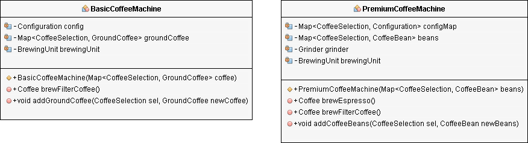
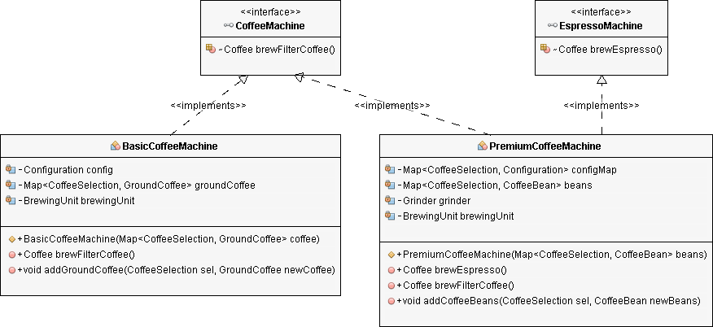

# Dependency Inversion

*“Depend on abstractions, rather than concrete implementations”*

One of the most dangerous parts when changing a system is having your changes unexpectedly influence other, unrelated parts of your system.

We want to guard against the situation where a change ripples through the whole system, causing waves and possible bugs throughout.

By depending on abstractions, decoupling ourselves from concrete implementations, we can set up walls between behaviors.

Abstractions better move us into standardized communication methods between components, making it easier to independently replace or change things.

General idea: High-level modules, which provide complex logic, should be easily reusable and unaffected by changes in low-level modules, which provide utility features.

To achieve this, you need to introduce an abstraction that decouples the high-level and low-level modules from each other.

Based on this idea, Robert C. Martin's definition of the Dependency Inversion Principle consist of two parts:

1. High-level modules should not depend on low-level modules. Both should depend on abstractions.

2. Abstractions should not depend on details. Details should depend on abstractions.

An important detail of this definition is, that high-level and low-level modules depend on the abstraction.

The design principle does not just change the direction of the dependency, as you might have expected when you read its name for the first time.

It splits the dependency btwn the high-level and low-level modules by introducing an abstraction btwn them. So in the end, you get two dependencies:

1. the high-level module depends on the abstraction, and

2. the low-level depends on the same abstraction.

## Based on other SOLID principles

If you consequently apply the Open/Closed Principle and the Liskov Substitution Principle to your code, it will also follow the Dependency Inversion Principle.

The Open/Closed Principle required a software component to be open for extension, but closed for modification.

You can achieve that by introducing interfaces for which you can provide different implementations.

The interface itself is closed for modification, and you can easily extend it by providing a new interface implementation.

Your implementations should follow the Liskov Substitution Principle so that you can replace them with other implementations of the same interface without breaking your application.

Let's take a look at the `CoffeeMachine` project in which I will apply all three of these design principles.

## Brewing coffee w/ the Dependency Inversion Principle

You can buy lots of different coffee machines.

Rather simple ones that use water and ground coffee to brew filter coffee, and premium ones that include a grinder to freshly grind the required amount of coffee beans and which you can use to brew different kinds of coffee.

If you build a coffee machine application that automatically brews you a fresh cup of coffee in the morning, you can model these machines as a `BasicCoffeeMachine` and a `PremiumCoffeeMachine` class.



## Implementing the `BasicCoffeeMachine`

The implementation of the `BasicCoffeeMachine` is quite simple. It only implements a constructor and two public methods. You can call the `addGroundCoffee` method to refill ground coffee, and the `brewFilterCoffee` method to brew a cup of filter coffee.

```java
import java.util.Map;

public class BasicCoffeeMachine implements CoffeeMachine {

    private Configuration config;
    private Map<CoffeeSelection, GroundCoffee> groundCoffee;
    private BrewingUnit brewingUnit;

    public BasicCoffeeMachine(Map<CoffeeSelection, GroundCoffee> coffee) {
        this.groundCoffee = coffee;
        this.brewingUnit = new BrewingUnit();
        this.config = new Configuration(30, 480);
    }

    @Override
    public Coffee brewFilterCoffee() {
        // get the coffee
        GroundCoffee groundCoffee = this.groundCoffee.get(CoffeeSelection.FILTER_COFFEE);
        // brew a filter coffee
       return this.brewingUnit.brew(CoffeeSelection.FILTER_COFFEE, groundCoffee, this.config.getQuantityWater());
    }

    public void addGroundCoffee(CoffeeSelection sel, GroundCoffee newCoffee) throws CoffeeException {
        GroundCoffee existingCoffee = this.groundCoffee.get(sel);
        if (existingCoffee != null) {
            if (existingCoffee.getName().equals(newCoffee.getName())) {
                existingCoffee.setQuantity(existingCoffee.getQuantity() + newCoffee.getQuantity())
            } else {
                throw new CoffeeException("Only one kind of coffee supported for each CoffeeSelection.")
            }
        } else {
            this.groundCoffee.put(sel, newCoffee)
        }
    }
}
```

## Implementing the `PremiumCoffeeMachine`

The implementation of the `PremiumCoffeeMachine` class looks very similar. The main differences are:

- It implements the `addCoffeeBeans` method instead of the `addGroundCoffee` method.

- It implements the additional `brewEspresso` method.

The `brewFilterCoffee` method is identical to the one provided by the `BasicCoffeeMachine`.

```java
import java.util.HashMap;
import java.util.Map;

public class PremiumCoffeeMachine {
    private Map<CoffeeSelection, Configuration> configMap;
    private Map<CoffeeSelection, CoffeeBean> beans;
    private Grinder grinder
    private BrewingUnit brewingUnit;

    public PremiumCoffeeMachine(Map<CoffeeSelection, CoffeeBean> beans) {
        this.beans = beans;
        this.grinder = new Grinder();
        this.brewingUnit = new BrewingUnit();
        this.configMap = new HashMap<>();
        this.configMap.put(CoffeeSelection.FILTER_COFFEE, new Configuration(30, 480));
        this.configMap.put(CoffeeSelection.ESPRESSO, new Configuration(8, 28));
    }

    public Coffee brewEspresso() {
        Configuration config = configMap.get(CoffeeSelection.ESPRESSO);
        // grind the coffee beans
        GroundCoffee groundCoffee = this.grinder.grind(
            this.beans.get(CoffeeSelection.ESPRESSO),
            config.getQuantityCoffee())
        // brew an espresso
        return this.brewingUnit.brew(CoffeeSelection.ESPRESSO, groundCoffee,
            config.getQuantityWater());
    }

    public Coffee brewFilterCoffee() {
        Configuration config = configMap.get(CoffeeSelection.FILTER_COFFEE);
        // grind the coffee beans
        GroundCoffee groundCoffee = this.grinder.grind(
            this.beans.get(CoffeeSelection.FILTER_COFFEE),
            config.getQuantityCoffee());
        // brew a filter coffee
        return this.brewingUnit.brew(CoffeeSelection.FILTER_COFFEE, groundCoffee,
            config.getQuantityWater());
    }

    public void addCoffeeBeans(CoffeeSelection sel, CoffeeBean newBeans) throws CoffeeException {
        CoffeeBean existingBeans = this.beans.get(sel);
        if (existingBeans != null) {
            if (existingBeans.getName().equals(newBeans.getName())) {
                existingBeans.setQuantity(existingBeans.getQuantity() + newBeans.getQuantity());
            } else {
                throw new CoffeeException("Only one kind of coffee supported for each CoffeeSelection.");
            }
         } else {
             this.beans.put(sel, newBeans);
         }
    }
}
```

To implement a class that follow the Dependency Inversion Principle and can use the `BasicCoffeeMachine` or the `PremiumCoffeeMachine` class to brew a cup of coffee, you need to apply the Open/Closed and the Liskov Substitution Principle.

That requires a small refactoring during which you introduce interface abstractions for both classes.

## Introducing abstractions

The main task of both coffee machine classes is to brew coffee. But they enable you to brew different kinds of coffee.

If you use a `BasicCoffeeMachine`, you can only brew filter coffee, but w/ a `PremiumCoffeeMachine`, you can brew filter coffee or espresso.

So, which interface abstraction would be a good fit for both classes?

As all coffee lovers will agree, there are huge differences btwn filter coffee and espresso.

That's why we are using different machines to brew them, even so, some machines can do both.

I, therefore, suggest to create two independent abstractions:

- The `FilterCoffeeMachine` interface defines the `Coffee` `brewFilterCoffee()` method and gets implemented by all coffee machine classes that can brew a filter coffee.

- All classes that you can use to brew an espresso, implement the `EspressoMachine` interface, which defines the `Coffee` `brewEspresso()` method.

As you can see in the following code snippets, the definition of both interface is pretty simple.

```java
public interface CoffeeMachine {
    Coffee brewFilterCoffee();
}

public interface EspressoMachine {
    Coffee brewEspresso();
}
```

In the next step, you need to refactor both coffee machine classes so that they implement one or both of these interfaces.

## Refactoring the `BasicCoffeeMachine` class

Let's start w/ the `BasicCoffeeMachine` class. You can use it to brew a filter coffee, so it should implement the `CoffeeMachine` interface.

The class already implements `brewFilterCoffee()` method. You only need to add `implements CoffeeMachine` to the class definition.

```java
public class BasicCoffeeMachine implements CoffeeMachine {
    private Configuration config;
    private Map<CoffeeSelection, GroundCoffee> groundCoffee;
    private BrewingUnit brewingUnit;

    public BasicCoffeeMachine(Map<CoffeeSelection, GroundCoffee> coffee) {
        this.groundCoffee = coffee;
        this.brewingUnit = new BrewingUnit();
        this.config = new Configuration(30, 480);
    }

    @Override
    public Coffee brewFilterCoffee() {
        // get the coffee
        GroundCoffee groundCoffee = this.groundCoffee.get(CoffeeSelection.FILTER_COFFEE);
        // brew a filter coffee
        return this.brewingUnit.brew(CoffeeSelection.FILTER_COFFEE, groundCoffee, this.config.getQuantityWater());
    }

    public void addGroundCoffee(CoffeeSelection sel, GroundCoffee newCoffee) throws CoffeeException {
        GroundCoffee existingCoffee = this.groundCoffee.get(sel);
        if (existingCoffee != null) {
            if (existingCoffee.getName().equals(newCoffee.getName())) {
                existingCoffee.setQuantity(existingCoffee.getQuantity() + newCoffee.getQuantity());
            } else {
             throw new CoffeeException("Only one kind of coffee supported for each CoffeeSelection.");
           }
        } else {
            this.groundCoffee.put(sel, newCoffee);
        }
    }
}
```

## Refactoring the `PremiumCoffeeMachine` class

The refactoring of the `PremiumCoffeeMachine` also doesn't require a lot of work.

You can use the coffee machine to brew filter coffee and espresso, so the `PremiumCoffeeMachine` class should implement the `CoffeeMachine` and the `EspressoMachine` interfaces.

The class already implements the methods defined by both interfaces. You just need to declare that it implements the interfaces.

```java
import java.util.HashMap;
import java.util.Map;

public class PremiumCoffeeMachine implements CoffeeMachine, EspressoMachine {
    private Map<CoffeeSelection, Configuration> configMap;
    private Map<CoffeeSelection, CoffeeBean> beans;
    private Grinder grinder;
    private BrewingUnit brewingUnit;

    public PremiumCoffeeMachine(Map<CoffeeSelection, CoffeeBean> beans) {
        this.beans = beans;
        this.grinder = new Grinder();
        this.brewingUnit = new BrewingUnit();
        this.configMap = new HashMap<>();
        this.configMap.put(CoffeeSelection.FILTER_COFFEE, new Configuration(30, 480));
        this.configMap.put(CoffeeSelection.ESPRESSO, new Configuration(8, 28));
    }

    @Override
    public Coffee brewEspresso() {
        Configuration config = configMap.get(CoffeeSelection.ESPRESSO);
        // grind the coffee beans
        GroundCoffee groundCoffee = this.grinder.grind(
           this.beans.get(CoffeeSelection.ESPRESSO),
           config.getQuantityCoffee());
       // brew an espresso
       return this.brewingUnit.brew(CoffeeSelection.ESPRESSO, groundCoffee,
           config.getQuantityWater());
    }

    @Override
    public Coffee brewFilterCoffee() {
        Configuration config = configMap.get(CoffeeSelection.FILTER_COFFEE);
        // grind the coffee beans
        GroundCoffee groundCoffee = this.grinder.grind(
            this.beans.get(CoffeeSelection.FILTER_COFFEE),
            config.getQuantityCoffee());
        // brew a filter coffee
        return this.brewingUnit.brew(CoffeeSelection.FILTER_COFFEE,
            groundCoffee,config.getQuantityWater());
    }

    public void addCoffeeBeans(CoffeeSelection sel, CoffeeBean newBeans) throws CoffeeException {
        CoffeeBean existingBeans = this.beans.get(sel);
        if (existingBeans != null) {
            if (existingBeans.getName().equals(newBeans.getName())) {
                existingBeans.setQuantity(existingBeans.getQuantity() + newBeans.getQuantity());
            } else {
                throw new CoffeeException("Only one kind of coffee supported for each CoffeeSelection.");
            }
        } else {
            this.beans.put(sel, newBeans);
        }
    }
}
```

The `BasicCoffeeMachine` and the `PremiumCoffeeMachine` classes now follow the **Open/Closed** and the **Liskov Substitution** principles.

The interfaces enable you to add new functionality w/o changing any existing code by adding new interface implementations. And by splitting the interfaces into `CoffeeMachine` and `EspressoMachine`, you separate the two kinds of coffee machines and ensure that all `CoffeeMachine` and `EspressoMachine` implementations are interchangeable.



## Implementing the coffee machine application

You can now create additional, higher-level classes that use one or both of these interfaces to manage coffee machines w/o directly depending on any specific coffee machine implementation.

As you can see in the following code snippet, due to the abstraction of the `CoffeeMachine` interface and its provided functionality, the implementation of the `CoffeeApp` is very simple.

It requires a `CoffeeMachine` object as a constructor parameter and uses it in the `prepareCoffee` method to brew a cup of filter coffee.

```java
public class CoffeeApp {
    private CoffeeMachine coffeeMachine;

    public CoffeeApp(CoffeeMachine coffeeMachine) {
     this.coffeeMachine = coffeeMachine
    }

    public Coffee prepareCoffee() throws CoffeeException {
        Coffee coffee = this.coffeeMachine.brewFilterCoffee();
        System.out.println("Coffee is ready!");
        return coffee;
    }
}
```

The only code that directly depends on one of the implementation classes is the `CoffeeAppStarter` class, which instantiates a `CoffeeApp` object and provides an implementation of the `CoffeeMachine` interface.

You could avoid this compile-time dependency entirely by using a dependency injection framework, like Spring or CDI, to resolve the dependency at runtime.

```java
import java.util.HashMap;
import java.util.Map;

public class CoffeeAppStarter {
    public static void main(String[] args) {
        // create a Map of available coffee beans
        Map<CoffeeSelection, CoffeeBean> beans = new HashMap<CoffeeSelection, CoffeeBean>();
        beans.put(CoffeeSelection.ESPRESSO, new CoffeeBean(
            "My favorite espresso bean", 1000));
        beans.put(CoffeeSelection.FILTER_COFFEE, new CoffeeBean(
             "My favorite filter coffee bean", 1000))
        // get a new CoffeeMachine object
        PremiumCoffeeMachine machine = new PremiumCoffeeMachine(beans);
        // Instantiate CoffeeApp
        CoffeeApp app = new CoffeeApp(machine);
        // brew a fresh coffee
        try {
           app.prepareCoffee();
        } catch (CoffeeException e) {
            e.printStackTrace();
        }
    }
}
```

## Summary

The Dependency Inversion Principle introduces an interface abstraction btwn the higher-level and lower-level software components to remove the dependencies btwn them.

As you have seen in the example project, you only need to consequently apply the **Open/Closed** and the **Liskov Substitution** principles to your code base.

After you have done that, your classes also comply with the **Dependency Inversion** Principle.

This enables you to change higher-level and lower-level components without affecting any other classes, as long as you don’t change any interface abstractions.
