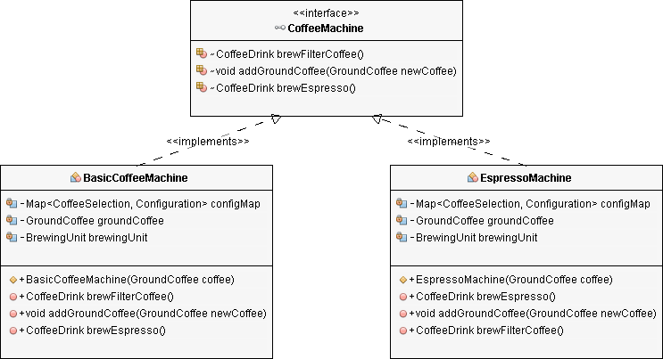
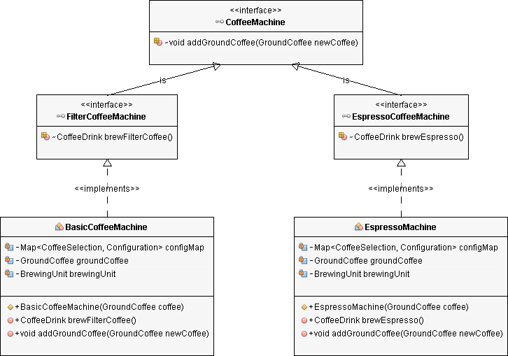

# Interface Segregation Principle

*“Interfaces should be small, focused on a specific use case”*

The surface area of a class has a direct influence on how easy it is to use. 

Although a class might have several different ways to use it, any specific client should see only those behaviors specific to its needs.

When we focus on effectively grouping and naming the behaviors of our class, we naturally build small interfaces that provide a clear, cohesive view of what our class does. 

If it is difficult to name, that is feedback that our class is getting too large.

Similar to the **Single Responsibility Principle**, the goal of the Interface Segregation Principle is to reduce the side effects and frequency of required changes by splitting the software into multiple, independent parts.

This is only achievable if you define your interfaces so that they fit a specific client or task.

## Violating the Interface Segregation Principle

From a technical point of view, the implementation of each change bears a risk. 

It's tempting to add a new method to an existing interface even though it implements a different responsibility and would be better separate in a new interface.

That's often the beginning of interface pollution, which sooner or later leads to bloated interfaces that contain methods implementing several responsibilities.

In the beginning, the project used the `BasicCoffeeMachine` class to model a basic coffee machine. It uses ground coffee to brew a delicious filter coffee.

```java
class BasicCoffeeMachine implements CoffeeMachine {

    private Map<CoffeeSelection, Configuration> configMap;
    private GroundCoffee groundCoffee;
    private BrewingUnit brewingUnit;

    public BasicCoffeeMachine(GroundCoffee coffee) {
        this.groundCoffee = coffee;
        this.brewingUnit = new BrewingUnit();

        this.configMap = new HashMap<>();
        this.configMap.put(CoffeeSelection.FILTER_COFFEE, new Configuration(30, 480));
    }

    @Override
    public CoffeeDrink brewFilterCoffee() {
        Configuration config = configMap.get(CoffeeSelection.FILTER_COFFEE);

        // brew a filter coffee
        return this.brewingUnit.brew(CoffeeSelection.FILTER_COFFEE, this.groundCoffee, config.getQuantityWater());
    }

    @Override
    public void addGroundCoffee(GroundCoffee newCoffee) throws CoffeeException {
        if (this.groundCoffee != null) {
            if (this.groundCoffee.getName().equals(newCoffee.getName())) {
                this.groundCoffee.setQuantity(this.groundCoffee.getQuantity() + newCoffee.getQuantity());
            } else {
                throw new CoffeeException("Only one kind of coffee supported for each CoffeeSelection.");
            }
        } else {
            this.groundCoffee = newCoffee;
        }
    }
}
```

At that time, it was perfectly fine to extract the `CoffeeMachine` interface w/ the methods `addGroundCoffee` and `brewFilterCoffee`.

These are the two essential methods of a coffee machine and should be implemented by all future coffee machines.

```java
public interface CoffeeMachine {
    CoffeeDrink brewFilterCoffee() throws CoffeeException;
    void addGroundCoffee(GroundCoffee newCoffee) throws CoffeeException;
}
```

## Polluting the interface w/ a new method

But then somebody decided that the application also needs to support espresso machines.

The development team modeled it as the `EspressoMachine` class that you can see in the following code snippet. It's pretty similar to the `BasicCoffeeMachine` class.

```java
public class EspressoMachine implements CoffeeMachine {

    private Map configMap;
    private GroundCoffee groundCoffee;
    private BrewingUnit brewingUnit;

    public EspressoMachine(GroundCoffee coffee) {
        this.groundCoffee = coffee;
        this.brewingUnit = new BrewingUnit();

        this.configMap = new HashMap();
        this.configMap.put(CoffeeSelection.ESPRESSO, new Configuration(8, 28));
    }

    @Override
    public CoffeeDrink brewEspresso() {
        Configuration config = configMap.get(CoffeeSelection.ESPRESSO);

        // brew a filter coffee
        return this.brewingUnit.brew(CoffeeSelection.ESPRESSO,
            this.groundCoffee, config.getQuantityWater());
    }

    @Override
    public void addGroundCoffee(GroundCoffee newCoffee) throws CoffeeException {
        if (this.groundCoffee != null) {
            if (this.groundCoffee.getName().equals(newCoffee.getName())) {
                this.groundCoffee.setQuantity(this.groundCoffee.getQuantity()
                    + newCoffee.getQuantity());
            } else {
                throw new CoffeeException(
                    "Only one kind of coffee supported for each CoffeeSelection.");
            }
        } else {
            this.groundCoffee = newCoffee;
        }
    }

    @Override
    public CoffeeDrink brewFilterCoffee() throws CoffeeException {
       throw new CoffeeException("This machine only brew espresso.");
    }
}
```

The developer decided that an espresso machine is just a different kind of coffee machine. So, it has to implement the `CoffeeMachine` interface.

The only difference is the `brewEspresso` method, which the `EspressoMachine` class implements instead of the `brewFilterCoffee` method.

Let's ignore the Interface Segregation Principle for now and perform the following three changes:

1. The `EspressoMachine` class implements the `CoffeeMachine` interface and its `brewFilterCoffee` method.

```java
public CoffeeDrink brewFilterCoffee() throws CoffeeException {
    throw new CoffeeException("This machine only brews espresso.")
}
```

2. We add the `brewEspresso` method to the `CoffeeMachine` interface so that the interface allows you to brew an espresso.

```java
public interface CoffeeMachine {

    CoffeeDrink brewFilterCoffee() throws CoffeeException;
    void addGroundCoffee(GroundCoffee newCoffee) throws CoffeeException;
    CoffeeDrink brewEspresso() throws CoffeeException;
}
```

3. You need to implement the `brewEspresso` method on the `BasicCoffeeMachine` class b/c it's defined by the `CoffeeMachine` interface. You can also provide the same implementation as a default method on the `CoffeeMachine` interface.

```java
@Override
public CoffeeDrink brewEspresso() throws CoffeeException {
    throw new CoffeeException("This machine only brews filter coffee.");
}
```

After you've done these changes, your class diagram should look like this:



The 2nd and 3rd change should especially show you that the `CoffeeMachine` interface is not a good fit for these two coffee machines.

The `brewEspresso` method fo the `BasicCoffeeMachine` class and the `brewFilterCoffee` method of the `EspressoMachine` class throw a `CoffeeException` b/c these operations are not supported by these kinds of machines. You only had to implement them b/c they are required by the `CoffeeMachine` interface.

But the implementation of these two methods isn't the real issue.

The problem is that the `CoffeeMachine` interface will change if the signature of the `brewFilterCoffee` method of the `BasicCoffeeMachine` method changes. That will also require a change in the `EspressoMachine` class and all other classes that use the `EspressoMachine`, even so, the `brewFilterCoffee` method doesn't provide any functionality and they don't call it.

## Follow the Interface Segregation Principle

How can we fix the `CoffeeMachine` interface and its implementations `BasicCoffeeMachine` and `EspressoMachine`?

Split the `CoffeeMachine` interface into multiple interfaces for the different kinds of coffee machines.

All known implementations of the interface implement the `addGroundCoffee` method. So, there is no reason to remove it.

```java
public interface CoffeeMachine {

    void addGroundCoffee(GroundCoffee newCoffee) throws CoffeeException;
}
```

That's not the case for the `brewFilterCoffee` and `brewEspresso` methods. You should create two new interfaces to segregate them from each other.

And in this example, these two interfaces should also extend the `CoffeeMachine` interface.

But that doesn't have to be the case if you refactor your own application. Please check carefully if an interface hierarchy is the right approach, or if you should define a set of interfaces.

After you've done that, the `FilterCoffeeMachine` interface extends the `CoffeeMachine` interface, and defines the `brewFilterCoffee` method.

```java
public interface FilterCoffeeMachine extends CoffeeMachine {

    CoffeeDrink brewFilterCoffee() throws CoffeeException;
}
```

And the `EspressoCoffeeMachine` interface also extends the `CoffeeMachine` interface, and defines the `brewEspresso` method.

```java
public interface EspressoCoffeeMachine extends CoffeeMachine {

    CoffeeDrink brewEspresso() throws CoffeeException;
}
```

With the segregation of the interfaces, the functionalities of the different coffee machines are independent of each other. As a result, the `BasicCoffeeMachine` and the `EspressoMachine` class no longer need to provide empty method implementations and are independent of each other.



The `BasicCoffeeMachine` class now implements the `FilterCoffeeMachine` interface, which only defines the `addGroundCoffee` and the `brewFilterCoffee` methods.

```java
public class BasicCoffeeMachine implements FilterCoffeeMachine {

    private Map<CoffeeSelection, Configuration> configMap;
    private GroundCoffee groundCoffee;
    private BrewingUnit brewingUnit;

    public BasicCoffeeMachine(GroundCoffee coffee) {
        this.groundCoffee = coffee;
        this.brewingUnit = new BrewingUnit();

        this.configMap = new HashMap<>();
        this.configMap.put(CoffeeSelection.FILTER_COFFEE, 
            new Configuration(30, 480));
    }

    @Override
    public CoffeeDrink brewFilterCoffee() {
        Configuration config = configMap.get(CoffeeSelection.FILTER_COFFEE);

        // brew a filter coffee
        return this.brewingUnit.brew(CoffeeSelection.FILTER_COFFEE,
            this.groundCoffee, config.getQuantityWater());
    }

    @Override
    public void addGroundCoffee(GroundCoffee newCoffee) throws CoffeeException {
        if (this.groundCoffee != null) {
            if (this.groundCoffee.getName().equals(newCoffee.getName())) {
                this.groundCoffee.setQuantity(this.groundCoffee.getQuantity()
                    + newCoffee.getQuantity());
            } else {
                throw new CoffeeException(
                    "Only one kind of coffee supported for each CoffeeSelection.");
            }
        } else {
            this.groundCoffee = newCoffee;
        }
    }

}
```

And the `EspressoMachine` class implements the `EspressoCoffeeMachine` interface w/ its methods `addGroundCoffee` and `brewEspresso`.

```java
public class EspressoMachine implements EspressoCoffeeMachine {

    private Map configMap;
    private GroundCoffee groundCoffee;
    private BrewingUnit brewingUnit;

    public EspressoMachine(GroundCoffee coffee) {
        this.groundCoffee = coffee;
        this.brewingUnit = new BrewingUnit();

        this.configMap = new HashMap();
        this.configMap.put(CoffeeSelection.ESPRESSO, new Configuration(8, 28));
    }

    @Override
    public CoffeeDrink brewEspresso() throws CoffeeException {
        Configuration config = configMap.get(CoffeeSelection.ESPRESSO);

        // brew a filter coffee
        return this.brewingUnit.brew(CoffeeSelection.ESPRESSO,
            this.groundCoffee, config.getQuantityWater());
    }

    @Override
    public void addGroundCoffee(GroundCoffee newCoffee) throws CoffeeException {
        if (this.groundCoffee != null) {
            if (this.groundCoffee.getName().equals(newCoffee.getName())) {
                this.groundCoffee.setQuantity(this.groundCoffee.getQuantity()
                    + newCoffee.getQuantity());
            } else {
                throw new CoffeeException(
                    "Only one kind of coffee supported for each CoffeeSelection.");
            }
        } else {
            this.groundCoffee = newCoffee;
        }
    }
}
```

## Extending the application

After you segregated the interfaces so that you can evolve the two coffee machine implementations independently of each other, you might be wondering how you can add different kinds of coffee machines to your applications. 

In general there are four options for that:

1. The new coffee machine is a `FilterCoffeeMachine` or an `EspressoCoffeeMachine`. In this case, you only need to implement the corresponding interface.

2. The new coffee machine brews filter coffee and espresso - a situation is similar to the first one. The only difference is that your class now implements both interfaces; the `FilterCoffeeMachine` and the `EspressoCoffeeMachine`.

3. The new coffee machine is completely different to the other two. Maybe it's one of these pad machines that you can also use to make tea or other hot drinks. In this case, you need to create a new interface and decide if you want to extend the `CoffeeMachine` interface. In the example of the pad machine, you shouldn't do that b/c you can't add ground coffee to a pad machine. So, your `PadMachine` class shouldn't need to implement an `addGroundCoffee` method.

4. The new coffee machine provides new functionality, but you can also use it to brew a filter coffee or an espresso. In that case, you should define a new interface for the new functionality. Your implementation class can then implement this new interface and one or more of the existing interfaces. But please make sure to segregate the new interface from the existing ones, as you did for the `FilterCoffeeMachine` and the `EspressoCoffeeMachine` interfaces.

## Summary

By following the Interface Segregation Principle, you prevent bloated interfaces that define methods for multiple responsibilities.

As explained in the Single Responsibility Principle, you should avoid classes and interfaces w/ multiple responsibilities b/c they change often and make your software hard to maintain.
