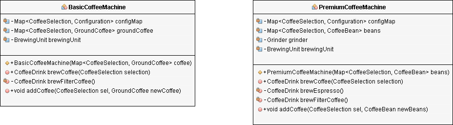
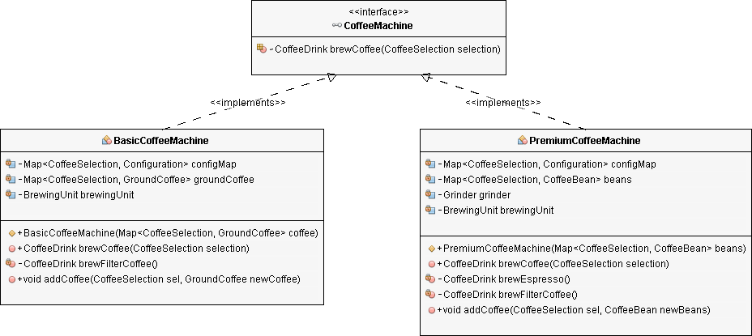

## Liskov Substitution (LSP)

*“Derived types should be substitutable for their base types”*

Extends the Open/Closed Principle by focusing on the behavior of a superclass and its subtypes.

## The Liskov Substitution Principle in practical software development

The principle defines that objects of a superclass shall be replaceable w/ objects of its subclasses w/o breaking the application. That requires the objects of your subclasses to behave in the same way as the objects of your superclass. 

An overriden method of a subclass needs to accept the same input parameter values as the method of the superclass. That means you can implement less restrictive validation rules, but you are not allowed to enforce stricter ones in your subclass. Otherwise, any code that calls this method on an object of the superclass might cause an exception, if it gets called w/ an object of the subclass.

Similar rules apply to the return value of the method. The return value of a method of the subclass needs to comply w/ the same rules as the return value of the method of the superclass.

You can only decide to apply even stricter rules by returning a specific subclass of the defined return value, or by returning a subset of the valid return values of the superclass.

## Enforcing the Liskov Substitution Principle

If you decide to apply this principle to your code, the behavior of your classes becomes more important than its structure.

Unfortunately, there is no easy way to enforce this principle. The compiler only checks the structural rules defined by the Java language, but it can't enforce a specific behavior.

You need to implement your own checks to ensure that your code follows the Liskov Substitution Principle. In the best case, you do this via code reviews and test cases. In your test cases, you can execute a specific part of your application w/ objects of all subclasses to make sure that none of them causes an error or significantly changes its performance.

## Making coffee w/ the Liskov Substitution Principle

If you decide to implement an application that automatically brews a cup of coffee every morning so that you don't have to get out of bed before it's ready, you might decide to model these coffee machines as two classes w/ the methods `addCoffee` and `brewCoffee`.



## A basic coffee machine

The `BasicCoffeeMachine` can only brew filter coffee. So, the `brewCoffee` method checks if the provided `CoffeeSelection` value is equal to `FILTER_COFFEE` before it calls the private `brewFilterCoffee` method to create and return a `CoffeeDrink` object.

```java
public class BasicCoffeeMachine { 

    private Map configMap; 
    private Map groundCoffee; 
    private BrewingUnit brewingUnit;

    public BasicCoffeeMachine(Map coffee) { 
        this.groundCoffee = coffee; 
        this.brewingUnit = new BrewingUnit(); 

        this.configMap = new HashMap(); 
        this.configMap.put(CoffeeSelection.FILTER_COFFEE, 
            new Configuration(30, 480)); 
    } 

    public CoffeeDrink brewCoffee(CoffeeSelection selection) throws CoffeeException {
        switch (selection) { 
            case FILTER_COFFEE: 
                return brewFilterCoffee(); 
            default: 
                throw new CoffeeException(
                    "CoffeeSelection [" + selection + "] not supported!"); 
        } 
    } 

    private CoffeeDrink brewFilterCoffee() { 
        Configuration config = configMap.get(CoffeeSelection.FILTER_COFFEE); 

        // get the coffee 
        GroundCoffee groundCoffee = this.groundCoffee.get(
            CoffeeSelection.FILTER_COFFEE); 

        // brew a filter coffee 
        return this.brewingUnit.brew(CoffeeSelection.FILTER_COFFEE, 
            groundCoffee, config.getQuantityWater()); 
    } 

    public void addCoffee(CoffeeSelection sel, GroundCoffee newCoffee) 
        throws CoffeeException {

        GroundCoffee existingCoffee = this.groundCoffee.get(sel); 
        if (existingCoffee != null) { 
            if (existingCoffee.getName().equals(newCoffee.getName())) { 
                existingCoffee.setQuantity(
                    existingCoffee.getQuantity() + newCoffee.getQuantity()); 
            } else { 
                throw new CoffeeException(
                    "Only one kind of coffee supported for each CoffeeSelection."); 
            } 
        } else { 
            this.groundCoffee.put(sel, newCoffee); 
        } 
    } 
}
```

The `addCoffee` method expects a `CoffeeSelection` enum value and a `GroundCoffee` object. It uses the `CoffeeSelection` as the key of the internal `groundCoffee Map`.

These are the most important parts of the `BasicCoffeeMachine` class. Let's take a look at the `PremiumCoffeeMachine`.

## A premium coffee machine

The premium coffee machine has an integrated grinder, and the internal implementation of the `brewCoffee` method is a little more complex. But you don't see that from the outside. The method signature is identical to the one of the `BasicCoffeeMachine` class.

```java
public class PremiumCoffeeMachine { 

    private Map<CoffeeSelection, Configuration> configMap; 
    private Map<CoffeeSelection, CoffeeBean> beans; private Grinder grinder; 
    private BrewingUnit brewingUnit; 

    public PremiumCoffeeMachine(Map<CoffeeSelection, CoffeeBean> beans) { 
        this.beans = beans; 
        this.grinder = new Grinder(); 
        this.brewingUnit = new BrewingUnit(); 

        this.configMap = new HashMap<>(); 
        this.configMap.put(CoffeeSelection.FILTER_COFFEE, 
            new Configuration(30, 480)); 
        this.configMap.put(CoffeeSelection.ESPRESSO, 
            new Configuration(8, 28)); 
    } 

    @Override 
    public CoffeeDrink brewCoffee(CoffeeSelection selection) 
        throws CoffeeException { 

        switch(selection) { 
            case ESPRESSO: 
                return brewEspresso(); 
            case FILTER_COFFEE: 
                return brewFilterCoffee(); 
            default: 
                throw new CoffeeException(
                    "CoffeeSelection [" + selection + "] not supported!"); 
        } 
    } 

    private CoffeeDrink brewEspresso() { 
        Configuration config = configMap.get(CoffeeSelection.ESPRESSO); 

        // grind the coffee beans 
        GroundCoffee groundCoffee = this.grinder.grind( 
        this.beans.get(CoffeeSelection.ESPRESSO), 
            config.getQuantityCoffee()); 

        // brew an espresso 
        return this.brewingUnit.brew(CoffeeSelection.ESPRESSO, 
            groundCoffee, config.getQuantityWater()); 
    } 

    private CoffeeDrink brewFilterCoffee() { 
        Configuration config = configMap.get(CoffeeSelection.FILTER_COFFEE); 

        // grind the coffee beans 
        GroundCoffee groundCoffee = this.grinder.grind( 
            this.beans.get(CoffeeSelection.FILTER_COFFEE), 
                config.getQuantityCoffee()); 

        // brew a filter coffee 
        return this.brewingUnit.brew(CoffeeSelection.FILTER_COFFEE, 
            groundCoffee, config.getQuantityWater()); 
    } 

    public void addCoffee(CoffeeSelection sel, CoffeeBean newBeans) 
        throws CoffeeException { 

        CoffeeBean existingBeans = this.beans.get(sel); 
        if (existingBeans != null) { 
            if (existingBeans.getName().equals(newBeans.getName())) { 
                existingBeans.setQuantity(
                    existingBeans.getQuantity() + newBeans.getQuantity()); 
            } else { 
                throw new CoffeeException(
                    "Only one kind of coffee supported for each CoffeeSelection."); 
            } 
        } else { 
            this.beans.put(sel, newBeans); 
        } 
    } 
}
```

But that's not the case for the `addCoffee` method. It expects an object of type `CoffeeBean` instead of an object of type `GroundCoffee`. If you add a shared superclass or an interface that gets implemented by the `BasicCoffeeMachine` and the `PremiumCoffeeMachine` class, you will need to decide how to handle this difference.

## Introducing a shared interface

You can either create another abstraction, e.g., `Coffee`, as the superclass of `CoffeeBean` and `GroundCoffee` and use it as the type of the method parameter. That would unify the structure of both `addCoffee` methods, but require additional validation in both methods.

The `addCoffee` method of the `BasicCoffeeMachine` class would need to check that the caller provided an instance of `GroundCoffee`, and the `addCoffee` implementation of the the `PremiumCoffeeMachine` would require an instance of `CoffeeBean`.

This would obviously break the Liskov Substitution Principle b/c the validation would fail if you provide a `BasicCoffeeMachine` object instead of a `PremiumCoffeeMachine` and vice versa.

The better approach is to exclude the `addCoffee` method from the interface or superclass b/c you can't interchangeably implement it.

The `brewCoffee` method, on the other hand, could be part of a shared interface or superclass, as long as the superclass or interface only guarantees that you can use it to brew filter coffee.

The input validation of both implementations accepts the `CoffeeSelection` value `FILTER_COFFEE`. The `addCoffee` method of the `PremiumCoffeeMachine` class also accepts the enum value `ESPRESSO`. But as I explained at the beginning of this article, the different subclasses may implement less restrictive validation rules.



## Summary

The Liskov Substitution Principle extends the Open/Closed principle and enables you to replace objects of a parent class w/ objects of a subclass w/o breaking the application.

This requires all subclasses to behave in the same way as the parent class. To achieve that, your subclasses need to follow these rules:

* Don't implement any stricter validation rules on input parameters than implemented by the parent class.

* Apply at the least the same rules to all output parameters as applied by the parent class.

Polymorphism is a key part of a flexible design. Being able to substitute a more specific type when a general type is expected allows us to provide different behaviors w/o having complex branching. 

There is a danger, though, if the specialized type significantly changes fundamental expectations of the more general type’s behavior Derived types should enhance any base behaviors, rather than change it.

A healthy focus on the names we give our types can help in abiding by LSP. A specialized type’s name should reflect that it is an enhancement of the base, not a change.

### 7.2.3 Honor the Contract

Subclasses agree to a *contract*; they promise to be substitutable for their superclasses. 

Substitutability is possible only when objects behave as expected, and subclasses are *expected* to conform to their superclass's interface. They must respond to every message in that interface, taking the same kinds of inputs and returning the same kinds of outputs. They are not permitted to do anything that forces others to check their type in order to know how to treat them or what to expect of them.

Where superclasses place restrictions on input arguments and return values, subclasses can indulge in a slight bit of freedom w/o violating their contract. Subclasses may accept input parameters that have broader restrictions and may return results that have narrower restrictions, all while remaining perfectly substitutable for their superclasses.

Subclasses that fail to honor their contract are difficult to use. They're "special" and cannot be freely substituted for their superclasses. These subclasses are declaring that they are not really a *kind-of* their superclass and cast doubt on the correctness of the entire hierarchy.

When you honor the contract, you are following the **Liskov Substitution Principle**. Her principle states:

* Let *q(x)* be a property about objects of *x* of type *T*. Then *q(y)* should be true for objects *y* of type *S* where *S* is a subtype of *T*.

In order for a type system to be sane, sub-types must be substitutable for their supertypes.

Following this principle crates applications where a subclass can be used anywhere its superclass would be and where objects that include modules can be trusted to interchangeably play the module's role.
