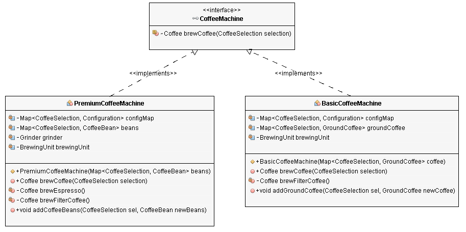

# Open-Closed Principle (OCP)

*“A system [classes, modules, functions, etc.] should be open for extension, but closed for modification”*

Be able to add new functionality w/o changing the existing code, preventing situations in which a change to one of your classes also requires you to adapt all depending classes.

Changing code is dangerous; once we have it written and tested, we want to minimize the chance for bugs to be introduced. 

By introducing or altering behavior only through extension, we benefit from the stability of small, stable core pieces that won’t change out from under us.

Uses interfaces instead of superclasses to allow different implementations which you can easily substitute w/o changing the code that uses them. The interfaces are closed for modifications, and you can provide new implementations to extend the functionality of your software.

The main benefit of this approach is that an interface introduces an additional level of abstraction which enables loose coupling. The implementations of an interface are independent of each other and don't need to share any code.

If you consider it beneficial that two implementations of an interface share some code, you can either use inheritance or composition.

There is a danger when focusing too much on the OCP. If we plan for extensibility, our systems become riddled with unnecessary and unwieldy extension points and extensibility mechanisms. 

To counter this, we should focus on isolating knowledge, naturally building only the extension points that truly represent the pieces of our system that will change.

## The `BasicCoffeeMachine` class

```java
import java.util.HashMap;
import java.util.Map;

public class BasicCoffeeMachine {

    private Map<CoffeeSelection, Configuration> configMap;
    private Map<CoffeeSelection, GroundCoffee>; groundCoffee;
    private BrewingUnit brewingUnit;

    public BasicCoffeeMachine(Map<CoffeeSelection, GroundCoffee> coffee) {
        this.groundCoffee = coffee;
        this.brewingUnit = new BrewingUnit();

        this.configMap = new HashMap<>();
        this.configMap.put(CoffeeSelection.FILTER_COFFEE, new Configuration(30, 480));
    }

    public Coffee brewCoffee(CoffeeSelection selection) {
        Configuration config = configMap.get(CoffeeSelection.FILTER_COFFEE);

        // get the coffee
        GroundCoffee groundCoffee = this.groundCoffee.get(CoffeeSelection.FILTER_COFFEE);

        // brew a filter coffee
        return this.brewingUnit.brew(CoffeeSelection.FILTER_COFFEE, groundCoffee, config.getQuantityWater());
    }

    public void addGroundCoffee(CoffeeSelection sel, GroundCoffee newCoffee) throws CoffeeException {
        GroundCoffee existingCoffee = this.groundCoffee.get(sel);
        if (existingCoffee != null) {
            if (existingCoffee.getName().equals(newCoffee.getName())) {
                existingCoffee.setQuantity(existingCoffee.getQuantity() + newCoffee.getQuantity());
            } else {
                throw new CoffeeException("Only one kind of coffee supported for each CoffeeSelection.");
            }
        } else {
            this.groundCoffee.put(sel, newCoffee);
        }
    }
}
```

You can easily control such a simple coffee machine via an app, right? So, let's do that.

## The `BasicCoffeeApp` class

The `main` method of the `BasicCoffeeApp` prepares a `Map` w/ ground coffee, instantiates a `BasicCoffeeMachine` object, and calls the `prepareCoffee` method to brew the coffee.

```java
public class BasicCoffeeApp {

    private BasicCoffeeMachine coffeeMachine;

    public BasicCoffeeApp(BasicCoffeeMachine coffeeMachine) {
        this.coffeeMachine = coffeeMachine;
    }

    public Coffee prepareCoffee(CoffeeSelection selection) throws CoffeeException {
        Coffee coffee = this.coffeeMachine.brewCoffee(selection);
        System.out.println("Coffee is ready!");
        return coffee;
    }

    public static void main(String[] args) {
        // create a Map of available coffee beans
        Map<CoffeeSelection, GroundCoffee> beans = new HashMap<CoffeeSelection, GroundCoffee>();
        beans.put(CoffeeSelection.FILTER_COFFEE, new GroundCoffee(
            "My favorite filter coffee bean", 1000));

        // get a new CoffeeMachine object
        BasicCoffeeMachine machine = new BasicCoffeeMachine(beans);

        // Instantiate CoffeeApp
        BasicCoffeeApp app = new BasicCoffeeApp(machine);

        // brew a fresh coffee
        try {
            app.prepareCoffee(CoffeeSelection.FILTER_COFFEE);
        } catch (CoffeeException e) {
            e.printStackTrace();
        }
    } // end main
} // end CoffeeApp
```

## Applying the Open/Closed Principle

But what happens when you replace your `BasicCoffeeMachine`? You might get a better one w/ an integrated grinder, which can brew more than just filtered coffee. Unfortunately, the `CoffeeApp` doesn't support this kind of coffee machine.

It would be great if your app could control both types of coffee machines. But that will require a few code changes. And as you're already on it, why not change it so that you will not need to adapt it to future coffee machines.

## Extracting the `CoffeeMachine` interface

Following the Open/Closed Principle, you need to extract an interface that enables you to control the coffee machine. That's often the critical part of the refactoring. You need to include the methods that are mandatory for controlling the coffee machine, but none of the optional methods which would limit the flexibility of the implementations.

In this example, that's only the `brewCoffee` method. So, the `CoffeeMachine` interface specifies only one method, which needs to be implemented by all classes that implement it.

```java
public interface CoffeeMachine {

    Coffee brewCoffee(CoffeeSelection selection) throws CoffeeException;
}
```

## Adapting the `BasicCoffeeMachine` class

In the next step, you need to adapt the `BasicCoffeeMachine` class. It already implements the `brewCoffee` method and provides all the functionality it needs. So, you just need to declare that the `BasicCoffeeMachine` class implements the `CoffeeMachine` interface.

```java
public class BasicCoffeeMachine implements CoffeeMachine { ... }
```

## Add more implementations

You can now add new implementations of the CoffeeMachine interface.

The implementation fo the `PremiumCoffeeMachine` class is more complex than the `BasicCoffeeMachine` class. Its `brewCoffee` method, which is defined by the `CoffeeMachine` interface, supports two different `CoffeeSelections`.

Based on the provided `CoffeeSelection`, the method calls a separate, private method that brews the selected coffee.

As you can see in the implementation of these methods, the class also uses `composition` to reference a `Grinder`, which grinds the coffee beans before brewing the coffee.

```java
import java.util.HashMap;
import java.util.Map;

public class PremiumCoffeeMachine implements CoffeeMachine {

    private Map<CoffeeSelection, Configuration> configMap;
    private Map<CoffeeSelection, CoffeeBean> beans;
    private Grinder grinder;
    private BrewingUnit brewingUnit;

    public PremiumCoffeeMachine(Map<CoffeeSelection, CoffeeBean> beans) {
        this.beans = beans;
        this.grinder = new Grinder();
        this.brewingUnit = new BrewingUnit();

        this.configMap = new HashMap<>();
        this.configMap.put(CoffeeSelection.FILTER_COFFEE, new Configuration(30, 480));
        this.configMap.put(CoffeeSelection.ESPRESSO, new Configuration(8, 28));
    }

    @Override
    public Coffee brewCoffee(CoffeeSelection selection) throws CoffeeException {
        switch(selection) {
            case ESPRESSO:
                return brewEspresso();
            case FILTER_COFFEE:
                return brewFilterCoffee();
            default:
                throw new CoffeeException("CoffeeSelection [" + selection + "] not supported!");
        }
    }

    private Coffee brewEspresso() {
        Configuration config = configMap.get(CoffeeSelection.ESPRESSO);

        // grind the coffee beans
        GroundCoffee groundCoffee = this.grinder.grind(
            this.beans.get(CoffeeSelection.ESPRESSO),
                config.getQuantityCoffee());

        // brew an espresso
        return this.brewingUnit.brew(CoffeeSelection.ESPRESSO, groundCoffee,
            config.getQuantityWater());
    }

    private Coffee brewFilterCoffee() {
        Configuration config = configMap.get(CoffeeSelection.FILTER_COFFEE);

        // grind the coffee beans
        GroundCoffee groundCoffee = this.grinder.grind(
            this.beans.get(CoffeeSelection.FILTER_COFFEE),
                config.getQuantityCoffee());

        // brew a filter coffee
        return this.brewingUnit.brew(CoffeeSelection.FILTER_COFFEE, groundCoffee,
            config.getQuantityWater());
    }

    public void addCoffeeBeans(CoffeeSelection sel, CoffeeBean newBeans) throws CoffeeException {
        CoffeeBean existingBeans = this.beans.get(sel);
        if (existingBeans != null) {
            if (existingBeans.getName().equals(newBeans.getName())) {
                existingBeans.setQuantity(existingBeans.getQuantity() + newBeans.getQuantity());
            } else {
                throw new CoffeeException("Only one kind of coffee supported for each CoffeeSelection.");
            }
        } else {
            this.beans.put(sel, newBeans);
        }
    }
}
```

You're done w/ most of the refactoring work. You applied the Open/Closed Principle by introducing the `CoffeeMachine` interface and provided two implementations of it:



The only thing that's left in the app is to use different implementations of that interface.

## Adapting the CoffeeApp

The `CoffeeApp` class consists of 2 parts:

1. the `CoffeeApp` class and

2. the `main` method

You need to instantiate a specific `CoffeeMachine` implementation in the `main` method. So, you will always need to adopt this method, if you replace your current coffee machine. But as long as the `CoffeeApp` class uses the `CoffeeMachine` interface, you will not need to adapt it.

```java
import java.util.HashMap;
import java.util.Map;

public class CoffeeApp {

    private CoffeeMachine coffeeMachine;

    public CoffeeApp(CoffeeMachine coffeeMachine) {
        this.coffeeMachine = coffeeMachine;
    }

    public Coffee prepareCoffee(CoffeeSelection selection) throws CoffeeException {
        Coffee coffee = this.coffeeMachine.brewCoffee(selection);
        System.out.println("Coffee is ready!");
        return coffee;
    }

    public static void main(String[] args) {
        // create a Map of available coffee beans
        Map<CoffeeSelection, CoffeeBean>; beans = new HashMap<CoffeeSelection, CoffeeBean>();
        beans.put(CoffeeSelection.ESPRESSO, new CoffeeBean(
            "My favorite espresso bean", 1000));
        beans.put(CoffeeSelection.FILTER_COFFEE, new CoffeeBean(
            "My favorite filter coffee bean", 1000));

        // get a new CoffeeMachine object
        PremiumCoffeeMachine machine = new PremiumCoffeeMachine(beans);

        // Instantiate CoffeeApp
        CoffeeApp app = new CoffeeApp(machine);

        // brew a fresh coffee
        try {
            app.prepareCoffee(CoffeeSelection.ESPRESSO);
        } catch (CoffeeException e) {
            e.printStackTrace();
        }
    } // end main
} // end CoffeeApp
```

## Summary

The Open/Closed Principle promotes the use of interfaces to enable you to adapt the functionality of your application w/o changing the existing code.

We used this principle in the example application to control different kinds of coffee machines via our `CoffeeApp`.

As long as a coffee machine implements the CoffeeMachine interface, you can control it via the app. The only thing you need to do when you replace your existing coffee machine is to provide a new implementation of the interface and change the main method which instantiates the specific implementation.
