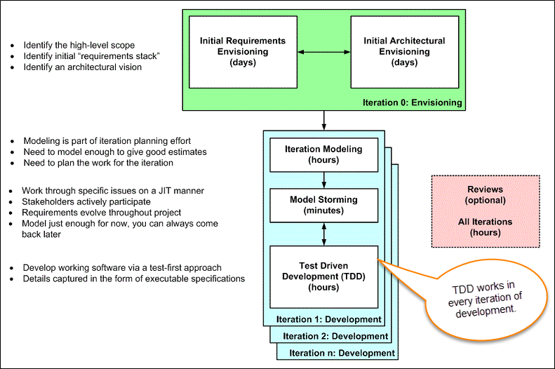
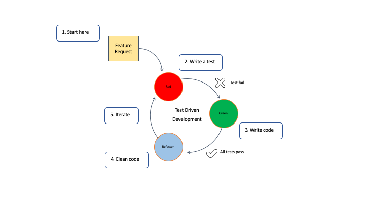

# Test-Driven Development

## What is acceptance TDD and Developer TDD

 

There are two levels of TDD:

1. **Acceptance TDD (ATDD)**: With ATDD you write a single acceptance test. This test fulfills the requirement of the specification or satisfies the behavior of the system. After that write just enough production/functionality code to fulfill that acceptance test. Acceptance test focuses on the overall behavior of the system.

2. **Developer TDD**: With Developer TDD you write single developer test i.e. unit test and then just enough production code to fulfill that test. The unit test focuses on every small functionality of the system. Developer TDD is simply called as TDD.The main goal of ATDD and TDD is to specify detailed, executable requirements for your solution on a just in time (JIT) basis. JIT means taking only those requirements in consideration that are needed in the system. So increase efficiency.

 

## Scaling TDD via Agile Driven Development (AMDD)

 

TDD is very good at detailed specification and validation. It falls short at addressing larger scoped problems such as overall design, use of the system, or UI. **AMDD** addresses the Agile scaling issues that TDD does not.

Thus AMDD used for bigger issues.

The lifecycle of AMDD:

In Model-driven Development (MDD), extensive models are created before the source code is written. Which in turn have an agile approach?

In above figure, each box represents a development activity.

Envisioning is one of the TDD process of predicting/imagining tests which will be performed during the first week of the project. The main goal of envisioning is to identify the scope of the system and architecture of the system. High-level requirements and architecture modeling is done for successful envisioning.

It is the process where not a detailed specification of software/system is done but exploring the requirements of software/system which defines the overall strategy of the project.

 

### Iteration 0: Envisioning

 

There are two main sub-activates:

1. *Initial requirements envisioning*. It may take several days to identify high-level requirements and scope of the system. The main focus is to explore usage model, Initial domain model, and user interface model (UI).

2. *Initial Architectural envisioning*. It also takes several days to identify architecture of the system. It allows setting technical directions for the project. The main focus is to explore technology diagrams, User Interface (UI) flow, domain models, and Change cases.

 

### Iteration modeling

 

Here team must plan the work that will be done for each iteration.

* Agile process is used for each iteration, i.e. during each iteration, new work item will be added with priority

* First higher prioritized work will be taken into consideration. Work items added may be re-prioritized or removed from items stack any time

* The team discusses how they are going to implement each requirement. Modeling is used for this purpose

* Modeling analysis and design is done for each requirement which is going to implement for that iteration.

 

### Model storming

 

This is also known as *Just-in-time* Modeling.

* Here modeling session involves a team of 2/3 members who discuss issues on paper or whiteboard.

* One team member will ask another to model with them. This modeling session will take approximately 5 to 10 minutes. Where team members gather together to share whiteboard/paper.

* They explore issues until they don’t find the main cause of the problem. Just in time, if one team member identifies the issue which he/she wants to resolve then he/she will take quick help of other team members.

* Other group members then explore the issue and then everyone continues on as before. It is also called as stand-up modeling or customer QA sessions.

 

### Test-Driven Development (TDD)

 

* It promotes confirmatory testing of your application code and detailed specification.

* Both acceptance test (detailed requirements) and developer tests (unit test) are inputs for TDD.

* TDD makes the code simpler and clear. It allows the developer to maintain less documentation.

 

### Reviews

 

* This is optional. It includes code inspections and model reviews.

* This can be done for each iteration or for the whole project.

* This is a good option to give feedback for the project.

## First steps of test-driven development

There are 5 steps in the TDD flow:

1. Read, understand, and process the feature or bug request.

2. Translate the requirement by writing a unit test. If you have hot reloading set up, the unit test will run and fail as no code is implemented yet.

3. Write and implement the code that fulfills the requirement. Run all tests and they should pass, if not repeat this step.

4. Clean up your code by refactoring.

5. Rinse, lather, and repeat.

The below figure shows these steps and their agile, cyclical, and iterative nature:

This workflow is sometimes called Red-Green-Refactoring, which comes from the status of the tests within the cycle.

* The red phase indicate that code does not work.

* The green phase indicates that everything is working, but not necessary in the most optimal way.

* The blue phase indicates that the tester is refactoring the code, but is confident their code is covered w/ tests which gives the tester confidence to change and improve our code.

## Test-driven development and CI/CD

The unit tests that come out of TDD are also an integral part of the continuous integration/continuous delivery (CI/CD) process. TDD relates specifically to unit tests and continuous integration/continuous delivery pipelines which run all the unit tests at commit time. 

`Continuous integration` is a development practice that requires developers to integrate code into a shared repository several times a day. Each check-in is then verified by an automated build, allowing teams to detect problems early. By integrating regularly, you can detect errors quickly, and locate them more easily.

The tests are run in the deployment pipeline. If all tests pass, integration and deployment will happen. On the other hand, if any tests fail, the process is halted, thus ensuring the build is not broken.

## How to write unit tests that fail

There are a couple different ways to write unit tests that fail.

1. Write a test that references a function in the code that doesn't exist yet. This will cause the test to fail w/ a non-found error (for instance, a 404 error).

2. Alter the assert statement to make it fail. An assert stmt says what value the code being tested is expected to return; this kind of stmt is a key aspect of a unit test. The assert stmt should reflect the feature or bug fix request.

So, to make it fail, you would write an assert stmt that returns an unexpected value in a data structure you want to enrich. For example, your JSON returns a person's name, but your new requirement says to include the person's cellphone number. You would first write the assert statement to only include the person's name, which would cause it to fail. Then you would add the code to include the person's phone number as well.

Or, in real life coding: Your assert statement could be: `assert actualResult == {'track': 'foo fighters'}`. Once the code (function) is hooked up, the 404 goes away, but the actual result could be an empty object like {}. You then hard code the result in the function to be `{'track':'foo fighters'}`.

The test will now pass (Green!). The code is obviously just a sub for now, but you can get the basic understanding. The test is wired up to a point in the code correctly. From there, you can implement actual business logic, for example, read a file/db/call an external API.

## Deciding when to write unit tests

In general, there are two cases for when you'd write unit tests:

**Case A**: You write a unit test for a concise story representing a feature request. For example, a feature request might be to count the number of countries that a particular currency exchange supports. The first thing I do is write a unit test and see it fail. Then, I change the code iteratively until the unit test passes.

**Case B**: A piece of buggy code in production breaks. This bug triggers an issue that requires a fix/patch to be implemented. Returning to the currency exchange example, the code, when run manually, the user expects that $USD are used in many countries but the behavior is wrong, only one country returns.

The first thing to do is write a unit test and see it fail. Then, correct the implementation code until the test passes. Not only does the dix the code and remove the bug, but it also gives me a unit test that I can use repeatedly to ensure this piece of code maintains its integrity.

## Recommended unit testing frameworks

* [`Pytest`](https://docs.pytest.org/en/latest/): An open source and easy to learn tool that makes it easy to conduct unit tests

* Java: [`Junit 5`](https://junit.org/junit5/): Programmer-friendly testing framework for Java

* NodeJS: [`Jest`](https://jestjs.io/): a delightful JavaScript Testing Framework, w/ a focus on simplicity
