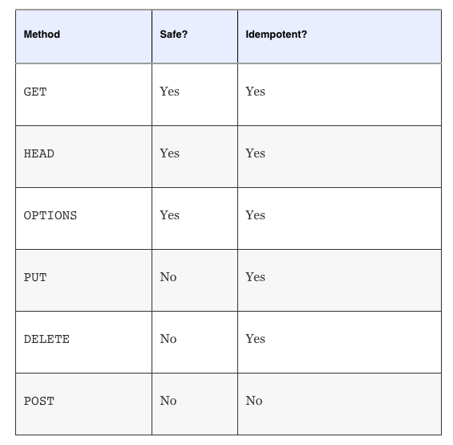

# HTTP Methods

HTTP defines a handful of methods, also called "verbs," that a client may use in order to describe the *type* of request being made

Each request can be modeled as doing a specific action on a resource. For example, a client may request to create, delete, update or simply read from a resource. In HTTP this corresponds to making `POST`, `DELETE`, `PUT` or `GET` requests respectively. `POST` and `PUT` requests accept payloads corresponding to the data being created or updated

Two additional methods, used much less frequently, are the `OPTIONS` and `HEAD` methods

The purpose of an `OPTIONS` request is to give the client information about what other methods may be used to interact w/ the resource in question

The `HEAD` request, on the other hand, is a little more useful. A `HEAD` request mimics a `GET` request, except that it omits the body of the response. Essentially, the client receives a response identical to what it would have received for a `GET` request, w/ the same meta data, but w/o the response body. Useful as it provides a quick way to check the response headers and existence of a resource

One important distinction laid down by HTTP is whether a method is **safe** or **unsafe**. A method is said to be safe if it doesn't modify a resource. In other words, the request may be thought of as "read-only". For example, making a `GET` (or `HEAD`) request for a resource from a server should not modify it in any way. All other methods are by default unsafe

Lastly, there is the concept of *idempotence*. An HTTP method is said to be idempotent if repeated invocations of a request lead to the same outcome. As long as the parameters of the request remain unchanged, the request could be made any number of times and the resource would still be left in the same state as if the request were made only once. This fits well w/ the notion of resource-oriented thinking

`GET`, `OPTIONS`, and `HEAD` are all naturally idempotent methods, as they are read-only operations. Additionally the `PUT` and `DELETE` methods are also characterized as idempotent. This is b/c updating any resource w/ the same set of parameters over and over again leads to the same end result

It may be slightly unintuitive for some to see why `DELETE` is also idempotent. Consider what happens to the system when multiple `DELETE` requests are made simultaneously. The first `DELETE` requests results in, well, the deletion of the resource. Making more `DELETE` requests at this point **does not modify the state that the system is in**. The system continues to remain in the same state that it was in after the first `DELETE` executed

To summarize:

## HTTP request methods

HTTP defines a set of **request methods** to indicate the desired action to be performed for a given resource. Although they can also be nouns, these request methods are sometimes referred to as *HTTP verbs*. Each of them implements a different semantic, but some common features are shared by a group of them: e.g. a request method can be safe, idempotent, or cacheable

**`GET`**

* The `GET` method requests a representation of the specified resource. Requests using `GET` should only retrieve data

**HEAD**

* The `HEAD` method asks for a response identical to a `GET` request, but w/o the response body

**POST**

* The `POST` method submits an entity to the specified resource, often causing a change in state or side effects on the server

**PUT**

* The `PUT` method replaces all current representations of the target resource w/ the request payload

**DELETE**

* The `DELETE` method deletes the specified resource

**CONNECT**

* The `CONNECT` method establishes a tunnel to the server identified by the target resource

**OPTIONS**

* The `OPTIONS` method describes the communication options for the target resource

**TRACE**

* The `TRACE` method performs a message loop-back test along the path to the target resource

**PATCH**

* The `PATCH` method applies partial modifications to a resouce
