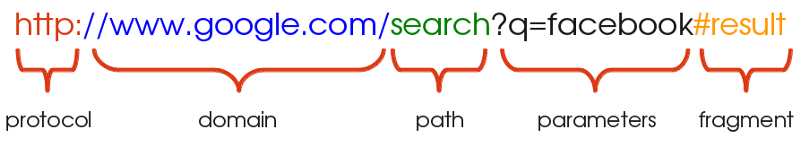

# RESTful Services Part I: HTTP in a Nutshell

The web is structured around resources. In early days, the web was merely a platform for sharing test/HTML based files, documents, images etc. In this sense, the web can be thought of as a collection of resources and is often referred to as bing *resource-oriented*

*Services* provide a means for exposing complexity, functionality, and interconnectivity within applications to clients. Generally, large applications may want to provide programmatic access to their platform to other developers and may do so by making use of services

Alternatively, services may be used to decompose an application into different logical units, interacting amongst themselves to produce some end result. In this case, a service acts as a consumer of other services

W/ services forming a critical component of web apps, devs naturally try and ensure that they are designed in a way that is scalable, performant and work w/ as little overhead as possible — both technical and otherwise

→ REST, short for REpresentational State Transfer, is an architectural style, aims to leverage all the same constructs that have allowed the Web to grow over the last couple of decades. It uses these as guiding principles for designing web services

Since all communication on the Web happens over HTTP, REST is intricately tied to it and uses a lot of the same ideas. As such, an understanding of REST requires an understanding of the underlying concepts of HTTP

## HTTP in a Nutshell

Most web applications are built around a client-server model. A client could be something as simple as a web browser displaying plain old HTML, a mobile application fetching and creating data or even other web services

Similarly, servers could be implemented in a variety of ways, using different tech stacks, languages, and serving different types of data

In order to accomodate this diversity, clients and servers must agree upon a set of conventions — a *protocol* — that dictates all communication btwn them. This protocol allows a web server to receive the information — *requests* — send by an arbitrary client, process them, and respond appropriately 

Modern day web apps use the *Hypertext Transfer Protocol*, commonly abbreviated to HTTP, in order to exchange information → provides a structured format for exchange of information over the web

As we shall see, HTTP lays down a broad set of guidelines in order to describe the type of data being exchanged — along w/ its format, validity, and other attributes

In the past, apps typically relied on HTTP solely as a transmission mechanism. Clients and servers exchange data *using* HTTP. Other conventions must then be developed in order to make sense of that data. One example of such a paradigm is SOAP, alternative to REST

HTTP already has the constructs needed in order to specify the action and the resource being acted upon (*client request*), as well as the outcome of those actions (*server response*), which prevents for additional overhead to transfer information

## 1. URLs

URL = Uniform Resource Locator & used to identify the address of a resource on the Web



A URL typically consists of the following components:

* *Protocol*: This is the protocol that the request is served over. This is most often just HTTP (or its secure version, HTTPS). Other protocols such as SMTP and FTP exist and may be used instead, but we will limit ourselves to HTTP in this discussion

* *Domain*: This is the host name of the server the resource is being requested from. The domain may be equivalently replaced by an IP address, which is usually done under the hood by a DNS

* *Path*: This is the location of the resource on the server. This may correspond to the location of the resource within the file system (i.e. /search/files/myFile.txt) although this practice is rarely used nowadays. It is more common for web services to nest paths based on relationship btwn resources (i.e. myBlog/blog/comments) where *blog* and *comments* represent two distinct resources

* *Parameters*: This is additional data, passed in the form of key-value pairs, that may be used by the server to identify the resource, or filter a list of resources

* *Fragment*: A fragment refers to a location *within* the resource being returned and is typically applied to documents. This may be thought of as a bookmark within the document returned and instructs the browser to locate the content at the bookmarked point and display it. For example, for HTML documents the browser directly scrolls to the element identified by the anchor. Fragments are also referred to as *anchors*

## 3. Status Codes

Status codes are a useful HTTP construct that provide information to the consumer about the outcome of a request and how to interpret it. For example, if I were to make a request to retrieve a file from a web server, I would expect to see a response w/ the status code describing whether or not my request was completed successfully. If not, the status code would give me a further clue as to why my request failed

HTTP defines several status codes, each pertaining to a specific scenario. Some of the common series of codes you might encounter are listed here:

* **2xx**: Status codes falling in the **2xx** series imply that the request completed successfully and w/o errors. Code 200 is the typical example

* **3xx**: A code in the **3xx** series implies redirection. This means that the server redirected to another location on receiving the request

* **4xx**: A **4xx** error, i.e. 400, 403, 404 etc are used when there is an error in the request made. This could be caused by a variety of reasons, such as unauthorized access to a resource, trying to work w/ a resource that doesn't actually exist, invalid parameters and so on

* **5xx**: A **5xx** response is used when there is an error on the server side. This means that the server is aware of the error and is incapable of processing this request. Typically, the response is accompanied by a brief description of what the cause of the error might be

## 4. HTTP Headers

Headers are an essential part of the HTTP communication. They serve to provide additional information for handling requests and responses. Note that the headers do not relate to the identification of the resource that is being acted upon. They typically appear as key value pairs and provide a host of information such as the cache policy for the response, the acceptable response type enforced by the client, the preferred language of response, encoding, etc

Credentials for authentication and authorization — such as access tokens — are also commonly passed using the *Authorization* header

Similarly, the server may also make use of response headers to set cookies on the client and analogously retrieve them w/ the same mechanism

Headers for a `GET` request made to *medium.com/bookmarks*

```
Request Headers
    :authority: medium.com
    :method: GET
    :path: /browse/bookmarks
    :scheme: https
    accept: text/html,application/xhtml+xml,application/xml
    accept-encoding:
    accept-language
    cache-control:
    cookie:
    upgrade-insecure-requests:
    user-agent:
```

**A note on HTTPS**: To avoid confusion, it is also important to understand what HTTPS is and how it differs from regular HTTP. Both HTTP and HTTPS use the same underlying mechanisms for transferring information, although HTTPS is (far) more secure. Data transferred over HTTPS is fully encrypted. This is an important consideration when the information in question is confidential, such as financial data or a user's personal information
