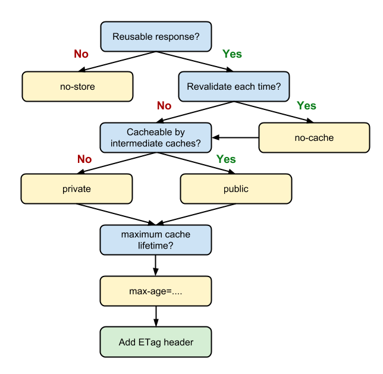
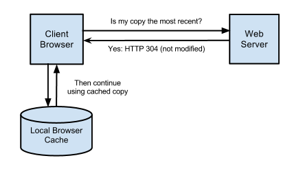

# RESTful Services Part II: Constraints and Goals

HTTP is only a small part of what goes into writing modern web services → how you *apply* constructs to create maintainable, robust services

## Defining REST

REST stands for **RE**presentational **S**tate **T**ransfer. It's an *architectural style*. This means that REST does not impose a formal standard to determine whether or not a web service is RESTful. Rather, it has a set of broad *constraints, each w/ a specific goal in mind

## Fielding's Constraints

Fielding create these constraints w/ the ultimate goal of making apps faster, more reliable, and easier to scale

As a web service designer, your service should try to comply w/ these constraints as closely as possible in order to reap their benefits

### Constraint #1: Client-Server Architecture

The first constraint proposed by REST is the separation of the server from its client. You should encourage separation of concerns btwn your server and clients wherever possible. Your goal should be to maximize the division of labor — and minimize overlap — btwn the two

The server, or *back end*, is typically responsible for storing your app's persistent data, along w/ all the business logic required to interact w/ it. This could include user authentication, authorization, data validation

The client, or *front end*, is responsible for making requests to the service, then doing something meaningful w/ the response that it receives

The client itself may be a web service, in which case it simply consumes the data. Alternatively, it may be user-facing. An example of this would be a web or mobile app. Here, it is also responsible for both *presenting* the data to the user, and presenting an *interface* for the user to interact w/

You should be able to treat each of these two components as a *black box* w/ respect to one another. This way, they can be modified independently. This encourages modularity within the app

This concept is not unique to RESTful apps, or even web applications. Most developers try to break up their projects into independent components anyway. But by stating this as an explicit constraint of RESTful design, Fielding further encourages this practice

Lastly, reducing the number of things that the server is responsible for reduces the amount of logic necessary. This in turn allows for better scalability and increased performance

### Constraint #2: Statelessness

Main goal of a stateless service is to make incoming requests self-sufficient, and execute them in complete isolation

Each request must have all the information that the server might need to properly process it and respond. In other words, the server does not need to use information from previous requests. The responsibility of maintaining the app state of a client is thus handed off to the client itself

In order to understand this, consider a very simple web service responsible for responding to a user's search queries. The exact representation of the entity being searched for is irrelevant. What's important is that, instead of returning hundreds of search results in a single go, the server employs *pagination*: returning only 10 results at a time out of an arbitrarily large result set

In a traditional "stateful" model of development, the server may be designed in such a way that it keeps track of all of its clients, along w/ all the pages they've already accessed

And so, when a request comes in for a new page, the server's able to look up the client in its system and determine the most recent page it received

Then the server can proceed to respond w/ the *next* page, and update its system to reflect this. This goes on as the client continues navigating the result set

In an alternate, stateless approach, the responsibility for maintaining its state is decentralized and shifted onto the client. The client then must specify the *actual* page numbers of the result they want, as opposed to asking for the next page. For example:

```
GET http://my-awesome-web-service.com/pages/1
GET http://my-awesome-web-service.com/pages/3
```

A stateless approach brings a couple of major advantages w/ it. First off, keeping track of client state becomes increasingly taxing on a server as the number of clients scales

Secondly, and more importantly, a stateless service is also **easily distributable**. If a server is responsible for maintaining information about an app's state, then it is also imperative that future requests are routed to the server that is *storing* this information

If there are hundreds of servers responsible for processing incoming requests, then there must be some mechanism in place to ensure that requests from a specific client always end up at a specific server instance

In the event that a server instance goes down, all information about a client's state that was stored on that server goes down w/ it

Of course, you could come up w/ an architecture where server instances can share data among themselves

A stateless service, by contrast, makes it much simpler to add and remove server instances on an ad-hoc basis. You can then further balance the load btwn them as needed

Since the servers are agnostic to the incoming requests, scaling up is just a matter of adding more servers to the load balancer. Similarly, killing servers — intentionally or otherwise — does not impact a service's reliability

Of course, this simplicity comes at a cost. Having the client attach identical data w/ every request is a potential source of redundancy. Bandwidth isn't free, so any additional information transferred adds some amount of overhead

### Constraint #3: Cache

The third constraint is that of explicit cacheability. The idea is to mark messages returned by a service as explicitly cacheable or non-cacheable. If they're cacheable, the server should figure out the *duration* for which the response is valid

If the client has access to a valid cached response for a given request, it avoids repeating the same request. Instead, it uses its cached copy. This helps alleviate some of the server's work, and thus contributes to scalability and performance

This is a form of *optimistic replication* — also known as *lazy replication* — where the service does not try to guarantee 100% consistency btwn itself and its clients unless absolutely critical. Instead, it makes this sacrifice in exchange for a gain in perceived performance

For example, an API corresponding to a blogging platform may choose to make the list of blog posts cacheable for a couple of minutes if it knows that the frequency w/ which ppl try to **access** the posts far exceeds the frequency w/ which new posts are created. As a result, users may **occasionally** be presented w/ stale data, but the system as a whole performs better

Of course, the cacheability of a resource and its duration are not universal, and require some consideration. If you chose incorrectly, this may frustrate your users

Web services typically achieve cacheability using the standard **Cache-Control** header. Sometimes they do this in conjunction w/ other headers specified by HTTP

The Cache-Control header effectively serves as a switch, determining whether a browser should cache the response in question

Resources marked as *private* are cached only by the client, and are therefore limited to that one client only

Resources marked *public*, on the other hand, may be cached by one or more intermediate proxies btwn the service and the client

As a result, these resources may potentially be served to multiple users. Alternatively, one may pass in the argument *no-cache* and completely stop any caching of the resource

Here's what one of these Cache-Control headers looks like:

```
Cache-Control: public;max-age=3431901
```

The header also lets you specify the *duration* for which the resource is valid. This lets the client know when it should stop using its cached copy and request a new copy

Here's the logic behind this:



Apart from this, HTTP also has mechanisms in place to perform what is known as a *conditional request*. The goal here is for the server to return certain resources to the client **only when specific conditions are met**



Assuming the client has a saved copy of a resource in its cache, it can make a request to the server to determine whether there is an updated copy of that same resource. If there is one, the server returns the new copy. Otherwise it tells the client to keep using its local copy

This helps prevent transfer of data over the network, while also making sure that the client has access to fresh data at all times

There are a couple of ways HTTP lets you accomplish this:

#### Caching Approach #1: If-Modified-Since/Last-Modified

Along w/ every response that the server sends back, it may choose to attach a *Last-Modified* timestamp. This indicates when the resource was last changed

When the client needs to request the resource again in the future, it makes the request to the server as it normally would, but w/ a relevant *If-Modified-Since* header. This tells the server to return the new copy of the resource, if one exists

Otherwise, the server returns the status code **304**, which instructs the client to keep using the copy it already has

#### Caching Approach #2: If-None-Match/ETag

This scheme works similar to the previous one, except for the way resources are identified. Instead of using timestamps, the server sends back w/ each response a unique hash explaining the state of the resource at that point in time (known as the ETag)

For future requests, the client sends the relevant ETag to the server. If a resource exists w/ the same ETag, the server tells the client to keep using the cached copy. Otherwise the server sends a new one back to the client

Caching is complicated. As your service begins to add more users, you'll want to learn more about caching and how you can use it to your advantage

### Constraint #4: Uniform Interface

The *Uniform Interface* (or *Uniform Contract*) tells a RESTful service what to serve, in the form of a document, image, non-virtual object, etc

REST does not however, dictate *how* you choose to interact w/ these resources, as long as they are consistent and well understood

In general, before a client can interact w/ a RESTful service, it needs to agree on:

1. **Identification**: There must be a way to uniquely identify every resource that the service has to offer

2. **Manipulation**: There must be a standard set of operations that can be performed on any given resource w/ predictable outcomes. The outcomes of these operations must also be self descriptive and uniquely understood

HTTP, for example, makes use of URLs for identification of resources. It also uses a handful of action verbs and well documented status codes to facilitate interaction w/ resource

Up until this point, we have considered RESTful services as being strictly tied to HTTP. W/ regards to web services, this is almost always accurate

But in theory, REST can be implemented over any protocol that provides a decent way to achieve the two conditions described above. For this reason, REST is sometimes also referred to as *REST over HTTP* to clarify that it's being used over the web

### Constraint #5: A Layered System

A layered system builds on the client-server constraint we discussed earlier, and enforces an even more separation of concerns. The overall architecture of your service an be separated into individual *layers*, each serving a specific function

More importantly, each layer must act independently, and interact only w/ the layers immediately adjacent to it. This forces requests to propagate in a predictable manner, w/o bypassing layers

For example, in order to scale, you may make use of a proxy behaving like a load balancer. The sole purpose of the proxy would then be to forward incoming requests to the appropriate server instance

The client, on the other hand, does not need to be aware of this division. It simply continues making requests to the same URL, unconcerned w/ the details of how the requests are being processed

Similarly, there may be another layer in the architecture responsible for caching responses in order to minimize the work needed to be done by the server

Another layer may behave like a *gateway*, and translate HTTP requests to other protocols

One way you could use this would be to implement an FTP server. The client, would continue to make requests to what it perceives to be an HTTP server, while you actually have an FTP server doing the work under the hood

Just like the client-server distinction, this layered system constraint minimizes the risk of coupling functionality in your service, but at the expense of additional overhead in the system

## Conclusion

Though these are technically hard requirements that a service must fulfill in order to be considered RESTful, in practice this does not always happen

Building real services is more about solving the problems at hand than meeting technical definitions. As a result, these constraints are most often used as guidelines by developers and architects, who then decide which rules to follow in their efforts to meet their own specific goals

This is where the terms *partially restful* and *fully restful* come from. And in fact, most services you encounter online aren't technically RESTful
