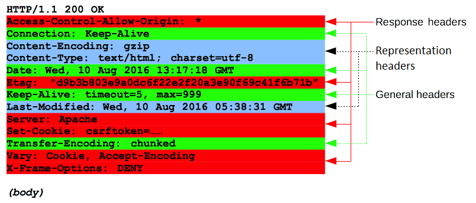

# HTTP Messages

HTTP messages are how data is exchanged btwn a server and a client. There are two types of messages: *requests* sent by the client to trigger an action on the server, and *responses*, the answer from the server

HTTP messages are composed of textual information encoded in ASCII, and span over multiple lines. In HTTP/1.1, and earlier version of the protocol, these messages were openly sent across the connection. In HTTP/2, the once human-readable message is now divided up into HTTP frames, providing optimization and performance improvements

Web developers, or webmasters, rarely craft these textual HTTP messages themselves: software, a Web browser, proxy, or Web server, perform this action. They provide HTTP messages through config files (for proxies or servers), APIs (for browsers), or other interfaces


The HTTP/2 binary framing mechanism has been designed to not require any alteration of the APIs or config files applied: it is broadly transparent to the user

HTTP requests, and responses, share similar structure and are composed of:

1. A *start-line* describing the requests to be implemented, or its status of whether successful or a failure. This start-line is always a single line

2. An optional set of *HTTP headers* specifying the request, or describing the body included in the message

3. A blank line indicating all meta-information for the request has been sent

4. An optional *body* containing data associated w/ the request (like content of an HTML form), or the document associated w/ a response. The presence of the body and its size is specified by the start-line and HTTP headers

The start-line and HTTP headers of the HTTP message are collectively known as the *head* of the requests, whereas its payload is known as the *body*


## HTTP Requests

### Start line

HTTP requests are messages sent by the client to initiate an action on the server. Their *start-line* contains three elements:

1. An *HTTP method*, a verb (like `GET`, `PUT`, or `POST`) or a noun (like `HEAD` or `OPTIONS`), that describes the action to be performed. For example, `GET` indicates that a resource should be fetched or `POST` means that data is pushed to the server (creating or modifying a resource, or generating a temporary document to send back)

2. The *request target*, usually a URL, or the absolute path of the protocol, port, and domain are usually characterized by the request context. The format of this request target varies btwn different HTTP methods. It can be

    * An absolute, ultimately followed by a `'?'` and query string. This is the most common form, known as the *origin form*, and is used w/ `GET`, `POST`, `HEAD`, and `OPTIONS` methods

        * `POST / HTTP/1.1`
    
        * `GET /background.png HTTP/1.0`
    
        * `HEAD /test.html?query=alibaba HTTP/1.1`

        * `OPTIONS /anypage.html HTTP/1.0`

    * A complete URL, known as the *absolute form*, is mostly used w/ `GET` when connected to a proxy
   
    ```
    GET https://developer.mozilla.org/en-US/docs/Web/HTTP/Messages HTTP/1.1
    ```
   
    * The authority component of a URL, consisting of the domain name and optionally the port (prefixed by a `':'`), is called the *authority form*. It is only used w/ `CONNECT` when setting up an HTTP tunnel.

    ```
    CONNECT developer.mozilla.org:80 HTTP/1.1
    ```

   * The *asterisk form*, a simple asterisk (`'*'`) is used w/ `OPTIONS`, representing the server as a whole.

    ```
    OPTIONS * HTTP/1.1
    ```
   
3. The *HTTP version*, which defines the structure of the remaining message, acting as an indicator of the expected version to use for the response

### Headers

HTTP headers from a request follow the same basic structure of an HTTP header: a case-insensitive string followed by a colon (`':'`) and a value whose structure depends upon the header. The whole header, including the value, consists of one single line, which can be quite long

Many different headers can appear in requests. They can be divided in several groups:

* General headers, like `Via`, apply to the message as a whole

* Request headers, like `User-Agent` or `Accept`, modify the request by specifying it further (like `Accept-Language`), by giving context (like `Referer`), or by conditionally restricting it (like `If-None`)

* Representation headers like `Content-Type` that describe the original format of the message data and any encoding applied (only present if the message has a body)


### Body

The final part of the request is its body. Not all requests have one: requests fetching resources, like `GET`, `HEAD`, `DELETE`, or `OPTIONS`, usually don't need one. Some requests send data to the server in order to update it: as often the case w/ `POST` requests (containing HTML form data)

Bodies can be broadly divided into two categories:

* Single-resource bodies, consisting of one single file, defined by the two headers: `Content-Type` and `Content-Length`

* Multiple-resource bodies, consisting of a multipart body, each containing a different bit of information. This is typically associated w/ `HTML Forms`

## HTTP Responses

### Status line

The start line of an HTTP response, called the *status line*, contains the following information:

1. The *protocol version*, usually `HTTP/1.1`

2. A *status code*, indicating success or failure of the request. Common status codes are `200`, `404`, or `302`

3. A *status text*. A brief, purely informational, textual description of the status code to help a human understand the HTTP message

A typical status line looks like: `HTTP/1.1 404 Not Found`

### Headers

HTTP headers for responses follow the same structure as any other header: a case-insensitive string followed by a colon (`':'`) and a value whose structure depends upon the type of the header. The whole header, including its value, presents as a single line

Many different headers can appear in responses. These can be divided into several groups:

* General headers, like `Via`, apply to the whole message

* Response headers, like `Vary` and `Accept-Ranges`, give additional information about the server which doesn't fit in the status line

* Representation headers like `Content-Type` that describe the original format of the message data and any encoding applied (only present if the message has a body)



### Body

The last part of a response is the body. Not all responses have one: responses w/ a status code that sufficiently answers the request w/o the need for corresponding payload (like `201` `Created` or `204` **`No Content`**) usually don't

Bodies can be broadly divided into three categories:

* Singe-resource bodies, consisting of a single file of known length, defined by the two headers: `Content-Type` and `Content-Length`

* Single-resource bodies, consisting of a single file of unknown length, encoded by chunks w/ `Transfer-Encoding` set to `chunked`

* Multiple-resource bodies, consisting of a multipart body, each containing a different section of information

## HTTP/2 Frames

HTTP 1/1.x messages have a few drawbacks for performance:

* Headers, unlike bodies, are uncompressed

* Headers are often very similar from one message to the next one, yet still repeated across connections

* No multiplexing can be done. Several connections need opening on the same server: and warm TCP connection are more efficient that cold ones

HTTP/2 introduces an extra step: it divides HTTP/1.x messages into frames which are embedded in a stream. Data and header frames are separated, which allows header compression. Several streams can be combined together, a process called *multiplexing*, allowing more efficient use of underlying TCP connections


HTTP frames are now transparent to Web developers. This is an additional step in HTTP/2, btwn HTTP/1.1 messages and the underlying transport protocol. No changes are needed in the APIs used by Web developers to utilize HTTP frames; when available in both the browser and the server, HTTP/2 is switched on and used

## Conclusion

HTTP messages are the key in using HTTP; their structure is simple, and they are highly extensible. The HTTP/2 framing mechanism adds a new immediate layer btwn the HTTP/1.x syntax and the underlying transport protocol, w/o fundamentally modifying it: building upon proven mechanisms
