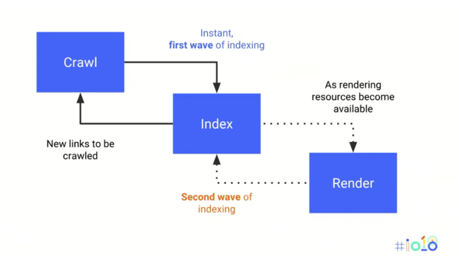

# JavaScript SEO: Server Side Rendering vs Client Side Rendering

## JavaScript SEO

At its core, JavaScript SEO is the practice of making sure that content on a page (executed via JS) is being correctly rendered, indexed, and ultimately ranked in search results by search engines. This is especially persistent due to the increasing popularity of client side rendering and websites built upon JavaScript frameworks. Before we continue, let's look at the two predominate types of rendering:

* **Server side rendering (SSR)** — the traditional rendering method, basically all of your page's resources are housed on the server. Then, when the page is requested, the HTML is delivered to the browser and rendered, JS and CSS downloaded, and final render appears to the user/bot

* **Client side rendering (CDS)** — a more recent kind of rendering method, this relies on JS executed on the client side (browser) via a JavaScript framework. Essentially the client will first request the source code which will have very little indexable HTML in it, then a second request will be made for the `.js` file containing all of the HTML in JavaScript as strings

## The Main Differences btwn SSE and CSR?

Server side rendering can be a bit faster at the initial request, quite simply b/c it doesn't require as many round trips to the server. However, it doesn't end here, performance also depends upon some additional factors. All of which can result in drastically varied user experiences:

* The internet speed of the user making the request

* How many active users are accessing the site at a given time

* The physical location of the server

* How optimized the pages are for speed

Client side rendering, on the other hand, is slower at initial request b/c it's making multiple round trips to the server. However, once these requests are complete, CSR offers a blazing fast experience via the JS framework

Here's a useful metaphor describing the difference btwn SSR and CSR:

W/ server-side rendering, whenever you want to see a new web page, you have to go out and get it, this is analogous to you driving over to the super market every time you want to eat. W/ client-side rendering, you go to the super market once and spend 45 minutes walking around buying a bunch of food for the month. Then, whenever you want to eat, you just open the fridge."-Adam Zerner

## Why is this Trend Happening?

W/ the growing popularity of JavaScript frameworks, such as Angular, React, and Vue.js, developers can now deliver webpages more efficiently and also provide an incredibly fast user experience. However, if not planned out carefully, this leap in efficiency can come at a substantial SEO price in the present

In the past, JS was predominantly used to add various levels of interaction to a web page. This was achieved by referencing JS libraries like JQuery. B/c the JS was simply manipulating the HTML content already present in the source code, there was little issue w/ search engines discovering and indexing the content. However, w/ some of the JS frameworks and CSR of today, all of a sudden the source code for webpage is practically blank and the content exclusively rendered by JS execution on the client side

This complicates things for search engines, but Google is really the only search engine today that is even somewhat posed to handle it. None of the other search engines have anywhere near the JS rendering capabilities being employed by Google presently. This means that even if your CSR content can be indexed by Google, it's probably not being indexed by any other search engines

## How does Google handle JavaScript rendering today?

Google has recently revealed their current two wave process for JS rendering and indexing at Google I/O

The **first wave** requests source code, crawls and indexes any present HTML and CSS, adds any present links to the crawl queue and downloads page response codes

* On a client side rendered site however, there's basically nothing for Google to index in the source code during this first wave

The **second wave** can occur a few hours to even a few weeks later, Google returns to the page when additional resources are available to fully render and index the JS generated content

* This means that where as in SSR there is generally no issue w/ Google's rendering delay b/c the content is all in the source code and indexed during the first wave, in CSR, where the index-able content is only revealed at render, this sizable delay can mean the content may not be indexed or appear in search results for days or even weeks

## Why does Google Struggle w/ JavaScript Rendering?

*"Why does Google need a two-step process to render JavaScript at all?"*

It's important to remember that rendering JavaScript at scale is very resource intensive. This means substantially increased electricity usage, processor power, potential crawl rate reduction and more. This in turn translates to significantly increased monetary cost

The reason?

JavaScript requires the search engine to spend longer rendering, which means additional electricity expended, increased CPU demand as well as dramatically slowing down the standard rendering process. Now, imagine every website on the web using straight CSR and you can begin to see just why rendering JS at such a scale can be problematic for search engines trying to operate efficiently

This additional work to render JS is not unique to just search engines though, you can also witness the effects of increased JS rendering strain on your own devices as well:

* For user comps (user desktops, laptops, mobile, tablets, etc), their CPU capabilities can differ greatly for each device type, for example a mobile device's CPU will generally struggle more w/ a heavy JS laden site than a desktop comp

* Heavy JavaScript can consume a large amount of a device's CPU, memory and even battery life. This shows just how far reaching the impact of JavaScript can have on performance, stretching from Googlebot all the way down to a user's mobile device

* As a result, it is always a good idea to test the pages using Chrome Dev Tools' "Performance" tab to test the run time performance. Here you can run test driven performance via network "throttling," which helps to simulate different mobile device CPU capacities, different internet speeds, and how well your pages are handled at those specifications

## What are the SEO Implications of SSR and CSR?

For server side rendering, all of the HTML content is present in the source code which means the search engine can request, crawl and index it immediately. Resulting in faster time to actually appear and be ranked in search results

For client side rendering, the HTML needing to be indexed is only revealed when the JS is fully rendered on the client side. Thus, w/ the two wave system Google currently employs, it can take anywhere from a few hours to a week before the content can be crawled, indexed and begin being ranked in search results

This time frame is also not taking into account whether there is prioritization logic at work on Google's end. If so, in some instances it could potentially take even longer

## What's the Solution?

While Google is currently working on upgrading its JavaScript rendering capabilities to be included in future Chrome releases, this vague timeline does not help webmasters today struggling w/ their CSR content not being indexed. This is also not taking into account all other search engines who are not even up to par w/ Google's current JS rendering capabilities

There are two primary solutions to this problem:

1. **Pre-rendering**—Essentially consists of listening and sending a pure HTML snapshot to the search engine bot when it requests your page. This ensures that the user can still enjoy the fast speeds provided by CSR, while also serving the search engines the HTML content needed to index and rank your pages

2. **Isomorphic JavaScript**—Recommended by Google, this option consists of both client and search engines receiving a pre-rendered page of indexable HTML content at the initial load (essentially acting like SSR). All of the JS functionality is then layered on top of this to provide the fast client side performance. It also works best for both users and search engine bots, however, there are a few glaring issues w/ Isomorphic rendering:

    * Implementation can be tricky, and many developers struggle w/ it. It can also be quite expensive given the resources needed to successfully implement. Extensive research should be done to determine the best way to perform SSR w/ your JS framework.

## Conclusion

It's clear that the use of JavaScript to enhance interactive, user experience and render web pages is only increasing. As such, it's up to use as SEOs to better communicate these considerations w/ our developers when approaching new projects

Google, and search engines in general, will continue to improve their capacity to render JS pages at scale. However, this will undoubtedly reveal new obstacles to overcomes as development techniques also continue to march forward. The ideas covered in this article are designed to give you a high level rundown of JavaScript SEO and the implications that spawned it
