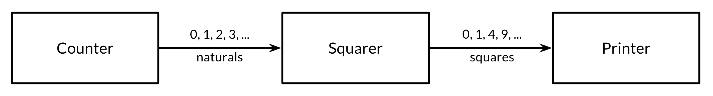

# 8.4.2 Pipelines

Channels can be used to connect goroutines together so that the output of one is the input to another. This is called a *pipeline*. The program below consists of three goroutines connected by two channels, as shown schematically in Figure 8.1.



The first goroutine, *counter*, generates the integers 0, 1, 2, ..., and sends them over a channel to the second goroutine, *squarer*, which receives each value, squares it, and sends the result over another channel to the third goroutine, *printer*, which receives the squared values and prints them. For clarity of this example, we have intentionally chosen very simple functions, though of course they are too computationally trivial to warrant their own goroutines in a realistic program.

*gopl.io/ch8/pipeline1*

```go
func main() {
    naturals := make(chan int)
    squares := make(chan int)

    // Counter
    go func() {
        for x := 0; ; x++ {
            naturals <- x
        }
    }()

    // Squarer
    go func() {
        for {
            x := <-naturals
            squares <- x * x
        }
    }()

    // Printer (in main goroutine)
    for {
        fmt.Println(<-squares)
    }
}
```

As you might expect, the program prints the infinite series of squares 0, 1, 4, 8, and so on. Pipelines like this may be found in long-running server programs where channels are used for lifelong communication between goroutines containing infinite loops. But what if want to send only a finite number of values through the pipeline?

If the sender knows that no further values will ever be sent on a channel, it is useful to communicate this fact to the receiver goroutines so that they can stop waiting. This is accomplished by *closing* the channel using the built-in `close` function:

```go
close(naturals)
```

After a channel has been closed, any further send operations on it will panic. After the closed channel has been *drained*, that is, after the last sent element has been received, all subsequent receive operations will proceed w/o blocking but will yield a zero value. Closing the `naturals` channel above would cause the squarer's loop to spin as it receives a never-ending stream of zero values, and to send these zeros to the printer.

There is no way to test directly whether a channel has been closed, but there is a variant of the receive operation that produces two results: the received channel element, plus a boolean value, conventionally called `ok`, which is `true` for a successful receive and `false` for a receive on a closed and drained channel. Using this feature, we can modify the squarer's loop to stop when the `naturals` channel is drained and close the `squares` channel in turn.

```go
// Squarer
go func() {
    for {
        x, ok := <-naturals
        if !ok {
            break // channel was closed and drained
        }
        squares <- x * x
    }
    close(squares)
}()
```

Because the syntax above is clumsy and this pattern is common, the language lets us use a `range` loop to iterate over channels too. This is a more convenient syntax for receiving all the values sent on a channel and terminating the loop after the last one.

In the pipeline below, when the counter goroutine finishes its loop after 100 elements, it closes the `naturals` channel, causing the squarer to finish its loop and close the `squares` channel (In a more complex program, it might make sense for the counter and squarer functions to defer the calls to `close` at the outset). Finally, the main goroutine finishes its loop and the program exits

*gopl.io/ch8/pipeline2*

```go
func main() {
    naturals := make(chan int)
    squares := make(chan int)

    // Counter
    go func() {
        for x := 0; x < 100; x++ {
            naturals <- x
        }
        close(naturals)
    }()

    // Squarer
    go func() {
        for x := range naturals {
            squares <- x * x
        }
        close(squares)
    }()

    // Printer (in main goroutine)
    for x := range squares {
        fmt.Println(x)
    }
}
```

You needn't close every channel when you've finished w/ it. It's only necessary to close a channel when it is important to tell the receiving goroutines that all data have been sent. A channel that the garbage collector determines to be unreachable will have its resources reclaimed whether or not it is closed. (Don't confuse this w/ the close operation for open files. It is important to call the *Close* method on every file when you've finished w/ it).

Attempting to close an already-closed channel causes a panic, as does closing a nil channel. Closing channels has another use as a broadcast mechanism, which we'll cover in Section 8.9.
