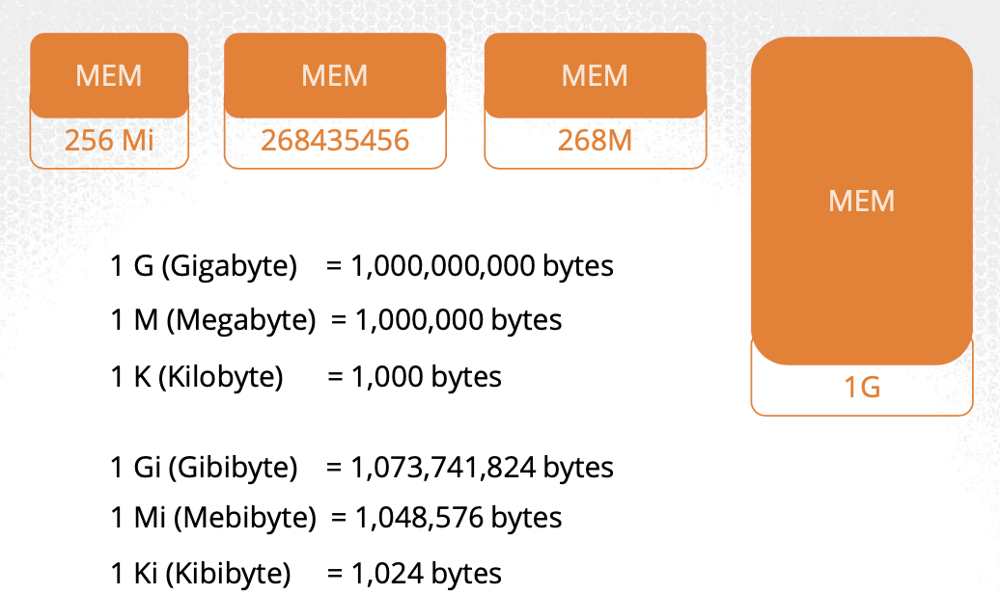

# Resource Requirements

* Each node has a set of CPU, Memory, and Disk resources available

  * Every pod consumes a set of resources. In our case, a pod will consume 2 CPUs, 1 memory, and some disk space

  * Whenever a pod is placed on a node, it consumes resources available to that node

* Is the K8s scheduler that decides which Node a pod is scheduled to

  * The scheduler takes into consideration the amount of resources required by a pod and those available on the nodes

* If there is no sufficient resources available on any of the nodes, K8s holds back scheduling the pod, and you will see the pod in a pending state

  * `kubectl get events` will indicate that the reason is "insufficient CPU"

## Resource requirements within pods

* By default, K8s assumes that a pod or a container within a pod requires .5 CPU and 256 Mebibyte of memory. This is known as the resource request for a container, or the minimum amount of CPU or Memory requested by the container

```yaml
apiVersion: v1
kind: Pod
metadata:
  name: simple-webapp-color
  labels:
    name: simple-webapp-color
spec:
  containers:
    - name: simple-webapp-color
      image: simple-webapp-color
      ports:
        - containerPort: 8080
      resources:
        requests:
          memory: "1Gi"
          cpu: 1
```

* When the scheduler tries to place the pod on a node, it uses these numbers to identify a Node which has sufficient amount of resources available

## CPU

* You can specify any value as a low as 0.1

  * 0.1 CPU can also be expressed as 100m where `m` stands for milli

  * You can go as low as 1m, but not any lower than that

* 1 count of CPU is equivalent to 1 vCPU; that’s 1 vCPU in AWS, or 1 Core in GCP or Azure or 1 Hyperthread

  * 1 AWS vVPU

  * 1 GCP Core

  * 1 Azure Core

  * 1 Hyperthread

## Memory



* W/ memory, you could specify 256 Mibibyte using the Mi suffix

> [!NOTE]
> 
> G is Gigabyte and refers to a 1000 Megabytes, whereas Gi refers to Gibibyte and refers to 1024 Mebibyte. The same applies to Megabyte and Kilobyte.

## Exceeding limits

* So what happens when a pod tries to exceed resources beyond its specified limit?

  * When dealing w/ CPU, K8s throttles the CPU so that it does not go beyond the specified limit

  * A container cannot use more CPU than its limit

* However, this is not the case w/ memory

  * A container can use more memory resources than its limit

  * So, if a pod tries to consume more memory than its limit constantly, the pod will be terminated

## Default resource requirements and limits

* For the pod to pick up default resource requirements, those default values for request and limit must be set by creating a LimitRange in that namespace:

```yaml
apiVersion: v1
kind: LimitRange
metadata:
  name: mem-limit-range
spec:
  limits:
  - default:
      memory: 512Mi
    defaultRequest:
      memory: 256Mi
    type: Container
```

