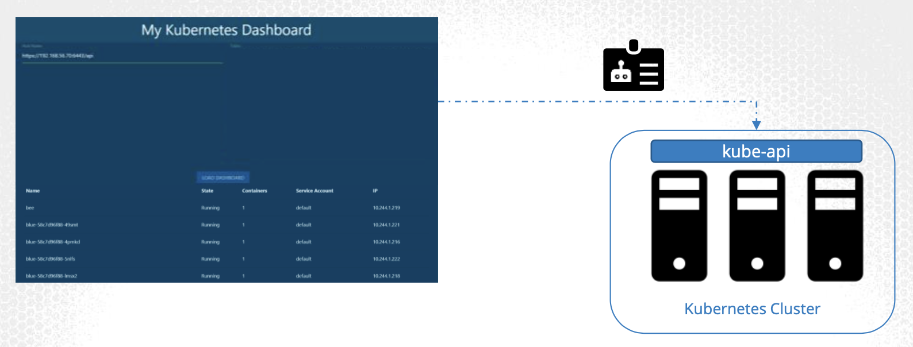
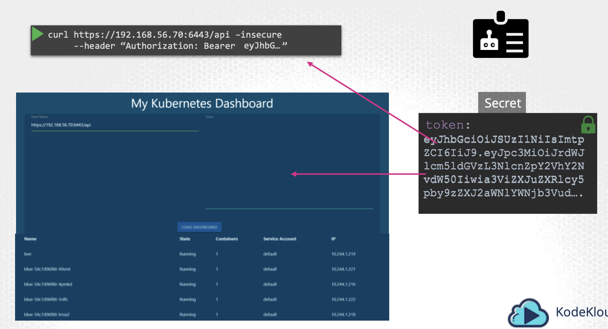
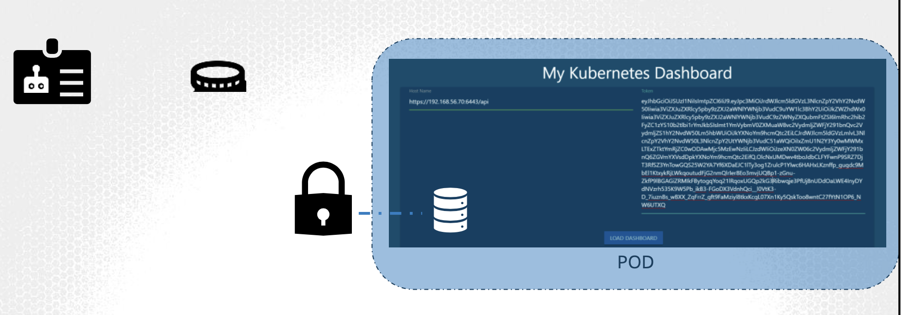
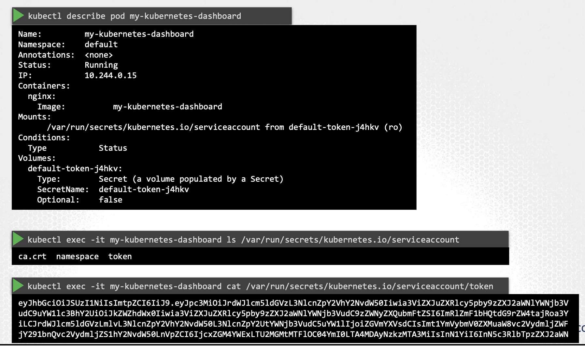

# Service Accounts

* There are two types of accounts in K8s:

  1. **User account**

  2. **Service account**

* A **user account** could be provided for an administrator accessing the cluster to perform administrative tasks, a developer accessing the cluster to deploy applications, etc.

* A **service account** could be provided for an account used by an application to interact w/ the K8s cluster

  * For example, a monitoring application like Prometheus uses a **service account** to poll the k8s API for performance metrics

  * An automated build tool like Jenkins uses service accounts to deploy applications on the k8s cluster

## Creating a ServiceAccount

* Below is a simple K8s dashboard application named `my-kubernetes-dashboard`

  * The application, when deployed, retrieves the list of pods in a K8s cluster by sending a request to the K8s API and displays it on a web page

  * In order for our application to query the K8s API, our application has to be authenticated → **service account**



* To create a **service account**, run the command `kubectl create serviceaccount` followed by the account name, which is `dashboard-sa` in our case

```zsh
kubectl create serviceaccount dashboard-sa
```

* To view the service accounts, run the `kubectl get serviceaccount`, which will list all the service accounts

```zsh
kubectl get serviceaccount
```

* When the service account is created, it also creates a token automatically

  * A token w/ a defined lifetime is generated through the **TokenRequestAPI** by the **serviceAccountAdmissionController** when the pod is created

  * The service account token is what must be used by the external application while authenticating to the K8s API

  * The token, however, is stored as a secret object; in this case, it's named `dashboard-sa-token-kbbdm`

* When a `serviceaccount` is created, a token is generated for the service account

  * A `secret` object is then created and the token is stored inside the `secret` object

  * The `secret` object is then linked to the `serviceaccount`

  * To view the token, view the `secret` object by running the command `kubectl describe secret`


* This token can then be used as an authentication bearer token while making a rest call to the K8s API

  * For example, in the `curl` example below, the bearer token is provided as an `Authorization` header while making a rest call to the K8s API



* When you create a service account and assign the right permissions using role based access control (RBAC) mechanisms, export your service account tokens and use them to configure your third party application to authenticate to the K8s API

## Application hosted on K8s cluster

* But, what if your third party application is hosted on the K8s cluster itself

  * For example, we can have our `custom-kubernetes-dashboard` or the Prometheus application (used to monitor K8s), deployed on the K8s cluster itself

* In this case, this whole process of exporting the `serviceaccount` token and configuring the third party application to use the token can be made simply by automatically mounting the `servicetoken` secret as a volume inside the pod hosting the third-party application

  * That way, the token to access the K8s API is already placed inside the pod and can be easily read by the application



## Default `serviceAccount`

* For every namespace in K8s, a `serviceaccount` named `default` is automatically created:

```zsh
$ kubectl get serviceaccount
NAME            SECRETS     AGE
default         1           218d
dashboard-sa    1           4d
```

  * Each namespace has its own default `serviceaccount`

* Whenever a pod is created, the default `serviceaccount` and its token are automatically mounted to that pod as a volume mount

  * For example, we have a simple pod definition file that creates a pod using `custom0kubernetes-dashboard` image

```yaml
apiVersion: v1
kind: Pod
metadata:
  name: my-kubernetes-dashboad
spec:
  containers:
    - name: my-kubernetes-dashboard
      image: my-kubernetes-dashboard
```

* We haven't specified any secrets or volume mounts

  * However, when the pod is created, by running the `kubectl describe pod` command to inspect the pod, you will see that a volume is automatically created from the secret named `default-token-j4hkv`, which is in fact the secret containing the token for the default `serviceaccount`

  * The secret token is mounted as a projected volume at location `/var/run/secrets/kubernetes.io/serviceaccount` inside the pod



```yaml
apiVersion: v1
kind: Pod
metadata:
  name: nginx
  namespace: default
spec:
  containers:
  ...
  volumes:
    - name: kube-api-access-6mtg8
      projected:
        defaultMode: 420
        sources:
        - serviceAccountToken:
            expirationSeconds: 3607
            path: token
  ...
```

  * The projected volume communicates w/ the token controller API **TokenRequestAPI** and fetches a token for the pod

  * If you run the `ls` command from within the pod to list the contents of the directory, you will see that the secret is mounted as 3 separate files

```zsh
kubectl exec -it my-kubernetes-dashboard ls /var/run/secrets/kubernetes.io/serviceaccount
ca.crt    namespace   token
```

  * The one w/ the actual token is the file named `token`

  * If you `cat` the contents of that file, you will see the token to be used for accessing the K8s API

* Remember that the default `serviceaccount` is very restricted, only having permissions to run basic K8s API queries

## Change `serviceaccount`

* To use a different `serviceaccount`, such as the one we just created, modify the pod definition file to include a `serviceaccount` field and specify the name of the new `serviceaccount`


* Recall, you cannot edit the `serviceaccount` of an existing pod, so you must delete and re-create the pod

  * However, in the case of a deployment, you can edit the `serviceaccount`, as any changes to the pod definition will take care of deleting and re-creating new pods w/ the correct `serviceaccount`

* K8s automatically mounts the default `servicaccount` if you haven't explicitly specified any

  * You may choose not to mount a `serviceaccount` automatically by setting the `automountServiceAcccountToken` field to `false` in the pod spec section

  * `cat pod-definition.yml`:

```yaml
apiVersion: v1
kind: Pod
metadata:
  name: my-kubernetes-dashboad
spec:
  containers:
    - name: my-kubernetes-dashboard
      image: my-kubernetes-dashboard
  automountServiceAccountToken: false
```

## Token

* The JSON web token (JWT) is valid as long as the service account exists

* Tokens generated by the **TokenRequestAPI** are more secure as they are:

  1. Audience bound

  2. Time bound

  3. Object bound

## Non-expiring tokens

* To create secrets w/ non-expiring tokens, create a secret object w/ the type set to `kubernetes.io/service-account-token` and specify the name of the service account within the annotations in the metadata like so:

  * `cat secret-definition.yml`

```yaml
apiVersion: v1
kind: Secret
type: kubernetes.io/service-account-token
metadata:
  name: mysecretname
  annotations:
    kubernetes.io/service-account-name: dashboard-sa
```

* The secret object will then be associated w/ that particular `serviceaccount`

## Learning recap

* Every namespace has a default `serviceaccount` and that `serviceaccount` has a secret object with a token associated with it

* When a pod is created, it automatically associated the `serviceAccount` to the pod and mounts the token in a well-known location within the pod, `var/run/secret/kubernetes.io/serviceaccount`

  * This makes the token accessible to a process that's running within the pod, enabling the process to query the K8s API