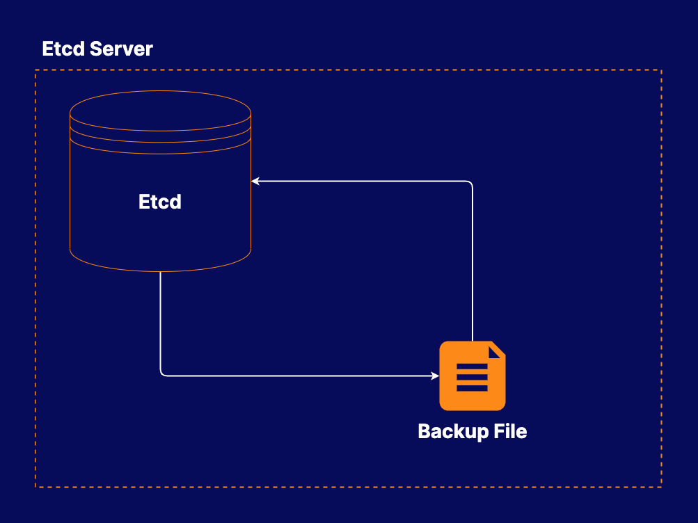

# Backing up and Restoring Kubernetes Data in etcd

## About this lab

Backups are an important part of any resilient system. Kubernetes is no exception. In this lab, you will have the opportunity to practice your skills by backing up and restoring a Kubernetes cluster state stored in etcd. This will help you get comfortable with the steps involved in backing up Kubernetes data.

## Learning objectives

[ ] Back Up the etcd Data

[ ] Restore the etcd Data from the Backup

## Additional resources

* A basic etcd instance.

* Back up the etcd data.

* Restore the etcd data and ensure the cluster still works.

You are working for BeeBox, a subscription service company that provides weekly shipments of bees to customers. The company is using Kubernetes to run some of their applications, and they want to make sure their Kubernetes infrastructure is robust and able to recover from failures.

Your task is to establish a backup and restore process for the Kubernetes cluster data. Back up the cluster's etcd data, then restore it to verify the process works.

You can find certificates to authenticate with etcd in `/home/cloud_user/etcd-certs`.
