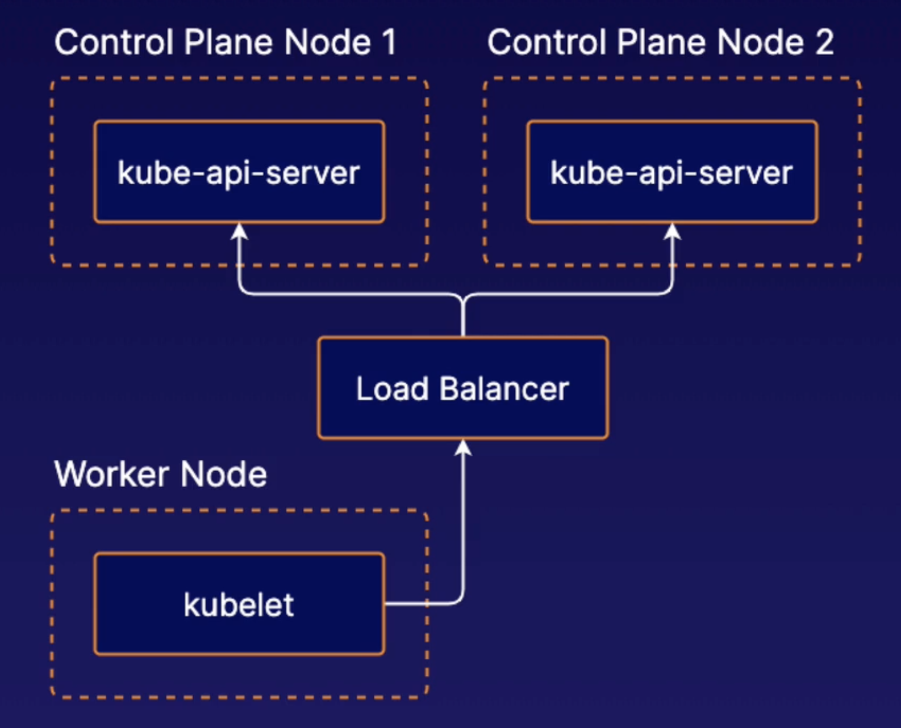
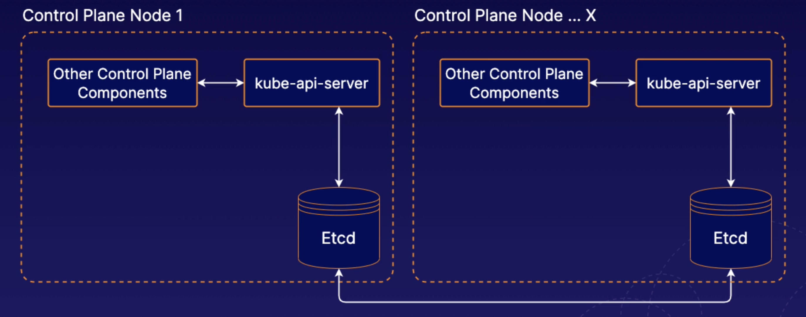
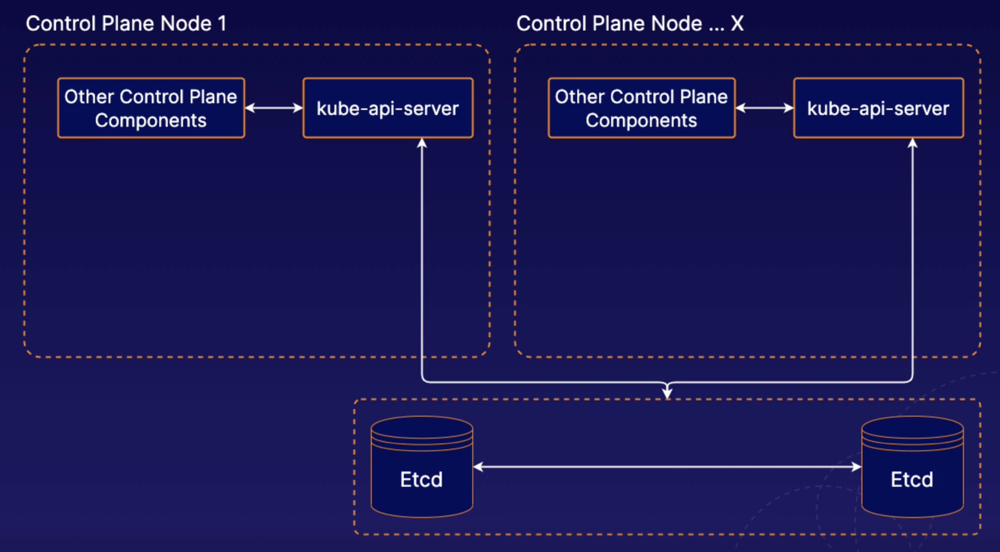

# Introduction to High Availability in K8s

## High availability in k8s

K8s facilitates high-availability applications, but you can also design the cluster itself to be highly available.

To do this, you need **multiple control plane nodes.**

## High availability control plane

When using multiple control planes for high availability, you will likely need to communicate w/ the Kubernetes API through a **load balancer**.

This includes clients such as **kubelet** instances running on worker nodes.

## Stacked etcd

Manage etcd instances in the context of a multi control plane high availability Kubernetes setup.

W/ stacked etcd, etcd runs on the same servers, or on the same nodes, as the rest of the control plane components.

This is the design pattern used by clusters that are set up using kubeadm.

Our control plane, which is running all of the different control plane components, is also running etcd, and in a high availability setup, each one of those individual control plane nodes would have its own etcd instance.

## External etcd

W/ stacked etcd, etcd is running on the same nodes as the control plane components. W/ external etcd, we have etcd running on completely separate nodes.

In the context of high availability, we can have multiple external etcd nodes in a high availability cluster and that set of servers would be a completely different set of servers from the ones that are running our normal Kubernetes control plane components.

W/ the external etcd model, you can have any number of Kubernetes control plane instances and any number of etcd nodes.
