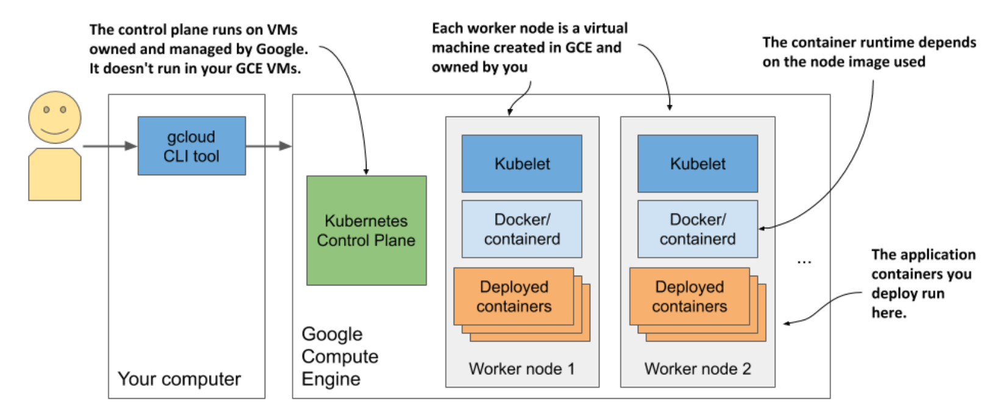

# 3.1.4 Creating a managed cluster with Google Kubernetes Engine

## Setting up Google Cloud and installing the GCloud client binary

* Complete [instructions](https://cloud.google.com/container-engine/docs/before-you-begin) for setting up GKE environment

* Procedure:

    1. Sign up for Google account

    2. Create a project in the Google Cloud Platform Console

    3. Enable billing

    4. Download and install the Google CLoud SDK, which includes the `gcloud` tool

    5. Create the cluster using the `gcloud` command-line tool

## Create a GKE K8s cluster w/ three nodes

* Before you create your cluster, you must decide in which geographical region and zone it should be created.

    * List of available locations: https://cloud.google.com/compute/docs/regions-zones

    * In the following examples, I use the europe-west3 region based in Grankfurt, Germany. It has three different zones. I'll use the zone europe-west3-c

    * The default zone for all gcloud operations can be set w/ the following command:

```zsh
$ gcloud config set compute/zone europe-west3-c
```

* Create the K8s cluster like so:

```zsh
$ gcloud container clusters create kiada --num-nodes 3 Creating cluster kiada in europe-west3-c...
...
kubeconfig entry generated for kiada.
NAME    LOCAT.    MASTER_VER    MASTER_IP   MACH_TYPE     ...   NODES   STATUS
kiada   eu-w3-c   1.13.11...    5.24.21.22  n1-standard-1 ...   3       RUNNING
```

> [!NOTE]
> 
> I'm creating all three worker nodes in the same zone, but you can also spread them across all zones in the region by setting the `compute/zone` config value to an entire region instead of a single zone. If you do so, note that `--num-nodes` indicates the number of nodes _per zone_. If the region contains three zones, and you only want three nodes, you must set `--num-nodes` to `1`.

* You should now have a running K8s cluster w/ three worker nodes

    * Each node is a virtual machine provided by the Google Compute Engine (GCE) infrastructure-as-a-service platform

    * You can list GCE virtual machines using the following command:

```zsh
$ gcloud compute instances list
NAME      ZONE        MACHINE_TYPE    INTERNAL_IP   EXTERNAL_IP     STATUS 
...-ctlk  eu-west3-c  n1-standard-1   10.156.0.16   34.89.238.55    RUNNING
...-gj1f  eu-west3-c  n1-standard-1   10.156.0.14   35.242.223.97   RUNNING 
...-r01z  eu-west3-c  n1-standard-1   10.156.0.15   35.198.191.189  RUNNING
```

> [!TIP]
> 
> Each VM incurs costs. To reduce the cost of your cluster, you can reduce the number of nodes to one, or even to zero while not using it.

* The system is shown in the next figure

    * Note that only your worker nodes run in GCE virtual machines

    * The control plane runs elsewhere - you can't access the machines hosting it



## Scaling the no. of nodes

* Google allows you to easily increase/decrease the number of nodes in your cluster

    * To scale the cluster to zero, use the following command:

```zsh
$ gcloud container clusters resize kiada --size 0
```

* When scaling to zero, none of the objects you create in your K8s cluster, including the applications you deploy, are deleted.

    * Granted, if you scale down to zero, the applications will have no nodes to run on, so they won't

    * But as soon as you scale the cluster back up, they will be redeployed

    * Even w/ no worker nodes, you can still interact w/ the K8s API (you can create, update, and delete objects)

## Inspecting a GKE worker node

If you're interestined in what's running on your nodes, you can log into them w/ the following command (use one of the node names from the output of the previous command):

```zsh
$ gcloud compute ssh gke-kiada-default-pool-9bba9b18-4glf
```

* While logged into the node, you can try to list all running containers w/ `docker ps`

    * You haven't run any applications yet, so you'll only see K8s system containers
