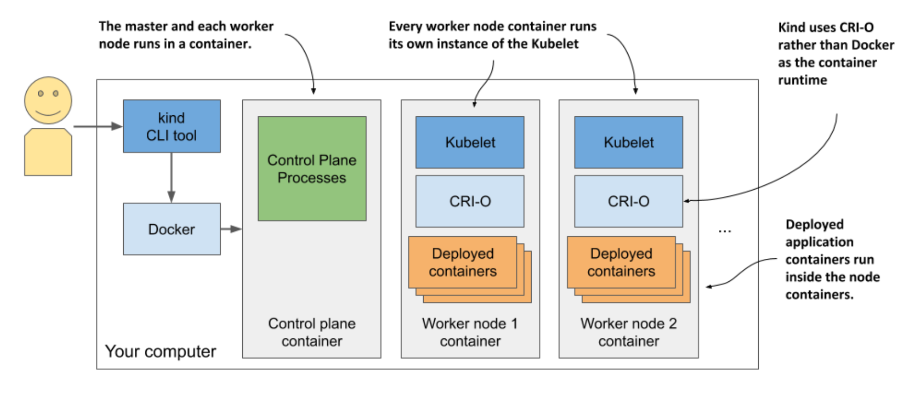

# 3.1.3 Running a local cluster using kind (Kubernetes in Docker)

* Instead of running Kubernetes in a virtual machine or directly on the host, kind runs each Kubernetes cluster node inside a container

    * Unlike Minikube, this allows it to create multi-node clusters by starting several containers

    * The actual application containers that you deploy to Kubernetes then run within these node containers

    * The system is shown in the next figure: 



* Recall that a process that runs in a container actually runs in the host OS

  * This means that when you run Kubernetes using kind, all Kubernetes components run in your host OS

  * The applications you deploy to the Kubernetes cluster also run your host OS

* This makes _kind_ the perfect tool for development and testing, as everything runs locally, and you can debug running processes as easily as when you run them outside a container

  * `nsenter` ▶︎ tool that runs Wireshark or web browser inside the containers that run our applications in the network or other namespaces of the container

## Installing KIND

* Just like Minikube, kind consists of a single binary executable file

* Installation instructions: [quick-start](https://kind.sigs.k8s.io/docs/user/quick-start/)

* On macOs and Linux, the commands to install it are as follows:

```zsh
$ curl -Lo ./kind https://kind.sigs.k8s.io/dl/v0.11.1/kind-$(uname)-amd64
$ chmod +x ./kind
$ mv ./kind /<SOME_DIR_IN_YOUR_PATH>/kind
```

> [!NOTE]
> 
> Docker must be installed on your system to use kind.


## Starting a K8s cluster w/ KIND

```zsh
$ kind create cluster
```

* Like Minikube, _kind_ configures kubectl to use the cluster that it creates

## Starting a multi-node cluster w/ KIND

* Kind runs a single-node cluster by default

  * If you want to run a cluster w/ multiple worker nodes, you must first create a configuration file

Listing 3.1 Config file for running a three-node cluster w/ the kind tool:

```yaml
kind: Cluster
apiVersion: kind.sigs.k8s.io/v1alpha3 nodes:
- role: control-plane
- role: worker
- role: worker
```

* W/ the file in place, create the cluster using the following command:

```zsh
$ kind create cluster --config kind-multi-node.yaml
```

## Listing worker nodes

* List cluster nodes using `kind get nodes`:

```zsh
$ kind get nodes
kind-worker2
kind-worker
kind-control-plane
```

* Since each node runs as a container, you can also see the nodes by listing the running containers using `docker ps`:

```zsh
$ docker ps
CONTAINER ID    IMAGE                 ... NAMES
45d0f712eac0    kindest/node:v1.18.2  ... kind-worker2 
d1e88e98e3ae    kindest/node:v1.18.2  ... kind-worker 
4b7751144ca4    kindest/node:v1.18.2  ... kind-control-plane
```

## Logging into cluster nodes provisioned by KIND

* Unlike Minkube, where you use `minikube ssh` to log into the node if you want to explore the processes running inside it, w/ kind you use `docker exec`

  * For example, to enter then node called `kind-control-plane`, run:

```zsh
$ docker exec -it kind-control-plane bash
```

* Instead of using Docker to run containers, nodes created by _kind_ use the CRI-O container runtime (lightweight alternative to Docker)

* The `crictl` CLI tool is used to interact w/ CRI-O

  * Its use is very similar to that of the `docker` tool

  * After logging into the node, list the containers running in it by running `crictl ps` instead of `docker ps`. Here's an example of the command and its output:

```
root@kind-control-plane:/# crictl ps
CONTAINER ID    IMAGE           CREATED       STATE       NAME
c7f44d171fb72   eb516548c180f   15 min ago    Running     coredns         ...
cce9c0261854c   eb516548c180f   15 min ago    Running     coredns         ...
e6522aae66fcc   d428039608992   16 min ago    Running     kube-proxy      ...
6b2dc4bbfee0c   ef97cccdfdb50   16 min ago    Running     kindnet-cni     ...
c3e66dfe44deb   be321f2ded3f3   16 min ago    Running     kube-apiserver  ...
```
