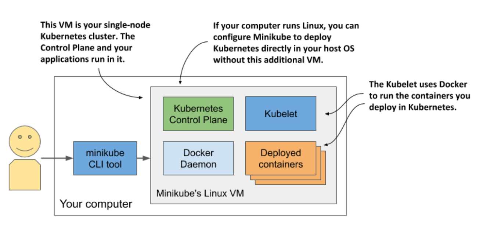

# 3.1.2 Running a local cluster using Minikube

* Minikube...

  * creates a Kubernetes cluster

  * tool maintained by K8s community

  * ...the cluster consists of a single node and is suitable for both testing K8s and developing apps locally

  * ...it normally runs Kubernetes in a Linux VM, but if your computer is Linux-based, it can also deploy K8s directly in your host OS via Docker

> [!NOTE]
> 
> If you configure Minikube to use a VM, you don't need Docker, but you do need a hypervisor like VirtualBox. In the other case you need Docker, but not the hypervisor.

## Installing Minikube

* Minikube has a single binary executable file

* On macOS you can install ut using the Brew Package Manager... on Linux you can either download a .deb or .rpm package or simply download the binary file and make it executable w/ the following command:

```zsh
$ curl -LO https://storage.googleapis.com/minikube/releases/latest/minikube-linux-amd64 && \
sudo install minikube-linux-amd64 /usr/local/bin/minikube
```

## Starting a K8s cluster w/ Minikube

```zsh
$ minikube start
```

> [!TIP]
> 
> If you use Linux, you can reduce the resources required by Minikube by creating the cluster w/o a VM. Use this command: `minikube start --vm-driver none`

### Checking Minikube's status

* When the `minikube start` command is complete, you can check the status by running the `minikube status` command:

```zsh
$ minikube status
host: Running
kubelet: Running
apiserver: Running
kubeconfig: Configured
```

* The output of the command shows that the Kubernetes host (the VM that hosts Kubernetes is running, and so are the Kubelet - the agent responsible for managing th node - and the Kubernetes API server.)

  * The last line shows that the kubectl command-line tool (CLI) is configured to use the Kubernetes cluster that Minikube has provided.

  * Minikube doesn't install the CLI tool, but it does create its configuration file.

### Visualizing the system



* The Control Plane components run in containers in the VM or directly in your host OS if you used the `--vm-driver none` option to create the cluster

  * The Kubelet runs directly in the VM's or your host's operating system

  * The Kubelet runs the applications you deploy in the cluster via the Docker Daemon

* You can run `minikube ssh` to log into the Minikube VM and explore it from inside

  * For example, you can see what's running in the VM by running `ps aux` to list running processes or `docker ps` to list running containers

> [!TIP]
> 
> If you want to list containers using your local docker CLI instance, as in the case of Docker Desktop, run the following command: `eval $(minikube docker-env)`
