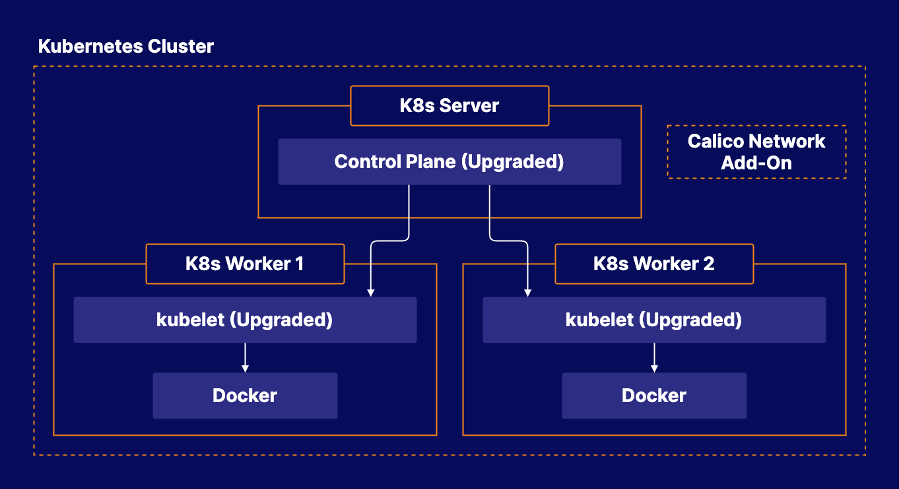

# Performing a Kubernetes Upgrade with kubeadm

## About this lab

When you are managing Kubernetes in the real world, it is essential that you are able to keep your cluster up to date. This lab will allow you to practice the process of upgrading a Kubernetes cluster to a newer Kubernetes version using kubeadm. This will ensure you are comfortable with the upgrade process and ready to manage real-world Kubernetes clusters.

## Learning objectives

[ ] Upgrade the Control Plane

[ ] Upgrade the Worker Nodes

## Additional resources

* **Three servers**: one control plane and two worker nodes. The cluster was built w/ kubeadm.

* Upgrade the control plane.

* Upgrade the worker nodes.

You are working for BeeBox, a subscription service company that provides weekly shipments of bees to customers. The company is using Kubernetes to run some of their applications, but a new version of Kubernetes has been released.

Your task is to upgrade Kubernetes. The cluster has one control plane server and two worker nodes. Upgrade all Kubernetes components on all three servers to Kubernetes version `1.22.2`.
