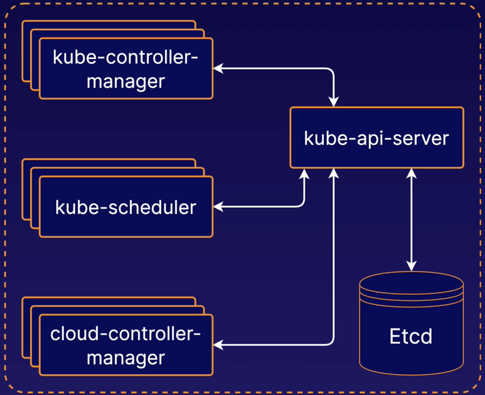
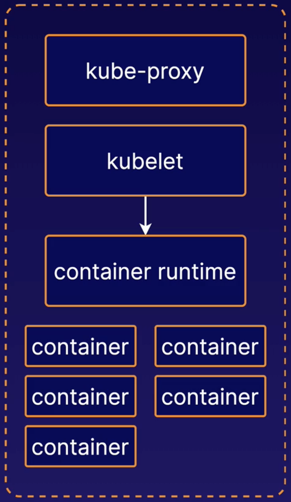
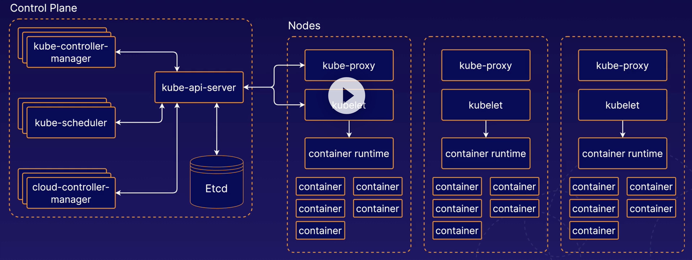

# K8s Architectural Overview

## K8s Control Plane

The **control plane** is a collection of multiple components responsible for managing the cluster itself globally. Essentially, the control plane controls the cluster.

Individual control plane components can run on any machine in the cluster, but usually are run on dedicated **controller** machines.

**Etcd** is the backend data store for the Kubernetes cluster. It provides high-availability storage for all data relating to the state of the cluster.

**kube-scheduler** handles **scheduling**, the process of selecting an available node in the cluster on which to run containers. When communicating w/ the Kubernetes API, and you use the API to instruct Kubernetes to run a pod or a container, `kube-scheduler` is the component that is responsible for actually assigning that container to a specific worker node.

**kube-controller-manager** runs a collection of multiple controller utilities in a single process. These controllers carry out a variety of automation-related tasks within the Kubernetes cluster. There are multiple utilities under the **kube-controller-manager** that carry out a variety of different tasks related to automation within the Kubernetes cluster.

**cloud-controller-manager** provides an interface between Kubernetes and various cloud platforms. It is only used when using cloud-based resources alongside Kubernetes.

These components could all be running on the same server or they could be running on multiple servers. From a high-availability perspective, you could even have multiple instances of any or all of these components running simultaneously across multiple servers.

## K8s Nodes

Kubernetes Nodes are the machines where the containers managed by the cluster run. A cluster can have any number of nodes.

Various node components manage containers on the machine and communicate w/ the control plane.

**Kubelet** is the Kubernetes agent that runs on each node. It communicates w/ the control plane and ensures that containers are run on its node as instructed by the control plane.

Kubelet also handles the process of reporting container status and other data about containers back to the control plane.

The **container runtime** is not build into Kubernetes. It is a separate piece of software that is responsible for actually running containers on the machine.

Kubernetes supports multiple container runtime implementations. Some popular container runtimes are **Docker** and **containerd**.

**kube-proxy** is a network proxy. It runs on each node and handles some tasks related to providing networking between containers and services in the cluster.

## A K8s Cluster - The Big Picture

