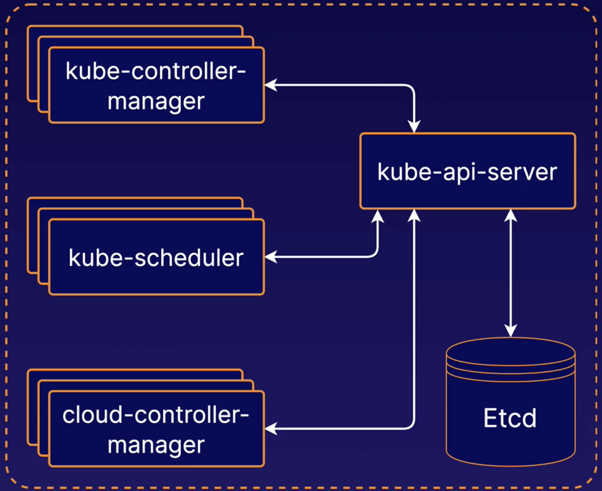
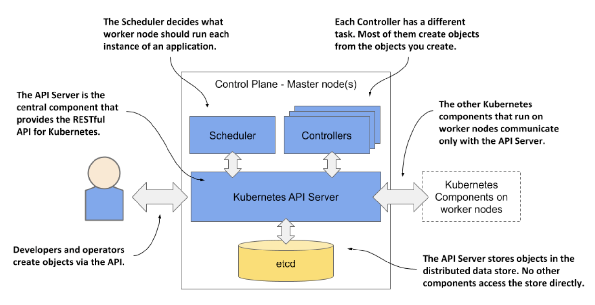
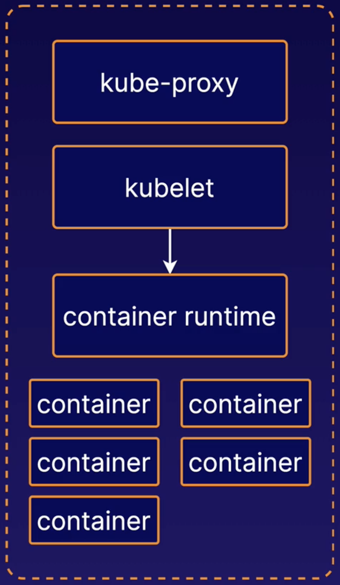
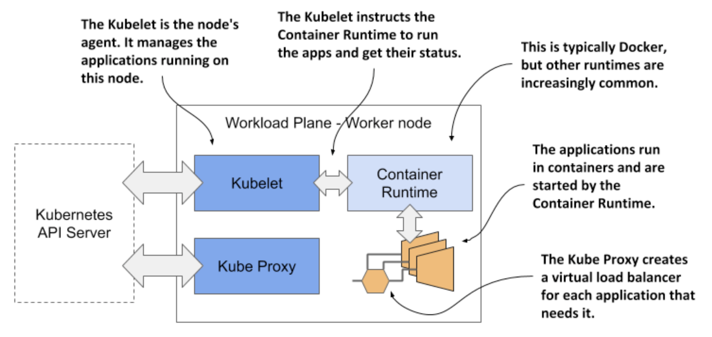

# K8s Architectural Overview

## 1.2.3 The architecture of a Kubernetes cluster

As you’ve already learned, a Kubernetes cluster consists of nodes divided into two groups:

* A set of _master nodes_ that host the Control Plane components, which are the brains of the system, since they control the entire cluster.

* A set of _worker nodes_ that form the Workload Plane, which is where your workloads (or applications) run.

## K8s Control Plane

The **control plane** is a collection of multiple components responsible for managing the cluster itself globally. Essentially, the control plane controls the cluster.

Individual control plane components can run on any machine in the cluster, but usually are run on dedicated **controller** machines.

**Etcd** is the backend data store for the Kubernetes cluster. It provides high-availability storage for all data relating to the state of the cluster.

**kube-scheduler** handles **scheduling**, the process of selecting an available node in the cluster on which to run containers. When communicating w/ the Kubernetes API, and you use the API to instruct Kubernetes to run a pod or a container, `kube-scheduler` is the component that is responsible for actually assigning that container to a specific worker node.

**kube-controller-manager** runs a collection of multiple controller utilities in a single process. These controllers carry out a variety of automation-related tasks within the Kubernetes cluster. There are multiple utilities under the **kube-controller-manager** that carry out a variety of different tasks related to automation within the Kubernetes cluster.

**cloud-controller-manager** provides an interface between Kubernetes and various cloud platforms. It is only used when using cloud-based resources alongside Kubernetes.

These components could all be running on the same server or they could be running on multiple servers. From a high-availability perspective, you could even have multiple instances of any or all of these components running simultaneously across multiple servers.

The Control Plane’s components are shown in the following figure:

* The _Kubernetes API Server_ exposes the RESTful Kubernetes API. Engineers using the cluster and other Kubernetes components create objects via this API.

* The _etcd_ distributed datastore persists the objects you create through the API, since the API Server itself is stateless. The Server is the only component that talks to etcd.

* The _Scheduler_ decides on which worker node each application instance should run.

* _Controllers_ bring to life the objects you create through the API. Most of them simply create other objects, but some also communicate with external systems (for example, the cloud provider via its API).

The components of the Control Plane hold and control the state of the cluster, but they don’t run your applications. This is done by the (worker) nodes.

## K8s Nodes

Kubernetes Nodes are the machines where the containers managed by the cluster run. A cluster can have any number of nodes.

Various node components manage containers on the machine and communicate w/ the control plane.

**Kubelet** is the Kubernetes agent that runs on each node. It communicates w/ the control plane and ensures that containers are run on its node as instructed by the control plane.

Kubelet also handles the process of reporting container status and other data about containers back to the control plane.

The **container runtime** is not build into Kubernetes. It is a separate piece of software that is responsible for actually running containers on the machine.

Kubernetes supports multiple container runtime implementations. Some popular container runtimes are **Docker** and **containerd**.

**kube-proxy** is a network proxy. It runs on each node and handles some tasks related to providing networking between containers and services in the cluster.

### Worker node components

The worker nodes are the computers on which your applications run. They form the cluster’s Workload Plane. In addition to applications, several Kubernetes components also run on these nodes. They perform the task of running, monitoring and providing connectivity between your applications. They are shown in the following figure:

Each node runs the following set of components:

* The _Kubelet_, an agent that talks to the API server and manages the applications running on its node. It reports the status of these applications and the node via the API.

* The _Container Runtime_, which can be Docker or any other runtime compatible with Kubernetes. It runs your applications in containers as instructed by the Kubelet.

* The _Kubernetes Service Proxy (Kube Proxy)_ load-balances network traffic between applications. Its name suggests that traffic flows through it, but that’s no longer the case.

#### Add-on components

Most Kubernetes clusters also contain several other components. This includes a DNS server, network plugins, logging agents and many others. They typically run on the worker nodes but can also be configured to run on the master.

## A K8s Cluster - The Big Picture

