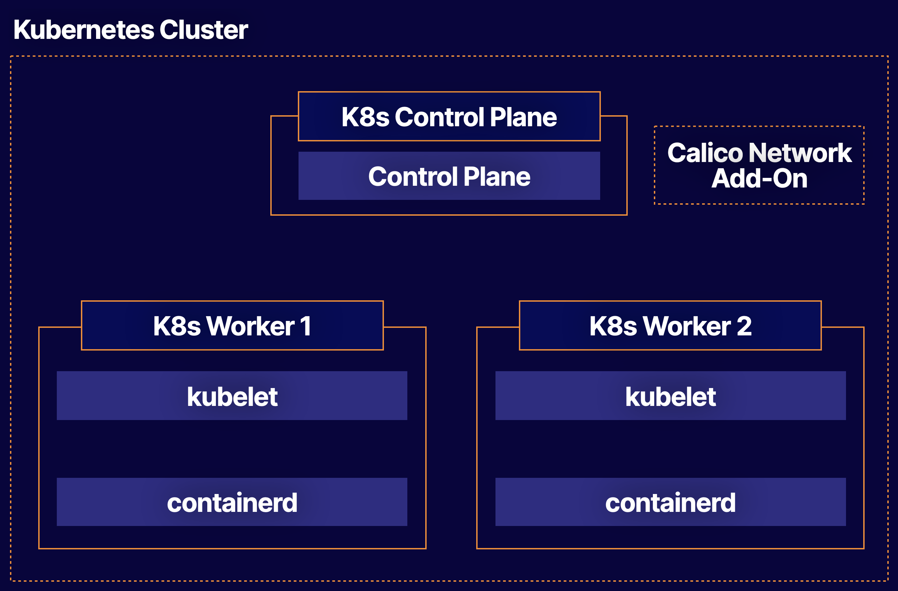

# Building a Kubernetes 1.24 Cluster with kubeadm

## About this lab

This lab will allow you to practice the process of building a new Kubernetes cluster. You will be given a set of Linux servers, and you will have the opportunity to turn these servers into a functioning Kubernetes cluster. This will help you build the skills necessary to create your own Kubernetes clusters in the real world.

## Learning objectives

[ ] Install Packages

[ ] Initialize the Cluster

[ ] Install the Calico Network Add-On

[ ] Join the Worker Nodes to the Cluster

## Additional resources

  * **Three Servers**: One control plane and two worker nodes.

  * Install packages.

  * Initialize the cluster.

  * Install the Calico network add-on.

  * Join the worker nodes to the cluster.

Your company wants to transition to a Kubernetes-based infrastructure for running their containerized applications. In order to do that, they will need a basic Kubernetes cluster to get started.

You have been provided with three servers. Build a simple Kubernetes cluster with one control plane node and two worker nodes.

* Install and use `kubeadm` to build a Kubernetes cluster on these servers.

* Install Kubernetes version `1.24.0`.

* Use `containerd` for your container runtime.

* The cluster should have one control plane node and two worker nodes.

* Use the Calico networking add-on to provide networking for the cluster.

> [!NOTE]
> 
> If you would like the lab setup to be the same as the CKA "Building a Kubernetes Cluster" lesson, you can also set the hostnames for each node with command `sudo hostnamectl set-hostname [k8s-control | k8s-worker1 | k8s-worker2]`. You would then place the three entries in each node's hosts file with `sudo vi /etc/hosts`. The hosts file should contain the private IP of each node along with its corresponding hostname.
