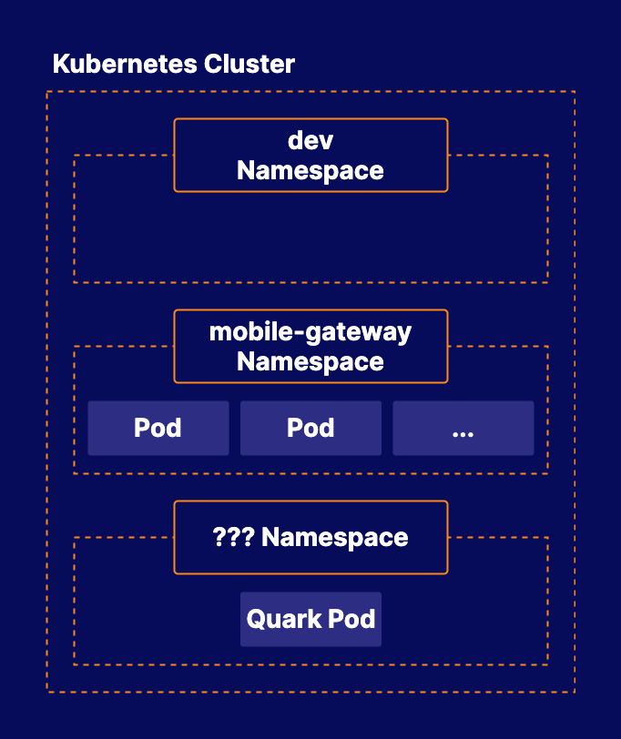

# Working with Kubernetes Namespaces

## About this lab

Namespaces are a central component of any Kubernetes infrastructure. This lab will give you the opportunity to work with namespaces in a functioning cluster. You will be able to practice the process of creating, using, and navigating Kubernetes namespaces.

## Learning objectives

[ ] Create the `dev` Namespace

[ ] Get a List of the Current Namespaces

[ ] Find the `quark` Pod's Namespace

## Additional resources

* An existing Kubernetes cluster.

* Create a new namespace called `dev`.

* List the current namespaces.

* Locate a pod w/ the name `Quark` and save the name of the pod's namespace to a file.

You are working for BeeBox, a subscription service company that provides weekly shipments of bees to customers. The company is in the process of containerizing their infrastructure and running their software on Kubernetes. As part of this process, the company is working on determining what namespaces it will need in the Kubernetes cluster.

You have been asked to access the cluster and perform some maintenance tasks related to the cluster's namespaces.

* The dev team would like a namespace they can work in that is separate from namespaces used to run production workloads. Create a new namespace called `dev`.

* One of the members of your security team would like to audit the namespaces that currently exist in the cluster. Get a list of the current namespaces and save it to a file located at `/home/cloud_user/namespaces.txt` on the control plane node.

* Someone on the team created a pod with the name `quark`, but they are not sure which namespace it is in. Determine which namespace this pod is in, and save the name of that namespace to a file located at `/home/cloud_user/quark-namespace.txt` on the control plane node.
