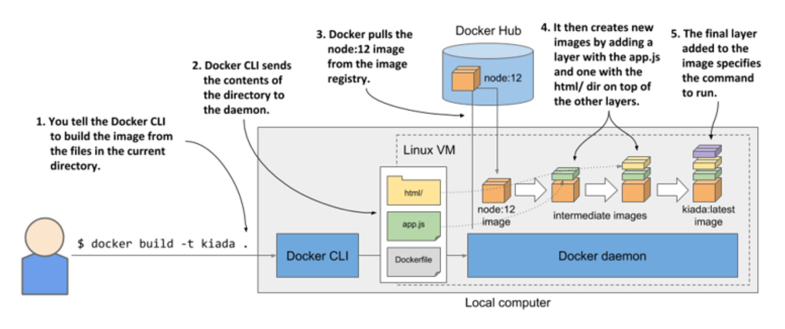
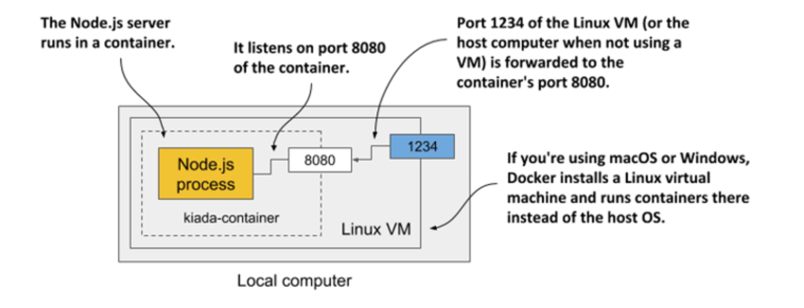

# Chapter 2. Understanding containers

## Creating the Kiada container image

Building the **`kiada:1.0`** image:

- [Makefile](kiada-0.1/Makefile) - contains commands to build and push the image

- [Dockerfile](kiada-0.1/Dockerfile) - Docker instructions for building the image

- [app.js](kiada-0.1/app.js) - application code (JavaScript)

## 2.2.2 Building the application

### Introducing the initial version of the application


The initial version of the application that you’ll run in this chapter, while supporting both HTML and plain-text modes, will not display the quote and pop quiz, but merely the information about the application and the request. This includes the version of the application, the network hostname of the server that processed the client’s request, and the IP of the client. Here’s the plain-text response that it sends:

```zsh
Kiada version 0.1. Request processed by "<SERVER_HOSTNAME>". Client IP: <CLIENT_IP>
```

The JavaScript code is in the `app.js` file and the HTML and other resources are in the `html` subdirectory. The template for the HTML response is in `index.html`. For the plain-text response it’s in `index.txt`.

You could now download and install Node.js locally and test the application directly on your computer, but that’s not necessary. Since you already have Docker installed, it’s easier to package the application into a container image and run it in a container. This way, you don’t need to install anything, and you’ll be able to run the same image on any other Docker-enabled host without installing anything there either.

### Creating the Dockerfile for the container image

To package your app into an image, you need a file called `Dockerfile`, which contains a list of instructions that Docker performs when building the image.

```dockerfile
FROM node:16    #A
COPY app.js /app.js     #B
COPY html/ /html    #C
ENTRYPOINT ["node", "app.js"]   #D
```

* **#A** ▶︎ The base image to build upon

* **#B** ▶︎ Adds the `app.js` file into the container image

* **#C** ▶︎ Copies the files in the html/ directory into the container image at /html/

* **#D** ▶︎ Specifies the command to execute when the image is run

The `FROM` line defines the container image that you’ll use as the starting point (the base image you’re building on top of). The base image used in the listing is the node container image with the tag `12`. In the second line, the `app.js` file is copied from your local directory into the root directory of the image. Likewise, the third line copies the `html` directory into the image. Finally, the last line specifies the command that Docker should run when you start the container. In the listing, the command is `node app.js`.

### Choosing a base image

You may wonder why use this specific image as your base. Because your app is a Node.js app, you need your image to contain the `node` binary file to run the app. You could have used any image containing this binary, or you could have even used a Linux distribution base image such as `fedora` or `ubuntu` and installed Node.js into the container when building the image. But since the `node` image already contains everything needed to run Node.js apps, it doesn’t make sense to build the image from scratch. In some organizations, however, the use of a specific base image and adding software to it at build-time may be mandatory.

### Building the container image

The `Dockerfile`, the `app.js` file, and the files in the `html` directory is all you need to build your image. W/ the following command, you'll build the image and tag it as `kiada:latest`:

```zsh
$ docker build -t kiada:latest .
Sending build context to Docker daemon 3.072kB
Step 1/4 : FROM node:16 #A
12: Pulling from library/node
092586df9206: Pull complete #B
ef599477fae0: Pull complete #B
... #B
89e674ac3af7: Pull complete #B
08df71ec9bb0: Pull complete #B
Digest: sha256:a919d679dd773a56acce15afa0f436055c9b9f20e1f28b4469a4bee69e0... Status: Downloaded newer image for node:16
 ---> e498dabfee1c    #C
Step 2/4 : COPY app.js /app.js    #D
 ---> 28d67701d6d9    #D
Step 3/4 : COPY html/ /html    #E
---> 1d4de446f0f0 #E
Step 4/4 : ENTRYPOINT ["node", "app.js"] #F
---> Running in a01d42eda116 #F
Removing intermediate container a01d42eda116 #F
---> b0ecc49d7a1d #F
Successfully built b0ecc49d7a1d #G Successfully tagged kiada:latest #G
```

* **#A** ▶︎ This corresponds to the first line of your Dockerfile

* **#B** ▶︎ Docker downloads the individual layers of the node:16 image

* **#C** ▶︎ This is the ID of image after the first build step is complete

* **#D** ▶︎ The app.js is copied into the image

* **#E** ▶︎ The html directory is copied into the image

* **#F** ▶︎ The final step of the build

* **#G** ▶︎ The final image ID and its tag

The `-t` option specifies the desired image name and tag, and the dot at the end specifies that Dockerfile and the artefacts needed to build the image are in the current directory. This is the so-called build context.

```zsh
$ docker images
 REPOSITORY   TAG     IMAGE ID      CREATED       VIRTUAL SIZE
 kiada        latest  b0ecc29d7a1d  1 minute ago  908 MB
```

### Understanding how the image is built

The following figure shows what happens during the build process. You tell Docker to build an image called `kiada` based on the contents of the current directory. Docker reads the `Dockerfile` in the directory and builds the image based on the directives in the file.



The build itself isn’t performed by the `docker` CLI tool. Instead, the contents of the entire directory are uploaded to the Docker daemon and the image is built by it. You’ve already learned that the CLI tool and the daemon aren’t necessarily on the same computer. If you’re using Docker on a non-Linux system such as macOS or Windows, the client is in your host OS, but the daemon runs inside a Linux VM. But it could also run on a remote computer.

> [!TIP]
> 
> Don’t add unnecessary files to the build directory, as they will slow down the build process—especially if the Docker daemon is located on a remote system.

To build the image, Docker first pulls the base image (`node:16`) from the public image repository (Docker Hub in this case), unless the image is already stored locally. It then creates a new container from the image and executes the next directive from the Dockerfile. The container’s final state yields a new image with its own ID. The build process continues by processing the remaining directives in the Dockerfile. Each one creates a new image. The final image is then tagged with the tag you specified with the `-t` flag in the `docker build` command.

### Understanding the image layers

Images consist of several layers. One might think that each image consists of only the layers of the base image and a single new layer on top, but that’s not the case. When building an image, a new layer is created for each individual directive in the Dockerfile.

During the build of the `kiada` image, after it pulls all the layers of the base image, Docker creates a new layer and adds the `app.js` file into it. It then adds another layer with the files from the `html` directory and finally creates the last layer, which specifies the command to run when the container is started. This last layer is then tagged as `kiada:latest`.

You can see the layers of an image and their size by running `docker history`. The command and its output are shown next (note that the top-most layers are printed first):

```zsh
$ docker history kiada:latest
```

The first three rows correspond to the three layers that you added. All the following rows correspond to the layers of the node:16 image and its base image(s).

Most of the layers you see come from the `node:16` image (they also include layers of that image’s own base image). The three uppermost layers correspond to the `COPY` and `ENTRYPOINT` directives in the Dockerfile.

As you can see in the `CREATED BY` column, each layer is created by executing a command in the container. In addition to adding files with the `COPY` directive, you can also use other directives in the Dockerfile. For example, the `RUN` directive executes a command in the container during the build. In the listing above, you’ll find a layer where the `apt-get update` and some additional `apt-get` commands were executed. `apt-get` is part of the Ubuntu package manager used to install software packages. The command shown in the listing installs some packages onto the image’s filesystem.

> [!TIP]
> 
> Each directive creates a new layer. I have already mentioned that when you delete a file, it is only marked as deleted in the new layer and is not removed from the layers below. Therefore, deleting a file with a subsequent directive won’t reduce the size of the image. If you use the `RUN` directive, make sure that the command it executes deletes all temporary files it creates before it terminates.

## 2.2.3 Running the container

With the image built and ready, you can now run the container with the following command:

```zsh
$ docker run --name kiada-container -p 1234:8080 -d kiada
9d62e8a9c37e056a82bb1efad57789e947df58669f94adc2006c087a03c54e02
```

This tells Docker to run a new container called `kiada-container` from the `kiada` image. The container is detached from the console (`-d` flag) and runs in the background. Port `1234` on the host computer is mapped to port `8080` in the container (specified by the `-p 1234:8080` option), so you can access the app at http://localhost:1234.

The following figure should help you visualize how everything fits together. Note that the Linux VM exists only if you use macOS or Windows. If you use Linux directly, there is no VM and the box depicting port `1234` is at the edge of the local computer.



### Accessing your app

Now access the application at http://localhost:1234 using `curl` or your internet browser:

```zsh
$ curl localhost:1234
Kiada version 0.1. Request processed by "44d76963e8e1". Client IP: ::ffff:172.17.0.1
```

> [!NOTE]
> 
> If the Docker Daemon runs on a different machine, you must replace `localhost` with the IP of that machine. You can look it up in the `DOCKER_HOST` environment variable.

If all went well, you should see the response sent by the application. In my case, it returns `44d76963e8e1` as its hostname. In your case, you’ll see a different hexadecimal number. That’s the ID of the container. You’ll also see it displayed when you list the running containers next.

### Listing all running containers

To list all the containers that are running on your computer, run the following command. Its output has been edited to make it more readable—the last two lines of the output are the continuation of the first two.

```zsh
$ docker ps 
CONTAINER ID    IMAGE           COMMAND         CREATED         ...
44d76963e8e1    kiada:latest    "node app.js"   6 minutes ago   ...

... STATUS          PORTS                     NAMES
... Up 6 minutes    0.0.0.0:1234->8080/tcp    kiada-container
```

For each container, Docker prints its ID and name, the image it uses, and the command it executes. It also shows when the container was created, what status it has, and which host ports are mapped to the container.

### Getting additional information about a container

The `docker ps` command shows the most basic information about the containers. To see additional information, you can use `docker inspect`:

```zsh
$ docker inspect kiada-container
```

Docker prints a long JSON-formatted document containing a lot of information about the container, such as its state, config, and network settings, including its IP address.

### Inspecting the application log

Docker captures and stores everything the application writes to the standard output and error streams. This is typically the place where applications write their logs. You can use the `docker logs` command to see the output:

```zsh
$ docker logs kiada-container
Kiada - Kubernetes in Action Demo Application
---------------------------------------------
Kiada 0.1 starting...
Local hostname is 44d76963e8e1
Listening on port 8080
Received request for / from ::ffff:172.17.0.1
```

You now know the basic commands for executing and inspecting an application in a container. Next, you’ll learn how to distribute it.

## 2.2.4 Distributing the container image

The image you've built is only available locally. To run it on other computers, you must first push it to an external image registry. Let’s push it to the public Docker Hub registry, so that you don’t need to set up a private one. You can also use other registries, such as Quay.io, which I’ve already mentioned, or the Google Container Registry.

Before you push the image, you must re-tag it according to Docker Hub’s image naming schema. The image name must include your Docker Hub ID, which you choose when you register at http://hub.docker.com. I’ll use my own ID (`luksa`) in the following examples, so remember to replace it with your ID when trying the commands yourself.

### Tagging an image under an additional tag

Once you have your ID, you’re ready to add an additional tag `for` your image. Its current name is `kiada` and you’ll now tag it also as `yourid/kiada:0.1` (replace `yourid` with your actual Docker Hub ID). This is the command I used:

```zsh
$ docker tag kiada luksa/kiada:0.1
```

Run `docker images` again to confirm that your image now has two names:

```zsh
$ docker images
```

As you can see, both `kiada` and `luksa/kiada:0.1` point to the same image ID, meaning that these aren’t two images, but a single image with two names.

### Pushing the image to Docker Hub

Before you can push the image to Docker Hub, you must log in with your user ID using the `docker login` command as follows:

```zsh
$ docker login -u yourid docker.io
```

The command will ask you to enter your Docker Hub password. After you’re logged in, push the `yourid/kiada:0.1` image to Docker Hub with the following command:

```zsh
$ docker push yourid/kiada:0.1
```

### Running the image on other hosts

When the push to Docker Hub is complete, the image is available to all. You can now run the image on any Docker-enabled host by running the following command:

```zsh
$ docker run --name kiada-container -p 1234:8080 -d luksa/kiada:0.1
```

If the container runs correctly on your computer, it should run on any other Linux computer, provided that the Node.js binary does not need any special Kernel features (it does not).

## 2.2.5 Stopping and deleting the container

If you’ve run the container on the other host, you can now terminate it, as you’ll only need the one on your local computer for the exercises that follow.

### Stopping a container

Instruct Docker to stop the container w/ this command:

```zsh
$ docker stop kiada-container
```

This sends a termination signal to the main process in the container so that it can shut down gracefully. If the process doesn’t respond to the termination signal or doesn’t shut down in time, Docker kills it. When the top-level process in the container terminates, no other process runs in the container, so the container is stopped.

### Deleting a container

The container is no longer running, but it still exists. Docker keeps it around in case you decide to start it again. You can see stopped containers by running `docker ps -a`. The `-a` option prints all the containers - those running and those that have been stopped. As an exercise, you can start the container again by running `docker start kiada-container`.

You can safely delete the container on the other host, because you no longer need it. To delete it, run the following `docker rm` command:

```zsh
$ docker rm kiada-container
```

This deletes the container. All its contents are removed and it can no longer be started. The image is still there, though. If you decide to create the container again, the image won’t need to be downloaded again. If you also want to delete the image, use the `docker rmi` command:

```zsh
$ docker rmi kiada:latest
```

Alternatively, you can remove all unused images with the `docker image prune` command.
