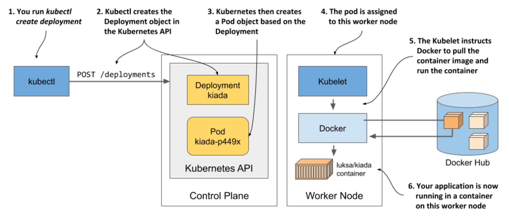

# Chapter 3. Deploying your first application

## Creating a three-node cluster with the [kind](https://kind.sigs.k8s.io/) tool

- [create-kind-cluster.sh](create-kind-cluster.sh) - script that creates the cluster

- [kind-multi-node.yaml](kind-multi-node.yaml) - configuration file for kind

## Creating the Kiada Deployment and Service

- [create-deployment.sh](create-deployment/create-deployment.sh) - creates a Deployment object that runs the Kiada application

- [expose-deployment.sh](expose-application/expose-deployment.sh) - exposes the Kiada application to the world

## This chapter covers

* Running a local Kubernetes cluster on your laptop

* Setting up a cluster on Google Kubernetes Engine

* Setting up a cluster on Amazon Elastic Kubernetes Service

* Setting up and using the `kubectl` command-line tool

* Deploying an application in Kubernetes and making it available across the globe

* Horizontally scaling the application

The goal of this chapter is to show you how to run a local single-node development Kubernetes cluster or set up a proper, managed multi-node cluster in the cloud. Once your cluster is running, you’ll use it to run the container you created in the previous chapter.

## 3.1 Deploying a Kubernetes cluster

Setting up a full-fledged, multi-node Kubernetes cluster isn’t a simple task, especially if you’re not familiar with Linux and network administration. A proper Kubernetes installation spans multiple physical or virtual machines and requires proper network setup to allow all containers in the cluster to communicate with each other.

You can install Kubernetes on your laptop computer, on your organization’s infrastructure, or on virtual machines provided by cloud providers (Google Compute Engine, Amazon EC2, Microsoft Azure, and so on). Alternatively, most cloud providers now offer managed Kubernetes services, saving you from the hassle of installation and management. Here’s a short overview of what the largest cloud providers offer:

* Google offers GKE - Google Kubernetes Engine,

* Amazon has EKS - Amazon Elastic Kubernetes Service,

* Microsoft has AKS – Azure Kubernetes Service,

* IBM has IBM Cloud Kubernetes Service,

* Alibaba provides the Alibaba Cloud Container Service.

Installing and managing Kubernetes is much more difficult than just using it, especially until you’re intimately familiar with its architecture and operation. For this reason, we’ll start with the easiest ways to obtain a working Kubernetes cluster. You’ll learn several ways to run a single-node Kubernetes cluster on your local computer and how to use a hosted cluster running on Google Kubernetes Engine (GKE).

A third option, which involves installing a cluster using the `kubeadm` tool, is explained in Appendix B. The tutorial there will show you how to set up a three-node Kubernetes cluster using virtual machines. But you may want to try that only after you’ve become familiar with using Kubernetes. Many other options also exist, but they are beyond the scope of this book.

## 3.3 Run your first application on K8s

We’ll use simple, one-line imperative commands to deploy your application

### 3.3.1 Deploy your application

* The imperative way to deploy an application is to use the `kubectl create deployment` command

    * The command creates a `Deployment` object, which represents an application deployed in the cluster

    * By using the imperative command, you avoid the need to know the structure of Deployment objects as when you write YAML or JSON manifests

#### Understanding what happens behind the scenes

* When you ran the `kubectl create` command, it created a new Deployment object in the cluster by sending an HTTP request to the Kubernetes API server

  * Kubernetes then created a new Pod object, which as then assigned or *scheduled* to one of the worker nodes

  * The Kubernetes agent on the worker node (the Kubelet) became aware of the newly created Pod object, saw that it was scheduled to its node, and instructed Docker to pull the specified image from the registry, create a container from the image, and execute it

> [!DEFINITION]
>
> The term scheduling refers to the assignment of the pod to a node. The pod runs immediately, not at some point in the future. Just like how the CPU scheduler in an operating system selects what CPU to run a process on, the scheduler in Kubernetes decides what worker node should execute each container. Unlike an OS process, once a pod is assigned to a node, it runs only on that node. Even if it fails, this instance of the pod is never moved to other nodes, as is the case with CPU processes, but a new pod instance may be created to replace it.

* Depending on what you use to run your Kubernetes cluster, the number of worker nodes in your cluster may vary

  * The figure shows only the worker node that the pod was scheduled to

  * In a multi-node cluster, none of the other worker nodes are involved in the process

## 3.4 Summary

* You can install Kubernetes locally, even on your laptop, using tools such as Docker Desktop or Minikube, which run Kubernetes in a Linux VM, or kind, which runs the master and worker nodes as Docker containers and the application containers inside those containers

* An application can be deployed using `kubectl create deployment`

  * It can then be exposed to clients by running `kubectl expose deployment`

  * Horizontally scaling the application is trivial: `kubectl scale deployment` instructs K8s to add new replicas or remove existing ones to reach the number of replicas you specify

* The basic unit of deployment is not a container, but a pod, which can contain one or more related containers

* Deployments, Services, Pods and Nodes are Kubernetes objects/resources

  * You can list them with `kubectl get` and inspect them with `kubectl describe`

* The Deployment object deploys the desired number of Pods, while the Service object makes them accessible under a single, stable IP address

* Each service provides internal load balancing in the cluster, but if you set the type of service to `LoadBalancer`, Kubernetes will ask the cloud infrastructure it runs in for an additional load balancer to make your application available at a publicly accessible address
