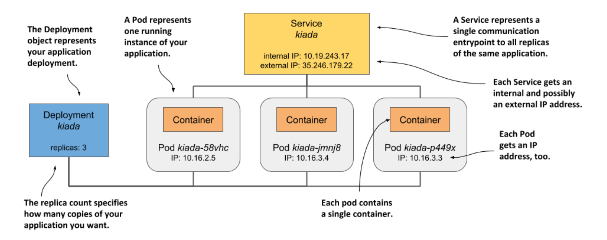

# Understanding the deployed application

* Physical view ▶︎ you've just seen the physical view: three running containers that are deployed on three worker nodes (a single node when using Minikube)

  * If you run K8s in the cloud, the cloud infrastructure has also created a load balancer for you

  * Docker Desktop also creates a type of local load balancer

  * Minikube doesn't create a load balancer, but you can access your service directly through the node port

* While differences in the physical view of the system in different clusters exist, the logical view is always the same, whether you use a small development cluster or a large production cluster w/ thousands of nodes

## Understanding the API objectes representing your application

* The logical view consists of the objects you’ve created in the Kubernetes API – either directly or indirectly

  * The following figure shows how the objects relate to each other:

* The objects are as follows:

  * the Deployment object you created,

  * the Pod objects that were automatically created based on the Deployment, and

  * the Service object you created manually

* The Deployment object represents an application deployment

  * It specifies which container image contains your application and how many replicas of the application K8s should run

  * Each replica is represented by a Pod object

  * The Service object represents a single communication entry point to these replicas

## Understanding the pods

* The essential and most important part of the system are the pods

  * Each pod definition contains one or more containers that make up the pod

  * When K8s brings a pod to life, it runs all the containers specified in its definition
    
  * As long as a Pod object exists, K8s will do its best to ensure that its containers keep running

  * It only shuts them down when the Pod object is deleted

## Understanding the role of the deployment

* When you first created the Deployment object, only a single Pod object was created

  * But when you increased the desired number of replicas on the Deployment, K8s created additional replicas

  * K8s ensures that the actual number of pods always matches the desired number

* If one or more pods disappear or their status is unknown, K8s replaces them to bring the actual number of pods back to the desired number of replicas

  * A pod disappears when someone or something deletes it, whereas a pod's status is unknown when the node it is running on no longer reports its status due to a network or node failure.

* Strictly speaking, a Deployment results in nothing more than the creation of a certain number of Pod objects

  * You may wonder if you can create Pods directly instead of having the Deployment create them for you

  * You can certainly do this, but if you wanted to run multiple replicas, you'd have to manually create each pod individually and make sure you give each one a unique name

  * You'd then also have to keep a constant eye on your pods to replace them if they suddenly disappear or the node on which they run fails

  * And that's exactly why you almost never create pods directly but use a Deployment instead

## Understanding why you need a service

* The third component of your system is the Service object

  * By creating it, you tell K8s that you need a single communication entry point to your pods

  * The service gives you a single IP address to talk to your pods, regardless of how many replicas are currently deployed

  * If the service is backed by multiple pods, it acts as a load balancer

  * But even if there is only one pod, you still want to expose it through a service

* Pods are ephemeral

  * A pod may disappear at any time

  * This can happen when its host node fails, when someone inadvertently deletes the pod, or when the pod is evicted from an otherwise healthy node to make room for other, more important nodes

  * When pods are created through a Deployment, a missing pod is immediately replaced w/ a new one

  * This new pod is not the same as the one it replaces

  * It's a completely new pod, w/ a new IP address

* If you weren't using a service and had configured your clients to connect directly to the IP of the original pod, you would now need to reconfigure all these clients to connect to the IP of the new pod

  * This is not necessary when using a service

  * Unlike pods, services aren't ephemeral

  * when you create a service, it is assigned a static IP address that never changes during lifetime of the service

* Instead of connecting directly to the pod, clients should connect to the IP of the service

  * This ensures that their connections are always routed to a healthy pod, even if the set of pods behind the service is constantly changing

  * It also ensures that the load is distributed evenly across all pods should you decide to scale the deployment horizontally
