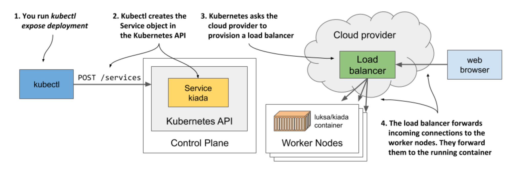
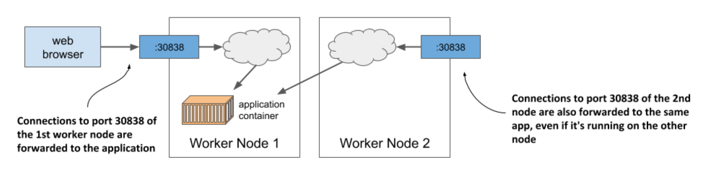

# 3.3.2 Exposing your application to the world

* Your application is now running, so the next question to answer is how to access it

  * Recall each pod gets its own IP address, but this address is internal to the cluster and not accessible from the outside

  * To make the pod accessible externally, you'll _expose_ it by creating a Service object

* Several types of Service objects exist

  * You decide what type you need

  * Some expose pods only within the cluster, while others expose them externally

  * A service w/ the type LoadBalancer provisions an external load balancer, which makes the service accessible via a public IP

  * This is the type of service you'll create now

## Create a service

* Imperative command to create the service:

```zsh
$ kubectl expose deployment kiada --type=LoadBalancer --port 8080
service/kiada exposed
```

* The `create deployment` command that you ran previously created a Deployment object, whereas the `expose deployment` command creates a Service object

* This is what running the above command tells Kubernetes:

  * You want to expose all pods that belong to the kiada Deployment as a new service

  * You want the pods to be accessible from outside the cluster via a load balancer

  * The application listens on port 8080, so you want to access it via that port

* You didn't specify a name for the Service object, so it inherits the name of the Deployment

## List services

* Services are API objects, just like Pods, Deployments, Nodes and virtually everything else in Kubernetes, so you can list them by executing `kubectl get services`:

```zsh
$ kubectl get svc
NAME          TYPE          CLUSTER-IP    EXTERNAL-IP   PORT(S)         AGE
kubernetes    ClusterIP     10.19.240.1   <none>        443/TCP         34m
kiada         LoadBalancer  10.19.243.17  <pending>     8080:30838/TCP  4s
```

> [!NOTE]
> 
> Notice the use of the abbreviation `svc` instead of `services`. Most resource types have a short name that you can use instead of the full object type (for example, `po` is short for `pods`, `no` for `nodes` and `deploy` for `deployments`).

* The list shows two services w/ their types, IPs, and the ports they expose

  * Ignore the `kubernetes` service for now and take a close look at the `kiada` service

  * It doesn't yet have an external IP address

  * Whether it gets one depends on how you've deployed the cluster

## List the available object types w/ kubectl api-resources

* You've used the `kubectl get` command to list various things in your cluster: Nodes, Deployments, Pods and now Services

  * These are all K8s object types

  * You can display a list of all supported types by running `kubectl api-resources`

  * The list shows the short name for each type and some other information you need to define objects in JSON/YAML files

## Understand load balancer services

* While K8s allows you to create so-called LoadBalancer services, it doesn't provide the load balancer itself

  * If your cluster is deployed in the cloud, K8s can ask the cloud infrastructure to provision a load balancer and configure it to forward traffic into your cluster

  * The infrastructure tells K8s the IP address of the load balancer and this becomes the external address of your service

* The process of creating the Service object, provisioning the load balancer and how it forwards connections into the cluster is shown below:



* Provisioning of the load balancer takes some time, so let's wait a few seconds and check whether the IP address is already assigned

  * This time, instead of listing all services, you'll display only the `kiada` service as follows:

```zsh
$ kubectl get svc kiada
NAME      TYPE          CLUSTER-IP    EXTERNAL-IP     PORT(S)         AGE
kiada     LoadBalancer  10.19.243.17  35.246.179.22   8080:30838/TCP  82s
```

* The external IP is now displayed

  * This means that the load balancer is ready to forward requests to your application for clients around the world

> [!NOTE]
> 
> If you deployed your cluster with Docker Desktop, the load balancer’s IP address is shown as `localhost`, referring to your Windows or macOS machine, not the VM where Kubernetes and the application runs. If you use Minikube to create the cluster, no load balancer is created, but you can access the service in another way. More on this later.

## Access your application through the load balancer

You can now send requests to your application through the external IP and port of the service:

```zsh
$ curl 35.246.179.22:8080
Kiada version 0.1. Request processed by "kiada-9d785b578-p449x". Client IP: ::ffff:1.2.3.4
```

> [!NOTE]
> 
> If you use Docker Desktop, the service is available at `localhost:8080` from within your host operating system. Use curl or your browser to access it.


* If you don't count the steps needed to deploy the cluster itself, only two simple commands were needed to deploy your application:

  * `kubectl create deployment`

  * `kubectl expose deployment`

## Access your application when a load balancer isn't available

* Not all K8s clusters have mechanisms to provide a load balancer

  * The cluster provided by Minikube is one of them

  * If you create a service of type LoadBalancer, the service itself works, but there is no load balancer

  * Kubectl always shows the external IP as `<pending>` and you must use a different method to access the service

* Several methods of accessing services exist

  * You can even bypass the service and access individual pods directly, but this is mostly used for troubleshooting

  * For now, let's explore the next easier way to access your service if no load balancer is available

* Minikube can tell you where to access the service if you use the following command:

```zsh
$ minikube service kiada --url
http://192.168.99.102:30838
```

* The command prints out the URL of the service

  * You can now point `curl` or your browser to that URL to access your application:

```zsh
$ curl http://192.168.99.102:30838
Kiada version 0.1. Request processed by "kiada-9d785b578-p449x". Client IP:
       ::ffff:172.17.0.1
```

> [!TIP]
> 
> If you omit the `--url` option when running the `minikube service` command, your browser opens and loads the service URL.

* You may wonder where this IP address and port come from

  * This is the IP of the Minikube virtual machine

  * You can confirm this by executing the `minikube ip` command

  * The Minikube VM is also your single worker node

  * The port `30838` is the so-called _node port_

  * It's the port on the worker node that forwards connections to your service

  * You may have noticed the port in the service's port list when you ran the `kubectl get svc` command:

```zsh
$ kubectl get svc kiada
NAME      TYPE          CLUSTER-IP      EXTERNAL-IP     PORT(S)           AGE
kiada     LoadBalancer  10.19.243.17    <pending>       8080:30838/TCP    82s
```

* Your service is accessible via this port number on all your worker nodes, regardless of whether you're using Minikube or any other K8s cluster

> [!NOTE]
> 
> If you use Docker Desktop, the VM running Kubernetes can’t be reached from your host OS through the VM’s IP. You can access the service through the node port only within the VM by logging into it using the special container.

* If you know the IP of at least one of your worker nodes, you should be able to access your service through this `IP:port` combination, provided that firewall rules do not prevent you from accessing the port

* The next figure shows how external clients access the application via the node ports



* Recall the load balancer forwards connections to the nodes and the nodes then forward them to the containers

  * The node ports are exactly where the load balancer sends incoming requests to

  * K8s then ensures that they are forwarded to the application running in the container
