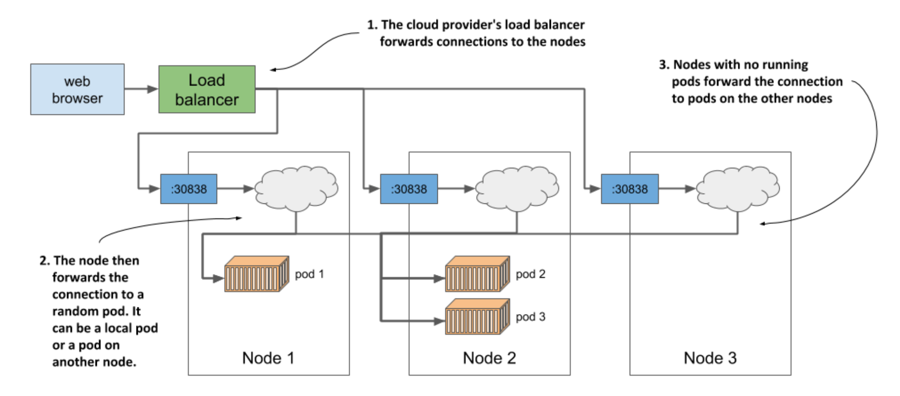

# Horizontally scaling the application

* You now have a running application that is represented by a Deployment and exposed to the world by a Service object

* One of the major benefits of running applications in containers is the ease w/ which you can scale your application deployments

  * You need to run additional instances to distribute the load and provide service to your users

  * This is known as _scaling out_

## Increase the number of running application instances

* To deploy your application, you've created a Deployment object

  * By default, it runs a single instance of your application

  * To run additional instance, you only need to scale the Deployment object w/ the following command:

```zsh
$ kubectl scale deployment kiada --replicas=3
deployment.apps/kiada scaled
```

* You've now told K8s that you want to run three exact copies or _replicas_ of your pod

  * Instead of telling K8s what to do, you simply set a new desired state of the system and letK8s achieve it

  * To do this, it examines the current state, compares it w/ the desired state, identifies the differences and determines what it must do to reconcile them

## See the results of the scale-out

* Although it’s true that the `kubectl scale deployment` command seems imperative, since it apparently tells Kubernetes to scale your application, what the command actually does is modify the specified Deployment object

  * Let's view the Deployment object again to see how the scale command has affected it

```zsh
$ kubectl get deploy
NAME    READY     UP-TO-DATE      AVAILABLE     AGE
kiada   3/3       3               3             18m
```

* Three instances are now up to date and available and three of three containers are ready

  * It's not clear from the command output, but the three containers are not part of the same pod instance

  * There are three pods w/ one container each

  * Confirm th by listing pods:

```zsh
$ kubectl get pods
NAME                    READY   STATUS    RESTARTS    AGE
kiada-9d785b578-58vhc   1/1     Running   0           17s
kiada-9d785b578-jmnj8   1/1     Running   0           17s
kiada-9d785b578-p449x   1/1     Running   0           18m
```

* As you can see, three pods now exist

  * As indicated in the `READY` column, each has a single container, and all the containers are ready

  * All the pods are `Running`

## Display the pods' host node when listing pods

* If you use a single-node cluster, all your pods run on the same node, but in a multi-node cluster, the three pods sould be distributed throughout the cluster

  * To see which nodes the pods were scheduled to, you can use the `-o wide` option to display a more detailed pod list:

```zsh
$ kubectl get pods -o wide
NAME                    ...   IP          NODE
kiada-9d785b578-58vhc   ...   10.244.1.5  kind-worker   # ← Pod scheduled to one node
kiada-9d785b578-jmnj8   ...   10.244.2.4  kind-worker2  # ← Two pods scheduled to another node
kiada-9d785b578-p449x   ...   10.244.2.3  kind-worker2  # ← Two pods scheduled to another node
```

> [!NOTE]
> 
> You can also use the `-o wide` output option to see additional information when listing other object types.

* The wide output shows that one pod was scheduled to one node, whereas the other two wer both scheduled to a different node

  * The Scheduler usually distributed pods evenly, but it depends on how it's configured

> [!NOTE]
> 
> The app itself must support horizontal scaling. Kubernetes doesn’t magically make your app scalable; it merely makes it trivial to replicate it.

## Does the host node matter?

* Regardless of the node they run on, all instances of your application have an identical OS environment, b/c they run in containers created from the same container image

  * You may remember from the previous chapter that the only thing that might be different is the OS kernel, but this only happens when different nodes use different kernel versions or load different kernel modules

* In addition, each pod gets its own IP and can communicate in the same way w/ any other pod - it doesn't matter if the other pod is on the same worker node, another node located in the same server rack or even a completely different data center

* So far, you've set no resource requirements for the pods, but if you had, each pod would have been allocated the requested amount of compute resources

  * It shouldn't matter to the pod which node provides these resources, as long as the pod's requirements are met

* Therefore, you shouldn't care where a pod is scheduled to

  * It's also why the default `kubectl get pods` command doesn't display information about the worker nodes for the listed pods
  
  * In the world of K8s, it's just not that important

## Observe requests hitting all three pods when using the service

```zsh
$ curl 35.246.179.22:8080
Kiada version 0.1. Request processed by "kiada-9d785b578-58vhc". Client IP: ::ffff:1.2.3.4
# ⬆ Request reaches the first pod 
$ curl 35.246.179.22:8080
Kiada version 0.1. Request processed by "kiada-9d785b578-p449x". Client IP: ::ffff:1.2.3.4
# ⬆ Request reaches the third pod
$ curl 35.246.179.22:8080
Kiada version 0.1. Request processed by "kiada-9d785b578-jmnj8". Client IP: ::ffff:1.2.3.4
# ⬆ Request reaches the second pod
$ curl 35.246.179.22:8080
Kiada version 0.1. Request processed by "kiada-9d785b578-p449x". Client IP: ::ffff:1.2.3.4
# ⬆ Request reaches the third pod again
```

* If you look closely at the responses, you'll see that they correspond to the names of the pods

  * Each request arrives at a different pod in a random order

  * This is what services in K8s do when more than one pod instance is behind them

  * They act as load balancers in front of the pods

  * Let's visualize the system using the following figure:



* As the figure shows, you shouldn't confuse this load balancing mechanism, which is provided by the K8s service itself, w/ the additional load balancer provided by the infrastructure when running in GKE or another cluster running in the cloud

  * Even if you use Minikube and have no external load balancer, your requests are still distributed acorss the three pods by the service itself

  * If you use GKE, there are actually _two_ load balancers in play

    * The figure shows that the load balancer provided by the infrastructure distributes request across the nodes, and the service then distributes requests across the pods
