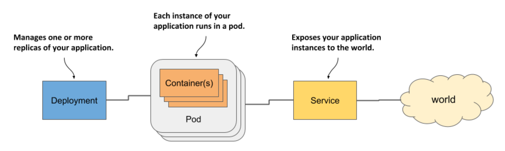

# Running workloads in Pods

## Creating the pod manifest for the Kiada application
- [kiada.yaml](kiada.yaml) - YAML manifest file for the `kiada` pod

## Modifying the application to read from standard input
Building the **`kiada:1.0-stdin`** image:
- [Makefile](kiada-stdin-image/Makefile) - contains commands to build and push the image
- [Dockerfile](kiada-stdin-image/Dockerfile) - Docker instructions for building the image
- [app.js](kiada-stdin-image/app.js) - application code (JavaScript)

Deploying the pod:
- [kiada-stdin.yaml](kiada-stdin.yaml) - manifest for the `kiada-stdin` pod
- [kiada-stdin-once.yaml](kiada-stdin-once.yaml) - manifest for the `kiada-stdin-once` pod, which uses `stdinOnce: true`
- [kiada-stdin-tty.yaml](kiada-stdin-tty.yaml) - manifest for the `kiada-stdin-tty` pod, which uses `tty: true`

## Adding the Envoy proxy container to the kiada pod
Building the **`kiada-ssl-proxy:0.1`** image:
- [Makefile](kiada-ssl-proxy-image/Makefile) - contains commands to build and push the image
- [Dockerfile](kiada-ssl-proxy-image/Dockerfile) - Docker instructions for building the image
- [envoy.yaml](kiada-ssl-proxy-image/envoy.yaml) - Envoy proxy configuration file
- [example-com.crt](kiada-ssl-proxy-image/example-com.crt) - Server certificate used by Envoy
- [example-com.key](kiada-ssl-proxy-image/example-com.key) - Private key used by Envoy

Deploying the pod:
- [kiada-ssl.yaml](kiada-ssl.yaml) - Manifest for the `kiada-ssl` pod

## Creating a pod with init containers
Building the **`init-demo:0.1`** image:
- [Makefile](init-demo-0.1/Makefile) - contains commands to build and push the image
- [Dockerfile](init-demo-0.1/Dockerfile) - Docker instructions for building the image
- [docker_entrypoint.sh](init-demo-0.1/docker_entrypoint.sh) - Shell script that runs in the container

Building the **`network-connectivity-checker:0.1`** image:
- [Makefile](network-connectivity-checker-0.1/Makefile) - contains commands to build and push the image
- [Dockerfile](network-connectivity-checker-0.1/Dockerfile) - Docker instructions for building the image
- [docker_entrypoint.sh](network-connectivity-checker-0.1/docker_entrypoint.sh) - Shell script that runs in the container

Deploying the pod:
- [kiada-init.yaml](kiada-init.yaml) - Manifest for the `kiada-init` pod
- [kiada-init-slow.yaml](kiada-init-slow.yaml) - Manifest for the `kiada-init-slow` pod, whose init container takes 60s to start

## Learning objectives

[ ] Understand how and when to group containers

[ ] Run an application by creating a Pod object from a YAML file

[ ] Communicate w/ an application, view its logs, and explore its environment

[ ] Add a sidecar container to extend the pod's main container

[ ] Initialize pods by running init containers at pod startup

* Recall the three types of objects you created to deploy a minimal application on Kubernetes

  * The following figure shows how they relate to each other and what functions they have in the system:

