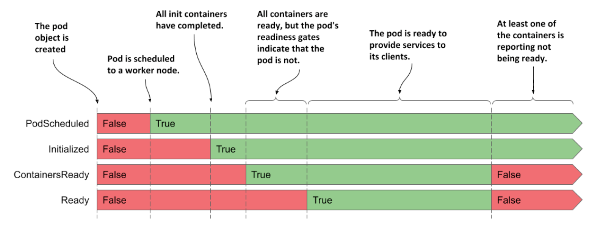

# Understanding pod conditions

* The phase of a pod says little about the condition of the pod

  * You can learn more by looking at the pod's list of conditions, just as you did for the node object in chapter 4

  * A pod's conditions indicate whether a pod has reached a certain state or not, and why that's the case

* In contrast to the phase, a pod has several conditions at the same time

  * Four condition _types_ are explained in the following table-list of pod conditions:

| **Pod Condition** | **Description**                                                                                                                                     |
|-------------------|-----------------------------------------------------------------------------------------------------------------------------------------------------|
| `PodScheduled`    | Indicates whether or not the pod has been scheduled to a node.                                                                                      |
| `Initialized`     | The pod's init containers have all completed successfully.                                                                                          |
| `ContainersReady` | All containers in the pod indicate that they are ready. This is a necessary but not sufficient condition for the entire pod to be ready.            |
| `Ready`           | The pod is ready to provide services to its clients. The containers in the pod and the pod's readiness gates are all reporting that they are ready. |

* Each condition is either fulfilled or not

  * As you can see in the following figure, the `PodScheduled` and `Initialized` conditions start as unfulfilled, but are soon fulfilled and remain so throughout the life of the pod

  * In contrast, the `Ready` and `ContainersReady` conditions can change many times during the pod's lifetime



* Do you remember the conditions you can find in a node object?

  * They are `MemoryPressure`, `DiskPressure`, `PIDPressure` and `Ready`

  * As you can see, each object has its own set of condition types, but many contain the generic `Ready` condition, which typically indicates whether everything is fine w/ the object

## Inspecting the pod's conditions

* To see the conditions of a pod, you can use `kubectl describe` as shown here:

```zsh
$ kubectl describe po kiada
...
 Conditions:
  Type              Status
  Initialized       True    # ← The pod has been initialized
  Ready             True    # ← The pod and its containers are ready
  ContainersReady   True    # ← The pod and its containers are ready
  PodScheduled      True    # ← The pod has been scheduled to a node
...
```

* The `kubectl describe` command shows only whether each condition is true or not

  * To find out why a condition is false, you must look for the `status.conditions` field in the pod manifest as follows:

```zsh
$ kubectl get po kiada -o json | jq .status.conditions
[
  {
    "lastProbeTime": null,
    "lastTransitionTime": "2020-02-02T11:42:59Z",
    "status": "True",
    "type": "Initialized"
  },
  ...
```

* Each condition has a `status` field that indicates whether the condition is `True`, `False`, or `Unknown`

  * In the case of the `kiada` pod, the status of all conditions is `True`, which means they are all fulfilled

  * The condition can also contain a `reason` field that specifies a machine-facing reason for the last change of the condition's status, and a `message` field that explains the change in detail

  * The `lastTransitionTime` field shows when the change occurred, while the `lastProbeTime` indicates when this condition was last checked
