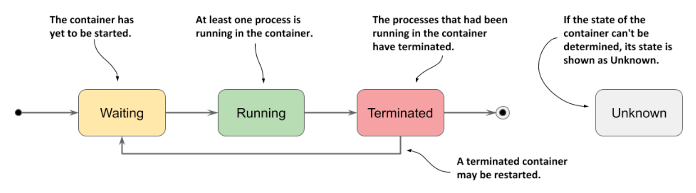

# Understanding the container status

* Also contained in the status of the pod is the status of each of its containers

  * Inspecting the status provides better insight into the operation of each individual container

* The status contains several fields

  * The `state` field indicates the container's current state, whereas the `lastState` field shows the state of the previous container after it has terminated

  * The container status also indicates the internal ID of the container (`containerID`), the `image` and the `imageID` the container is running, whether the container is `ready` or not and how often it has been restarted (`restartCount`)

## Understanding the container state

* The most important part of a container's status is its `state`

  * A container can be in one of the states shown in the following figure:



* Possible container states:

| **Container State** | **Description**                                                                                                                                                                                                                                      |
|---------------------|------------------------------------------------------------------------------------------------------------------------------------------------------------------------------------------------------------------------------------------------------|
| `Waiting`           | The container is waiting to be started. The `reason` and `message` fields indicate why the container is in this state.                                                                                                                               |
| `Running`           | The container has been created and processes are running in it. The `startedAt` field indicates the time at which this container was started.                                                                                                        |
| `Terminated`        | The processes that had been running in the container have terminated. The `startedAt` and `finishedAt` fields indicate when the container was started and terminated. The exit code w/ which the main process terminated is in the `exitCode` field. |
| `Unknown`           | The state of the container couldn't be determined.                                                                                                                                                                                                   |
## Displaying the status of the pod's containers

* The pod list displayed by `kubectl get pods` shows only the number of containers in each pod and how many of them are ready

  * To see the status of individual containers, you can use `kubectl describe`:

```zsh
$ kubectl describe po kiada ...
Containers:
  kiada:
  Container ID:   docker://c64944a684d57faacfced0be1af44686...
  Image:          luksa/kiada:0.1
  Image ID:       docker-pullable://luksa/kiada@sha256:3f28...
  Port:           8080/TCP
  Host Port:      0/TCP
  State:          Running # ← The current state of the container and when it was started
    Started:      Sun, 02 Feb 2020 12:43:03 +0100 # ← The current state of the container and when it was started
  Ready:          True # ← Whether the container is ready to provide its services
  Restart Count:  0 # ← How many times the container has been restarted
    Environment:    <none>
...
```

* Focus on the annotated lines in the listing, as they indicate whether the container is healthy

  * The `kiada` container is `Running` and is `Ready`

  * It has never been restarted

> [!TIP]
> 
> You can also display the container status(es) using `jq` like this: `kubectl get po kiada -o json | jq .status.containerStatuses`

## Inspecting the status of an init container

* Unlike w/ regular containers, the status of init containers isn't available in the `status` section of the pod object manifest, but in the `initContainerStatuses` field

## Inspecting the status of the kiada-init pod

* Use the `kubectl describe` command and the `kubectl get po kiada-init -o json | jq .status` command to find the information in the object definition
