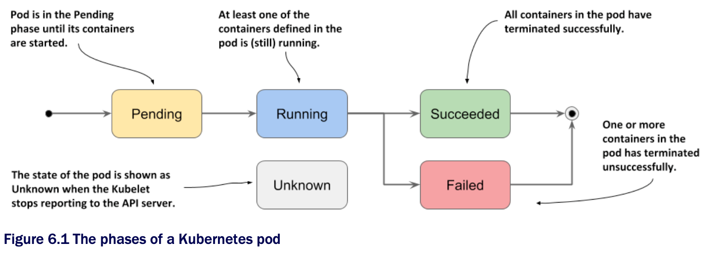

# Understanding the pod phase

* In any moment of the pod's life, it's in one of the five phases shown in the following figure:



* List of phases a pod can be in...

| **Pod Phase** | **Description**                                                                                                                                                                     |
|---------------|-------------------------------------------------------------------------------------------------------------------------------------------------------------------------------------|
| `Pending`     | After you create the Pod object, this is its initial phase. Until the pod is scheduled to a node and the images of its containers are pulled and started, it remains in this phase. |
| `Running`     | At least one of the pod's containers is running.                                                                                                                                    |
| `Succeeded`   | Pods that aren't intended to run indefinitely are marked as `Succeeded` when all their containers complete successfully.                                                            |
| `Failed`      | When a pod is not configured to run indefinitely and at least one of its containers terminates unsuccessfully, the pod is marked as Failed.                                         |
| `Unknown`     | The state of the pod is unknown b/c the Kubelet has stopped reporting communicating w/ the API server. Possibly the worker node has failed or has disconnected from the network.    |

* The pod's phase provides a quick summary of what's happening w/ the pod

  * Let's deploy the `kiada` pod again and inspect its phase

  * Create the pod by applying the [manifest file](./pod.kiada.yaml) to your cluster again:

```zsh
$ kubectl apply -f pod.kiada.yaml
```

## Displaying a pod's phase

* The pod's phase is one of the fields in the pod object's `status` section

  * You can see it by displaying its manifest and optionally grepping the output to search for the field:

```zsh
$ kubectl get po kiada -o yaml | grep phase phase: Running
```

> [!TIP]
> 
> Remember the `jq` tool? You can use it to print out the value of the `phase` field like this: `kubectl get po -o json | jq .status.phase`

* You can also see the pod's phase using `kubectl describe`

  * The pod's status is shown close to the top of the output:

```zsh
$ kubectl describe po kiada
Name:         kiada
Namespace:    default
...
Status:       Running
...
```

* Although it may appear that the `STATUS` column displayed by `kubectl get pods` also shows the phase, this is only true for pods that are healthy:

```zsh
$ kubectl get po kiada
NAME    READY   STATUS    RESTARTS    AGE
kiada   1/1     Running   0           40m
```

* For unhealthy pods, the `STATUS` column indicates what's wrong w/ the pod
