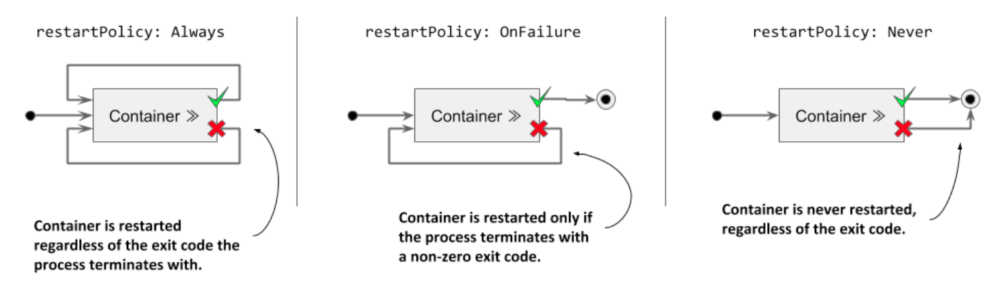
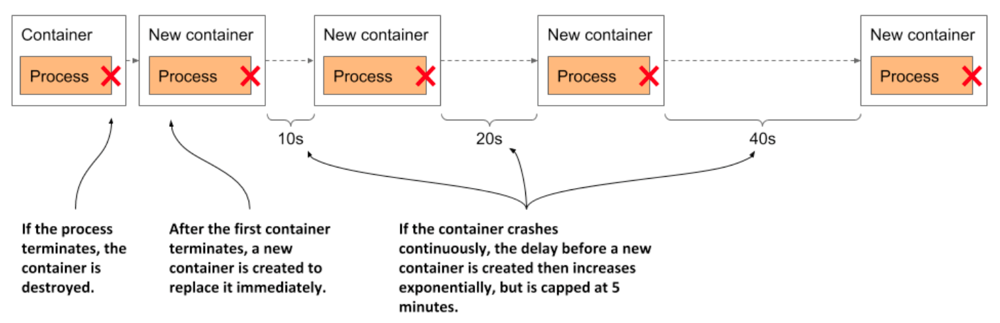

# Understanding container auto-restart

* When a pod is scheduled to a node, the Kubelet on that node starts its containers and from then on keeps them running for as long as the pod object exists

  * If the main process in the container terminates for any reason, the Kubelet restarts the container

  * If an error in your application causes it to crash, Kubernetes automatically restarts it, so even w/o doing anything special in the application itself, running it in K8s automatically gives it the ability to heal itself

  * Let's see this in action

## Observing a container failure

* In the previous chapter, you created the `kiada-ssl` pod, which contains the Node.js and the Envoy containers

  * Create the pod again and enable communication w/ the pod by running the following two commands:

```zsh
$ kubectl apply -f pod.kiada-ssl.yaml
$ kubectl port-forward kiada-ssl 8080 8443 9901
```

* You'll now cause the Envoy container to terminate to see how Kubernetes deals w/ the situation

  * Run the following command in a separate terminal so you can see how the pod's status changes when one of its containers terminates:

```zsh
$ kubectl get pods -w
```

* You'll also want to watch events in another terminal using the following command:

```zsh
$ kubectl get events -w
```

* You could emulate a crash of the container's main process by sending it the `KILL` signal, but you can't do this from inside the container b/c the Linux Kernel doesn't let you kill the root process (the process w/ PID 1)

  * You would have to SSH to the pod's host node and kill the process from there

  * Fortunately, Envoy's administration interface allows you to stop the process via its HTTP API

    * To terminate the `envoy` container, open the URL http://localhost:9901 in your browser and click the _quitquitquit_ button or run the following `curl` command in another terminal:

```zsh
$ curl -X POST http://localhost:9901/quitquitquit
OK
```

* To see what happens w/ the container and the pod it belongs to, examine the output of the `kubectl get pods -w` command you ran earlier

  * This is its output:

```zsh
$ kubectl get po -w
NAME          READY   STATUS    RESTARTS    AGE
kiada-ssl     2/2     Running   0           1s
kiada-ssl     1/2     NotReady  0           9m33s
kiada-ssl     2/2     Running   1           9m34s
```

* The listing shows that the pod's `STATUS` changes from `Running` to `NotReady`, while the `READY` column indicates that only one of the two containers is ready

  * Immediately thereafter, Kubernetes restarts the containers and the pod's status returns to `Running`

  * The `RESTARTS` column indicates that one container has been restarted

> [!NOTE]
> 
> If one of the pod's containers fails, the other containers continue to run.

* Now examine the output of the `kubectl get events -w` command you ran earlier

  * Here's the command and its output:

```zsh
$ kubectl get ev -w
LAST SEEN   TYPE      REASON      OBJECT          MESSAGE
0s          Normal    Pulled      pod/kiada-ssl   Container image already
                                                  present on machine
0s          Normal    Created     pod/kiada-ssl   Created container envoy
0s          Normal    Started     pod/kiada-ssl   Started container envoy
```

* The events show that the new `envoy` container has been started

  * You should be able to access the application via HTTPS again

  * Please confirm w/ your browser or `curl`

* The events in the listing also expose an important detail about how Kubernetes restarts containers

  * The second event indicates that the entire `envoy` container has been recreated

  * Kubernetes never restarts a container, but instead discards it and creates a new container

  * Regardless, we call this _restarting_ a container

> [!NOTE]
> 
> Any data that the process writes to the container's filesystem is lost when the container is recreated. This behavior is sometimes undesirable. To persist data, you must add a storage volume to the pod, as explained in the next chapter.

> [!NOTE]
>
> If init containers are defined in the pod and one of the pod's regular containers is restarted, the init containers are not executed again.

## Configuring the pod's restart policy

* By default, Kubernetes restarts the container regardless of whether the process in the container exits w/ a zero or non-zero exit code-in other words, whether the container completes successfully or fails

  * This behavior can be changed by setting the `restartPolicy` field in the pod's `spec`

  * Three restart policies exist

  * They are explained in the following figure:



* The following table describes the three pod restart policies:

| **Restart Policy** | **Description**                                                                                                                      |
|--------------------|--------------------------------------------------------------------------------------------------------------------------------------|
| `Always`           | Container is restarted regardless of the exit code the process in the container terminates with. This is the default restart policy. |
| `OnFailure`        | The container is restarted only if the process terminates w/ a non-zero exit code, which by convention indicates failure.            |
| `Never`            | The container is never restarted-not even when it fails                                                                              |

> [!NOTE]
> 
> Surprisingly, the restart policy is configured at the pod level and applies to all its containers. It can't be configured for each container individually.

## Understanding the time delay inserted before a container is restarted

* If you call Envoy's `/quitquitquit` endpoint several times, you'll notice that each time it takes longer to restart the container after it terminates

  * The pod's status is displayed as either `NotReady` or `CrashLoopBackOff`

  * Here's what it means:

    * As shown in the following figure, the first time a container terminates, it is restarted immediately

    * The next time, however, Kubernetes waits ten seconds before restarting it again

    * This delay is then doubled to 20, 40, 80, and then to 160 seconds after each subsequent termination. From then on, the delay is kept at five minutes

    * This delay that doubles between attempts is called exponential back-off



* In the worst case, a container can therefore be prevented from starting for up to five minutes

> [!NOTE]
> 
> The delay is reset to zero when the container has run successfully for 10 minutes. If the container must be restarted later, it is restarted immediately.

* Check the container status in the pod manifest as follows:

```zsh
$ kubectl get po kiada-ssl -o json | jq .status.containerStatuses
...
"state": {
  "waiting": {
    "message": "back-off 40s restarting failed container=envoy ...",
    "reason": "CrashLoopBackOff"
```

* As you can see in the output, while the container is waiting to be restarted, its state is `Waiting`, and the `reason` is `CrashLoopBackOff`

  * The `message` field tells you how long it will take for the container to be restarted

> [!NOTE]
> 
> When you tell Envoy to terminate, it terminates w/ exit code zero, which means it hasn't crashed. The `CrashLoopBackOff` status can therefore be misleading.
