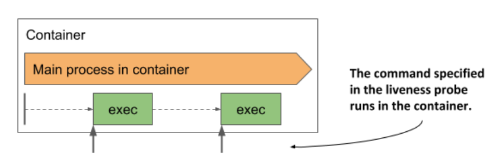

# Using the exec and the tcpSocket liveness probe types

* For applications that don't expose HTTP health-check endpoints, the `tcpSocket` or the `exec` liveness probes should be used

## Adding a tcpSocket liveness probe

* For applications that accept non-HTTP TCP connections, a `tcpDocket` liveness probe can be configured

  * Kubernetes tries to open a socket to the TCP port and if the connection is established, the probe is considered a success, otherwise it's considered a failure

* An example of a `tcpSocket` liveness probe is shown here:

```yaml
livenessProbe:
  tcpSocket:          # ← This tcpSocket probe uses TCP port 1234
    port: 1234        # ← This tcpSocket probe uses TCP port 1234
  periodSeconds: 2    # ← The probe runs every 2s
  failureThreshold: 1 # ← A single probe failure is enough to restart the container
```

* The probe in the listing is configured to check if the container's network port `1234` is open

  * An attempt to establish a connection is made every two seconds and a single failed attempt is enough to consider the container as unhealthy

## Adding an exec liveness probe

* Applications that do not accept TCP connections may provide a command to check their status

  * For these applications, an `exec` liveness probe is used

  * As shown in the next figure, the command is executed inside the container and must therefore be available on the container's file system



* The following is an example of a probe that runs `/usr/bin/healthcheck` every two seconds to determine if the application running in the container is still alive:

```yaml
  livenessProbe:
    exec:
      command:                # ← The command to run and its arguments
      - /usr/bin/healthcheck  # ← The command to run and its arguments
    periodSeconds: 2          # ← The probe runs every second
    timeoutSeconds: 1         # ← The command must return within one second
    failureThreshold: 1       # ← A single probe failure is enough to restart the container
```

* If the command returns exit code zero, the container is considered healthy

  * If it returns a non-zero exit code or fails to complete within one second as specified in the `timeoutSeconds` field, the container is terminated immediately, as configured in the `failureThreshold` field, which indicates that a single probe failure is sufficient to consider the container as unhealthy
