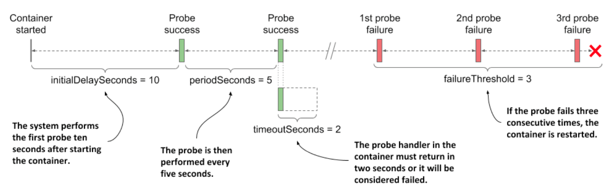

# Creating an HTTP GET liveness probe

* Let's look at how to add a liveness probe to each of the containers in the `kiada-ssl` pod

  * B/c they both run applications that understand HTTP, it makes sense to use an HTTP GET probe in each of them

  * The Node.js application doesn't provide any endpoints to explicitly check the health of the application, but the Envoy proxy does

  * In real-world applications, you'll encounter both cases

## Defining liveness probes in the pod manifest

* The following listing shows an updated manifest for the pod, which defines a liveness probe for each of the containers, w/ different levels of configuration (file `pod.kiada-liveness.yaml`):

  * Adding a liveness probe to a pod

```yaml
apiVersion: v1
kind: Pod
metadata:
  name: kiada-liveness
spec:
  containers:
  - name: kiada
    image: luksa/kiada:0.1
    ports:
    - name: http
      containerPort: 8080
    livenessProbe:                    # ← The liveness probe definition for the container running Node.js
      httpGet:                        # ← The liveness probe definition for the container running Node.js
        path: /                       # ← The liveness probe definition for the container running Node.js
        port: 8080                    # ← The liveness probe definition for the container running Node.js
  - name: envoy
    image: luksa/kiada-ssl-proxy:0.1
    ports:
    - name: https
      containerPort: 8443
    - name: admin
      containerPort: 9901
    livenessProbe:                    # ← The liveness probe for the Envoy proxy
      httpGet:                        # ← The liveness probe for the Envoy proxy
        path: /ready                  # ← The liveness probe for the Envoy proxy
        port: admin                   # ← The liveness probe for the Envoy proxy
      initialDelaySeconds: 10         # ← The liveness probe for the Envoy proxy
      periodSeconds: 5                # ← The liveness probe for the Envoy proxy
      timeoutSeconds: 2               # ← The liveness probe for the Envoy proxy
      failureThreshold: 3             # ← The liveness probe for the Envoy proxy
```

## Defining a liveness probe using the minimum required configuration

* The liveness probe for the `kiada` container is the simplest version of a probe for HTTP-based applications

  * The probe simply sends an HTTP `GET` request for the path `/` on port `8080` to determine if the container can still serve requests

  * If the application responds w/ an HTTP status between `200` and `399`, the application is considered healthy

* The probe doesn't specify any other fields, so the default settings are used

  * The first request is sent 10s after the container starts and is repeated every 5s

  * If the application doesn't respond within two seconds, the probe attempt is considered failed

  * If it fails three times in a row, the container is considered unhealthy and is terminated

## Understanding liveness probe configuration options

* The administration interface of the Envoy proxy provides the special endpoint `/ready` through which it exposes its health status

  * Instead of targeting port `8443`, which is the port through which Envoy forwards HTTPS requests to Node.js, the liveness probe for the `envoy` container targets this special endpoint on the `admin` port, which is port number `9901`

> [!NOTE]
> 
> As you can see in the `envoy` container's liveness probe, you can specify the probe's target port by name instead of by number.

* The liveness prove for the `envoy` container also contains additional fields

  * These are best explained w/ the following figure



* The parameter `initialDelaySeconds` determines how long Kubernetes should delay the execution of the first probe after starting the container

  * The `periodSeconds` field specifies the amount of time between the execution of two consecutive probes, whereas the `timeoutSeconds` field specifies how long to wait for a response before the probe attempt counts as failed

  * The `failureThreshold` field specifies how many times the probe must fail for the container to be considered unhealthy and potentially restarted
