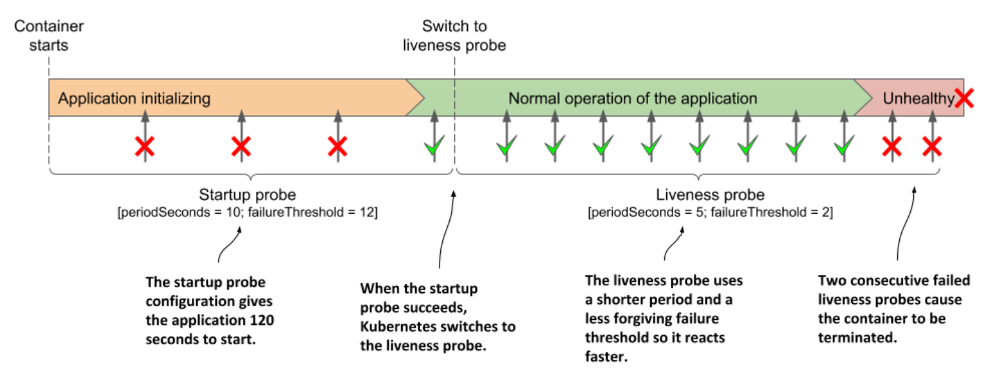

# Using a startup probe when an application is slow to start

* The default liveness probe settings give the application between 20 and 30 seconds to start responding to liveness probe requests

  * If the application takes longer to start, it is restarted and must start again

  * If the second start also takes as long, it is restarted again

  * If this continues, the container never reaches the state where the liveness probe succeeds and gets stuck in an endless restart loop

* To prevent this, you can increase the `initialDelaySeconds`, `periodSeconds` or `failureThreshold` settings to account for the long start time, but this will have a negative effect on the normal operation of the application

  * The higher the result of `periodSeconds * failureThreshold`, the longer it takes to restart the application if it becomes unhealthy

  * For applications that take minutes to start, increasing these parameters enough to prevent the application from being restarted prematurely may not be a viable option

## Introducing startup probes

* To deal w/ the discrepancy between the start and the steady-state operation of an application, Kubernetes provides _startup probes_

* If a startup probe is defined for a container, only the startup probe is executed when the container is started

  * The startup probe can be configured to consider the slow start of the application

  * When the startup probe succeeds, Kubernetes switches to using the liveness probe, which is configured to quickly detect when the application becomes unhealthy

## Adding a startup probe to a pod's manifest

* Imagine that the Kiada Node.js application needs more than a minute to warm up, but you want it to be restarted within 10 seconds when it becomes unhealthy during normal operation

  * The following listing shows how you configure the startup and liveness probes (you can find it in the file `pod.kiada-startup-probe.yaml`)

  * Using a combination of a startup and a liveness probe:

```yaml
...
containers:
  - name: kiada
    image: luksa/kiada:0.1
    ports:
    - name: http
      containerPort: 8080
    startupProbe:
      httpGet:
        path: /             # ← The startup and the liveness probes typically use the same endpoint
        port: http          # ← The startup and the liveness probes typically use the same endpoint
      periodSeconds: 10     # ← The application gets 120 seconds to start
      failureThreshold: 12  # ← The application gets 120 seconds to start
    livenessProbe:
      httpGet:
        path: /             # ← The startup and the liveness probes typically use the same endpoint
        port: http          # ← The startup and the liveness probes typically use the same endpoint
      periodSeconds: 5      # ← After startup, the application’s health is checked every 5 seconds, and is restarted when it fails the liveness probe twice
      failureThreshold: 2   # ← After startup, the application’s health is checked every 5 seconds, and is restarted when it fails the liveness probe twice
```

* When the container defined above starts, the application has 120 seconds to start responding to requests

  * Kubernetes performs the startup probe every 10 seconds and makes a maximum of 12 attempts

* As shown in the following figure, unlike liveness probes, it's perfectly normal for a startup probe to fail

  * A failure only indicates that the application hasn't yet been completely started

  * A successful startup probe indicates that the application has started successfully, and Kubernetes should switch to the liveness probe

  * The liveness probe is then typically executed using a shorter period of time, which allows for faster detection of non-responsive applications



> [!NOTE]
> 
> If the startup probe fails often enough to reach the `failureThreshold`, the container is terminated as if the liveness probe had failed.

* Usually, the startup and liveness probes are configured to use the same HTTP endpoint, but different endpoints can be used

  * You can also configure the startup probe as an `exec` or `tcpSocket` probe instead of an `httpGet` probe
