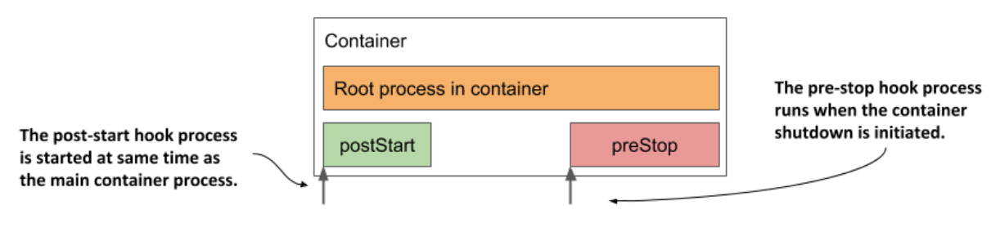

# Executing actions at container start-up and shutdown

* In the previous chapter you learned that you could use init containers to run containers at the start of the pod lifecycle

  * You may also want to run additional processes every time a container starts and just before it stops

  * You can do this by adding _lifecycle hooks_ to the container

  * Two types of hooks are currently supported:

    * _Post-start_ hooks, which are executed when the container starts, and

    * _Pre-stop_ hooks, which are executed shortly before the container stops

  * These lifecycle hooks are specified per container, as opposed to init containers, which are specified at the pod level

    * The next figure should help you visualize how lifecycle hooks fit into the lifecycle of a container

    * How the post-start and pre-stop hook fit into the container's lifecycle:

* Like liveness probes, lifecycle hooks can be used to either:

  * Execute a command inside the container, or

  * send an HTTP GET request to the application in the container

> [!NOTE]
> 
> The same as w/ liveness probes, lifecycle hooks can only be applied to regular containers and not to init containers. Unlike probes, lifecycle hooks do not support `tcpSocket` handlers.

* Let's look at the two types of hooks individually to see what you can use them for
