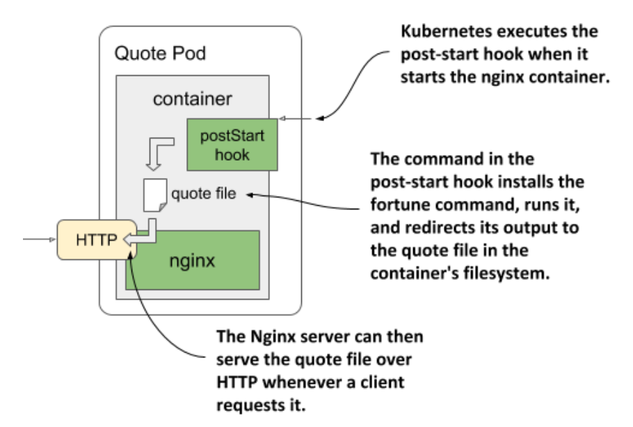

# Using post-start hooks to perform actions when the container starts

* The post-start lifecycle hook is invoked immediately after the container is created

  * You can use the `exec` type of the hook to send an HTTP request to the application running in the container to perform some type of initialization or warm-up procedure

* If you're the author of the application, you could perform the same operation within the application code itself, but if you need to add it to an existing application that you didn't create yourself, you may not be able to do so

  * A post-start hook provides a simple alternative that doesn't require you to change the application or its container image

* Let's look at an example of how a post-start hook can be used in a new service you'll create

## Introducing the quote service

* You may remember from section 2.2.1 that the final version of the Kubernetes in Action Demo Application (Kiada) Suite will contain the Quote and Quize services in addition to the Node.js application

  * The data from those two services will be used to show a random quote from the book and a multiple-choice pop quiz to help you test your K8s knowledge

  * To refresh you memory, the following figure shows the three components that make up the Kiada suite:


* Caveat: the `fortune` command prints to the standard output

  * It can't serve the quote over HTTP

  * However, this isn't a hard problem to solve

  * We can combine the `fortune` program w/ a web server such as Nginx to get the result we want

## Using a post-start container lifecycle hook to run a command in the container

* For the first version of the service, the container will run the `fortune` command when it starts up

  * The output will be redirected to a file in Nginx' web-root directory, so that it can serve it

  * Although this means that the same quote is returned in every request, this is a perfectly good start

* The Nginx web server is available as a container image, so let's use it

  * B/c the `fortune` command is not available in this image, you'd normally build a new image that uses that image as the base and installs the `fortune` package on top of it

  * But we'll keep things even simpler for now

* Instead of building a completely new image you'll use a post-start hook to install the `fortune` software package, download the file containing the quotes from this book, and finally run the `fortune command and write its output to a file that Nginx can serve

  * The operation of the quote-poststart pod is presented in the following figure:



* The following listing shows how to define the hook (file `pod.quote-poststart.yaml`)-pod w/ a post-start lifecycle hook:

```yaml
apiVersion: v1
kind: Pod
metadata:
  name: quote-poststart # ← The name of this pod is quote-poststart.
spec:
  containers:
  - name: nginx # ← The nginx:alpine container image is used in this single-container pod.
    image: nginx:alpine # ← The nginx:alpine container image is used in this single-container pod.
    ports: # ← The Nginx server runs on port 80.
    - name: http # ← The Nginx server runs on port 80.
      containerPort: 80 # ← The Nginx server runs on port 80.
    lifecycle: # ← A post-start lifecycle hook is used to run a command when the container starts.
      postStart: # ← A post-start lifecycle hook is used to run a command when the container starts.
        exec: # ← A post-start lifecycle hook is used to run a command when the container starts.
          command: # ← A post-start lifecycle hook is used to run a command when the container starts.
            - sh # ← This is the command
            - -c # ← This is its first argument.
            -| # ← The second argument is the multi-line string that follows.
              apk add fortune && \ # ← The second argument consists of these lines.
              curl -O https://luksa.github.io/kiada/book-quotes.txt && \ # ← The second argument consists of these lines.
              curl -O https://luksa.github.io/kiada/book-quotes.txt.dat && \ # ← The second argument consists of these lines.
              fortune book-quotes.txt > /usr/share/nginx/html/quote # ← The second argument consists of these lines.
```

* The YAML in the listing is not simple, so let's make sense of it

  * First, the easy parts:

    * The pod is named `quote-poststart` and contains a single container based on the `nginx:alpine` image

    * A single port is defined in the container

    * A `postStart` lifecycle hook is also defined for the container

      * It specifies what command to run when the container starts

      * The tricky part is the definition of this command, but we'll break it down for you:

        * It's a list of commands that are passed to the `sh` command as an argument

        * The reason this needs to be so is b/c you can't define multiple commands in a lifecycle hook

        * The solution is to invoke a shell as the main command and letting it run the list of commands by specifying them in the command string:

```zsh
sh -c "the command string"
```

  * In the previous listing, the third argument (the command string) is rather long, so it must be specified over multiple lines to keep the YAML legible

    * Multi-line string values in YAML can be defined by typing a pipeline character and following it w/ properly indented lines

    * The command string in the previous listing is therefore as follows:

```zsh
apk add fortune && \
curl -O https://luksa.github.io/kiada/book-quotes.txt && \
curl -O https://luksa.github.io/kiada/book-quotes.txt.dat && \
fortune book-quotes.txt > /usr/share/nginx/html/quote
```
  
* As you can see, the command string consists of four commands. Here's what they do:

  1. The `apk add fortune` command runs the Alpine Linux package management tool, which is part of the image that `nginx:alpine is based on, to install the `fortune` package in the container

  2. The first `curl` command downloads the `book-quotes.txt` file

  3. The second `curl` command downloads the `book-quotes.txt.dat` file

  4. The `fortune` command selects a random quote from the `book-quotes.txt` file and prints it to standard output. That output is redirected to the `/usr/share/nginx/html/quote` file.

* The lifecycle hook command runs parallel to the main process

  * The `postStart` name is somewhat misleading, b/c the hook isn't executed after the main process is fully started, but as soon as the container is created, at around the same time the main process starts

* When the `postStart` hook in this example completes, the quote produced by the `fortune` command is stored in the `/usr/share/nginx/html/quote` file and can be served by Nginx

* Use the `kubectl apply` command to create the pod from the `pod.quote-poststart.yaml` file, and you should then be able to use `curl` or your browser to get the quote at URI `/quote` on port `80` of the `quote-poststart` pod

  * You've already learned how to use the `kubectl port-forward` command to open a tunnel to the container, but you may want to refer to the sidebar b/c a caveat exists

* If everything works as it should, the Nginx server will return a random quote from this book as in the following example:

```zsh
$ curl localhost:1080/quote
The same as with liveness probes, lifecycle hooks can only be applied to regular containers
and
not to init containers. Unlike probes, lifecycle hooks do not support tcpSocket handlers.
```

  * The first version of the Quote service is now done, but you'll improve it in the next chapter

  * Now let's earn about the caveats of using post-start hooks before we move on

## Accessing the quote-poststart pod

* To retrieve the quote from the `quote-poststart` pod, you must first run the `kubectl port-forward` command, which may fail as shown here:

```zsh

$ kubectl port-forward quote-poststart 80
Unable to listen on port 80: Listeners failed to create with the following errors: [unable to create listener: Error listen tcp4 127.0.0.1:80: bind: permission denied unable to create listener: Error listen tcp6 [::1]:80: bind: permission denied] error: unable to listen on any of the requested ports: [{80 80}]
```

* The command fails if your operating system doesn't allow you to run processes that bind to port numbers 0-1023. To fix this, you must use a higher local port number as follows:

```zsh
$ kubectl port-forward quote-poststart 1080:80
```

* The last argument tells `kubectl` to use port `1080` locally and forward it to port `80` of the pod. You can now access the Quote service at http://localhost:1080/quote.

## Understanding how a post-start hook affects the container

* Although the post-start hook runs asynchronously w/ the main container process, it affects the container in two ways

  * First, the container remains in the `Waiting` state w/ the reason `ContainerCreating` until the hook invocation is completed

  * The phase of the pod is `Pending`

  * If you run the `kubectl logs` command at this point, it refuses to show the logs, even though the container is running

  * The `kubectl port-forward` command also refuses to forward ports to the pod

* If you want to see this for yourself, deploy the `pod.quote-poststart-slow.yaml` pod manifest file

  * It defines a post-start hook that takes 60 seconds to complete

  * Immediately after the pod is created, inspect its state, and display the logs w/ the following command:

```zsh
$ kubectl logs quote-poststart-slow
Error from server (BadRequest): container "nginx" in pod "quote-poststart-slow" is waiting
  to start: ContainerCreating
```

  * The error message returned implies that the container hasn't started yet, which isn't the case

    * To prove this, use the following command to list processes in the container:

```zsh
$ kubectl exec quote-poststart-slow -- ps x
PID   USER    TIME    COMMAND
  1   root    0:00    nginx: master process nginx -g daemon off;        # ← Nginx is running
  7   root    0:00    sh -c apk add fortune && \ sleep 60 && \ curl...  # ← The processes that run as part of the post-start hook
 13   nginx   0:00    nginx: worker process                             # ← Nginx is running
...                                                                     # ← Nginx is running
 20   nginx   0:00    nginx: worker process                             # ← Nginx is running
 21   root    0:00    sleep 60                                          # ← The processes that run as part of the post-start hook
 22   root    0:00    ps x
```

* The other way a post-start hook could affect the container is if the command used in the hook can't be executed or returns a non-zero exit code

  * If this happens, the entire container is restarted

  * To see an example of a post-start hook that fails, deploy the pod manifest `pod.quote-poststart-fail.yaml`

  * If you watch the pod's status using `kubectl get pods -w`, you'll see the following status:

```zsh
quote-poststart-fail 0/1 PostStartHookError: command 'sh -c echo 'Emulating a post-
  start hook failure'; exit 1' exited with 1:
```

* It shows the command that was executed and the code w/ which it terminated

  * When you review the pod events, you'll see a `FailedPostStartHook` warning event that indicates the exit code and what the command printed to the standard or error output

  * This is the event:

```zsh
Warning FailedPostStartHook Exec lifecycle hook ([sh -c ...]) for Container "nginx" in
  Pod "quote-poststart-fail_default(...)" failed - error: command '...' exited with 1:
  , message: "Emulating a post-start hook failure\n"
```

* The same information is also contained in the `containerStatuses` field in the pod's `status` field, but only for a short time, as the container status changes to `CrashLoopBackOff` shortly afterwards

> [!TIP]
> 
> B/c the state of a pod can change quickly, inspecting just its status may not tell you everything you need to know. Rather than inspecting the state at a particular moment in time, reviewing the pod's events is usually a better way to get the full picture.

## Capturing the output produced by the process invoked via a post-start hook

* As you've just learned, the output of the command defined in the post-start hook can be inspected if it fails

  * In cases where the command completes successfully, the output of the command is not logged anywhere

  * To see the output, the command must log to a file instead of the standard or error output

  * You can then view the contents of the file w/ a command like the following:

```zsh
$ kubectl exec my-pod -- cat logfile.txt
```

## Using an HTTP GET post-start hook

* In the previous example, you configured the post-start hook to execute a command inside the container

  * Alternatively, you can have K8s send an HTTP GET request when it starts the container by using an `httpGet` post-start hook

> [!NOTE]
> 
> You can't specify both an `exec` and an `httpGet` post-start hook for a container. They are exclusive.

* You can configure the lifecycle hook to send the request to a process running in the container itself, a different container in the pod, or a different host altogether

  * For example, you can use an `httpGet` post-start hook to tell another service about your pod

  * The following listing shows an example of a post-start hook definition that does this

  * You'll find it in file `pod.poststart-httpget.yaml` ▶︎ using an httpGet post-start hook to warm up a web server:

```yaml
lifecycle:                        # ← This is a post-start lifecycle hook that sends an HTTP GET request.
  postStart:                      # ← This is a post-start lifecycle hook that sends an HTTP GET request.
    httpGet:                      # ← This is a post-start lifecycle hook that sends an HTTP GET request.
      host: myservice.example.com # ← The host and port where the request is sent.
      port: 80                    # ← The host and port where the request is sent.
      path: /container-started    # ← The URI requested in the HTTP request.
```

* The example in the listing shows an `httpGet` post-start hook that calls the following URL when the container starts: `http://myservice.example.com/container-started`

* In addition to the `host`, `port`, and `path` fields shown in the listing ,you can also specify the `scheme` (`HTTP` or `HTTPS`) and the `httpHeaders` to be sent in the request

  * The `host` field defaults to the pod IP

    * Don't set it to `localhost` unless you want to send the request to the node hosting the pod

    * That's b/c the request is sent from the host node, not from within the container

* As w/ command-based post-start hooks, the HTTP GET post-start hook is executed at the same time as the container's main process

  * And this is what makes these types of lifecycle hooks applicable only to a limited set of use-cases

  * If you configure the hook to send the request to the container its defined in, you'll be in trouble if the container's main process isn't yet ready to accept requests

  * In that case, the post-start hook fails, which then causes the container to be restarted

  * On the next run, the same thing happens

  * The result is a container that keeps being restarted

  * To see this for yourself, try creating the pod defined in `pod.poststart-httpget-slow.yaml`

    * We've made the container wait one second before starting the web server

      * This ensures that the post-start hook never succeeds

      * But the same thing could also happen if the pause didn't exist

      * There is no guarantee that the web server will always start up fast enough

        * It might start fast on your computer or a server that's not overloaded, but on a production system under considerable load, the container may never start properly

> [!WARNING]
> 
> Using an HTTP GET post-start hook might cause the container to enter an endless restart loop. Never configure this type of lifecycle hook to target the same container or any other container in the same pod.

* Another problem w/ HTTP GET post-start hooks is that K8s doesn't treat the hook as failed if the HTTP server responds w/ status code such as `404 Not Found`

  * Make sure you specify the correct URI in your HTTP GET hook, otherwise you might not even notive that the post-start hook missed its mark
