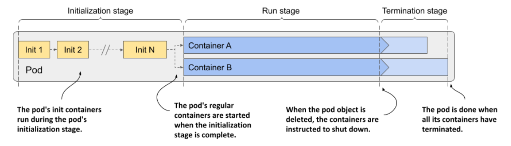
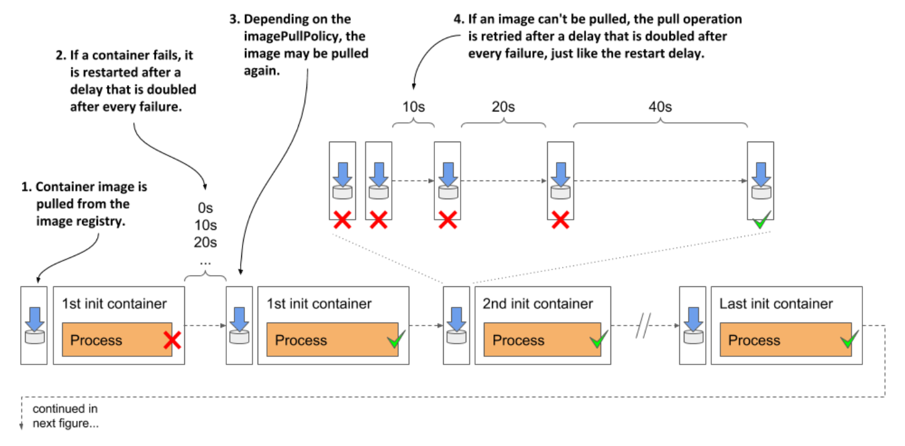
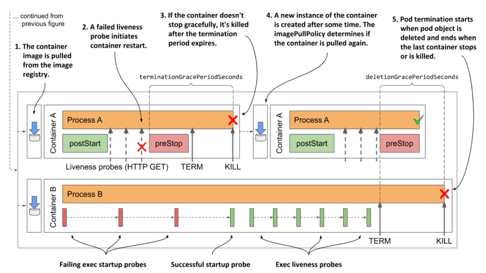

# Understanding the pod lifecycle

* So far in this chapter you've learned a lot about how the containers in a pod run

  * Now let's take a closer look at the entire lifecycle of a pod and its containers

* When you create a pod object, K8s schedules it to a worker node that then runs its containers

  * The pod's lifecycle is divided into the three stages shown in the next figure:

* The three stages of the pod's lifecycle are:

  1. The initialization stage, during which the pod's init containers run

  2. The run stage, in which the regular containers of the pod run.

  3. The termination stage, in which the pod's containers are terminated

* Let's see what happens in each of these stages:

  * [Initialization stage](./initialization-stage/README.md)

  * [Run stage](./run-stage/README.md)

  * [Termination stage](./termination-stage/README.md)

## Visualizing the full lifecycle of the pod's containers

* To conclude this chapter on what goes on in a pod, let's review everything that happens during the life of a pod

  * The following two figures summarize everything that's been explained in this chapter

* The initialization of the pod is shown in the next figure:

* When initialization is complete, normal operation of the pod's containers begins

  * This is shown in the next figure:

## Learning summary

* The status of the pod contains information about the phase of the pod, its conditions, and the status of each of its containers

  * You can view the status by running the `kubectl describe` command or by retrieving the full pod manifest using the command `kubectl get -o yaml`

* Depending on the pod's restart policy, its containers can be restarted after they are terminated

  * In reality, a container is never actually restarted

  * Instead, the old container is destroyed, and a new container is created in its place

* If a container is repeatedly terminated, an exponentially increasing delay is inserted before each restart

  * There is no delay for the first restart, then the delay is 10 seconds and then doubles before each subsequent restart

  * The maximum delay is 5 minutes and is reset to zero when the container has been running properly for at least twice this time

* An exponentially increasing delay is also used after each failed attempt to download a container image

* Adding a liveness probe to a container ensures that the container is restarted when it stops responding

  * The liveness probe checks the state of the application via an HTTP GET request, by executing a command in the container, or opening a TCP connection to one of the network ports of the container

* If the application needs a long time to start, a startup probe can be defined w/ settings that are more foregiving than those in the livess probe to prevent premature restarting of the container

* You can define lifecycle hooks for each of the pod's main containers

  * A post-start hook is invoked when the container starts, whereas a pre-stop hook is invoked when the container must shut down

  * A lifecycle hook is configured to either send an HTTP GET request or execute a command within the container

* If a pre-stop hook is defined in the container and the container must terminate, the hook is invoked first

  * The `TERM` signal is then sent to the main process in the container

  * If the process doesn't stop within `terminationGracePeriodSeconds` after the start of the termination sequence, the process is killed

* When you delete a pod object, all its containers are terminated in parallel

  * The pod's `deletionGracePeriodSeconds` is the time given to the containers to shut down

  * By default, it's set to the termination grace period, but can be overridden w/ the `kubectl delete` command

* If shutting down a pod takes a long time, it is likely that one of the processes running in it doesn't handle the `TERM` signal

  * Adding a `TERM` signal handler is a better solution than shortening the termination or deletion grace period
