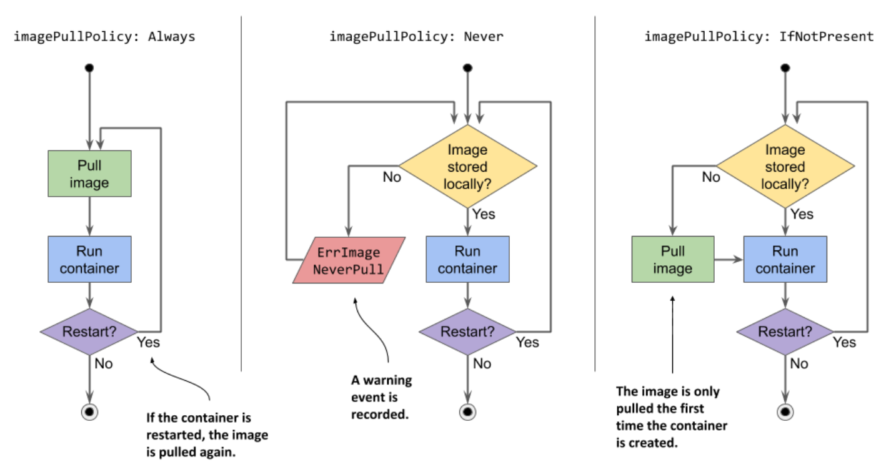
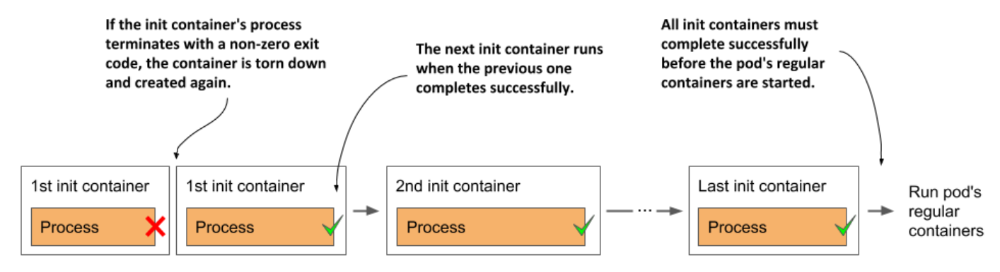

# Understanding the initialization stage

* As you've already learned, the pod's init containers run first

  * They run in the order specified in the `initContainers` field in the pod's `spec`

  * Let's examine everything that unfolds

## Pulling the container image

* Before each init container is started, its container image is pulled to the worker node

  * The `imagePullPolicy` field in the container definition in the pod specification determines whether the image is pulled every time, only the first time, or never

  * List of image pull-policies:

| **Image pull policy** | **Description**                                                                                                                                                                                                                                                                |
|-----------------------|--------------------------------------------------------------------------------------------------------------------------------------------------------------------------------------------------------------------------------------------------------------------------------|
| Not specified         | If the `imagePullPolicy` is not explicitly specified, it defaults to `Always` if the `:latest` tag is used in the image. For other image tags, it defaults to `IfNotPresent`.                                                                                                  |
| `Always`              | The image is pulled every time the container is (re)started. If the locally cached image matches the one in the registry, it is not downloaded again, but the registry still needs to be connected.                                                                            |
| `Never`               | The container image is never pulled from the registry. It must exist on the worker node beforehand. Either it was stored locally when another container w/ the same image was deployed, or it was built on the node itself, or simply downloaded by someone or something else. |
| `IfNotPresent`        | Image is pulled if it is not already present on the worker node. This ensures that the image is only pulled the first time it's required.                                                                                                                                      |

* The image-pull policy is also applied every time the container is restarted, so a closer look is warranted

  * Examine the following figure to understand the behavior of these three policies

> [!WARNING]
> 
> If the `imagePullPolicy` is set to `Always` and the image registry is offline, the container will not run even if the same image is already storred locally. A registry that is unavailable may therefore prevent your application from (re)starting

## Running the containers

* When the first container image is downloaded to the node, the container is started

  * When the first init container is complete, the image for the next init container is pulled and the container is started

  * This process is repeated until all init containers are successfully completed

  * Containers that fail might be restarted, as shown in the following figure:

## Restarting failed init containers

* If an init container terminates w/ an error and the pod's restart policy is set to `Always` or `OnFailure`, the failed init container is restarted

* If the policy is set to `Never`, the subsequent init containers and the pod's regular containers are never started

  * The pod's status is displayed as `Init:Error` indefinitely

  * You must then delete and recreate the pod object to restart the application

  * To try this yourself, deploy the file `pod.kiada-init-fail-norestart.yaml`

> [!NOTE]
> 
> If the container needs to be restarted and `imagePullPolicy` is set to `Always`, the container image is pulled again. If the container had terminated due to an error, and you push a new image w/ the same tag that fixes the error, you don't need to recreate the pod, as the updated container image will be pulled before the container is restarted

## Re-executing the pod's init containers

* Init containers are normally only executed once

  * Even if one of the pod's main containers is terminated later, the pod's init containers are not re-executed

  * However, in exceptional cases, such as when Kubernetes must restart the entire pod, the pod's init container might be executed again

    * This means that the operations performed by your init containers must be idempotent
