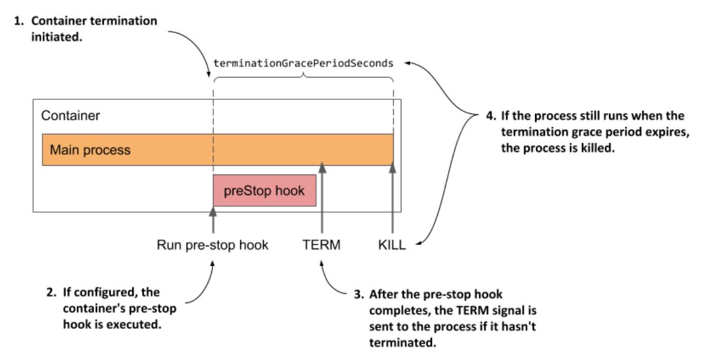

# Understanding the run stage

* When all init containers are successfully completed, the pod's regular containers are all created in parallel

* In theory, the lifecycle of each container should be independent of the other containers in the pod, but this is not quite true

> ### A container's post-start hook blocks the creation of the subsequent container
>
> * The Kubelet doesn't start all containers of the pod at the same time
>
>   * It creates and starts the container synchronously in the order they are defined in the pod's `spec`
>
>   * If a post-start hook is defined for a container, it runs asynchronously w/ the main container process, but the execution of the post-start hook handler blocks the creation and start of the subsequent containers
>
> * This is an implementation detail that might change in the future
>
> * In contrast, the termination of containers is performed in parallel
>
>   * A long-running pre-stop hook does block the shutdown of the container in which it is defined, but it does not block the shutdown of other containers
>
>   * The pre-stop hooks of the containers are all invoked at the same time

* The following sequence runs independently for each container

  * First, the container image is pulled, and the container is started

  * When the container terminates, it is restarted, if this provided for in the pod's restart policy

  * The container continues to run until the termination of the pod is initiated

  * A more detailed explanation of this sequence is presented next

## Pulling the container image

* Before the container is created, its image is pulled from the image registry, following the pod's `imagePullPolicy`

  * Once the image is pulled, the container is created

> [!NOTE]
> 
> Even if a container image can’t be pulled, the other containers in the pod are started nevertheless.

> [!WARNING]
> 
> Containers don’t necessarily start at the same moment. If pulling the image takes time, the container may start long after all the others have already started. Consider this if a containers depends on others.

## Running the container

* The container starts when the main container process starts

  * If a post-start hook is defined in the container, it is invoked in parallel w/ the main container process

  * The post-start hook runs asynchronously and must be successful for the container to continue running

* Together w/ the main container and the potential post-start hook process, the startup probe, if defined for the container, is started

  * When the startup probe is successful, or if the startup probe is not configured, the liveness probe is started

## Terminating and restarting the container on failures

* If the startup of the liveness probe fails so often that it reaches the configured failure threshold, the container is terminated

  * As w/ init containers, the pod's `restartPolicy` determines whether the container is then restarted or not

* Perhaps surprisingly, if the restart policy is set to `Never` and the startup hook fails, the pod's status is shown as `Completed` even though the post-start hook failed

  * You can see this for yourself by creating the pod defined in the file `pod.quote-poststart-fail-norestart.yaml`

## Introducing the termination grace period

* If a container must be terminated, the container's pre-stop hook is called so that the application can shut down gracefully

  * When the pre-stop hook is completed, or if no pre-stop hook is defined, the `TERM` signal is sent to the main container process

  * This is another hint to the application that it should shut down

* The application is given a certain amount of time to terminate

  * This time can be configured using the `terminationGracePeriodSeconds` field in the pod's `spec` and defaults to 30 seconds

  * The timer starts when the pre-stop hook is called or when the `TERM` signal is sent if no hook is defined

* If the process is still running after the termination grace period has expired, it's terminated by force via the `KILL` signal

  * This terminates the container

  * The following figure illustrates the container termination sequence:

* After the container has terminated, it will be restarted if the pod's restart policy allows it

  * If not, the container will remain in the `Terminated` state, but the other containers will continue running until the entire pod is shut down or until they fail as well
