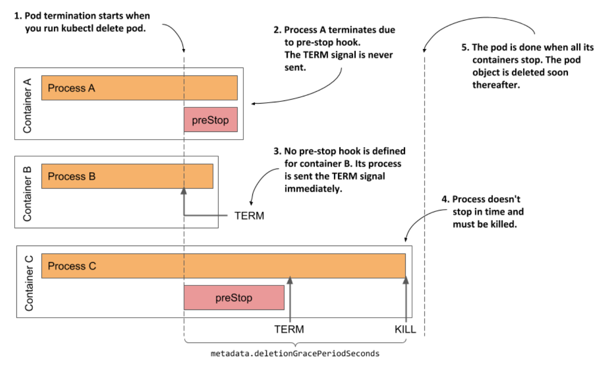

# Understanding the termination stage

* The pod's containers continue to run until you finally delete the pod object

  * When this happens, termination of all containers in the pod is initiated and its status is changed to `Terminating`

## Introducing the deletion grace period

* The termination of each container at pod shutdown follows the same sequence as when the container is terminated b/c it has failed its liveness probe, except that instead of the termination grace period, the pod's _deletion grace period_ determines how much time is available to the containers to shut down o ntheir own

* This grace period is defined in the pod's `metadata.deletionGracePeriodSeconds` field, which gets initialized when you delete the pod

  * By default, it gets its value from the `spec.terminationGracePeriodSeconds` field, but you can specify a different value in the `kubectl delete` command

## Understanding how the pod's containers are terminated

* As shown in the next figure, the pod's containers are terminated in parallel

  * For each of the pod's containers, the container's pre-stop hook is called, the `TERM` signal is then sent to the main container process, and finally the process is terminated using the `KILL` signal if the deletion grace period expires before the process stops by itself

  * After all the containers in the pod have stopped running, the pod object is deleted



## Inspecting the slow shutdown of a pod

* Let's look at this last stage of the pod's life on one of the pods you created previously

  * If the `kiada-ssl` pod doesn't run in your cluster, please create it again

  * Now delete the pod by running `kubectl delete pod kiada-ssl`

  * It takes surprisingly long to delete the pod, doesn't it (30 sec)?

    * This is neither normal nor acceptable, so let's fix it 

  * Considering what you've learned in this section, you may already know what's causing the pod to take so long to finish

    * If not, let's analyze the situation

      * The `kiada-ssl` pod has two containers

      * Both must stop before the pod object can be deleted
  
      * Neither container has a pre-stop hook defined, so both containers should receive the `TERM` signal immediately when you delete the pod

      * The 30s mentioned earlier matches the default termination grace period value, so it looks like one of the containers, if not both doesn't stop when it receives the `TERM` signal, and is killed after the grace period expires

## Changing the termination grace period

* You can try setting the pod's `terminationGracePeriodSeconds` field to a lower value to see if it terminates sooner

  * The following manifest shows how to in the pod manifest `pod.kiada-ssl-shortgraceperiod.yaml` ▶︎ setting a lower terminationGracePeriodSeconds for faster pod shutdown:

```yaml
apiVersion: v1
kind: Pod
metadata:
  name: kiada-ssl-shortgraceperiod
spec:
  terminationGracePeriodSeconds: 5 # ← This pod’s containers have 5 seconds to terminate after receiving the TERM signal or they will be killed
  containers:
  ...
```

* In the listing above, the pod's `terminationGracePeriodSeconds` is set to `5`

  * If you create and then delete this pod, you'll see that its containers are terminated within 5s of receiving the `TERM` signal

> [!TIP]
> 
> A reduction of the termination grace period is rarely necessary. However, it is advisable to extend it if the application usually needs more time to shut down gracefully.

## Specifying the deletion grace period when deleting the pod

* Any time you delete a pod, the pod's `terminationGracePeriodSeconds` determines the amount of time the pod is given to shut down, but you can override this time when you execute the `kubectl delete` command using the `--grace-period` command line option

  * For example, to give the pod 10s to shut down, you run the following command:

```zsh
$ kubectl delete po kiada-ssl --grace-period 10
```

> [!NOTE]
> 
> If you set this grace period to zero, the pod’s pre-stop hooks are not executed.

## Fixing the shutdown behavior of the Kiada application

* Considering that the shortening of the grace period leads to a faster shutdown of the pod, it's clear that at least one of the two containers doesn't terminate by itself after it receives the `TERM` signal

  * To see which one, recreate the pod, then run the following commands to stream the logs of each container before deleting the pod again:

```zsh
$ kubectl logs kiada-ssl -c kiada -f
$ kubectl logs kiada-ssl -c envoy -f 
```

* The logs show that the Envoy proxy catches the signal and immediately terminates, whereas the Node.js applciation doesn't respond to the signal

  * To fix this, you need to add the code in the following listing to the end of your `app.js` file

  * You'll find the updated file in [kiada-0.3/app.js](./kiada-0.3/app.js)

  * Handling the TERM signal in the kiada application:

```zsh
process.on('SIGTERM', function () {
  console.log("Received SIGTERM. Server shutting down...");
  server.close(function () {
    process.exit(0);
  });
});
```

* After you make the change to the code, create a new container image w/ the tag `:0.3`, push it to your image registry, and deploy a new pod that uses the new image

  * You can also use the image `docker.io/luksa/kiada:0.3` that we've build

  * To create the pod, apply the manifest file `pod.kiada-ssl-0.3.yaml`

* If you delete this new pod, you'll see that it shuts down considerably faster

  * From the logs of the `kiada` container, you can see that it begins to shut down as soon as it receives the `TERM` signal

> [!TIP]
> 
> Don’t forget to ensure that your init containers also handle the `TERM` signal so that they shut down immediately if you delete the pod object while it’s still being initialized.
