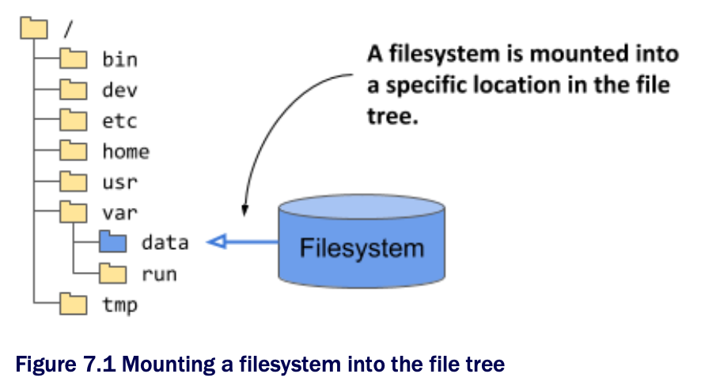

# Introducing volumes

* A pod is like a small logical computer that runs a single application

  * This application can consist of one or more containers that run the application processes

  * These processes share computing resources such as CPU, RAM, network interfaces, and others

  * In a typical computer, the processes use the same filesystem, but this isn't the case w/ containers

  * Instead, each container has its own isolated filesystem provided by the container image

* When a container starts, the files in its filesystem are those that were added to its container image during build time

  * The process running in the container can then modify those files or create new ones

  * When the container is terminated and restarted, all changes it made to its files are lost, b/c the previous container is not really restarted, but completely replaced

  * Therefore, when a containerized application is restarted, it can't continue from the point where it was when it stopped

  * Although this may be okay for some types of applications, others may need the entire filesystem or at least part of it to be preserved on restart

* This is achieved by adding a _volume_ to the pod and _mounting_ it into the container

> [!NOTE
> 
> _Mounting_ is the act of attaching the filesystem of some storage device or volume into a specific location in the operating system's file tree, as shown in the next figure. The contents of the volume are then available at that location

