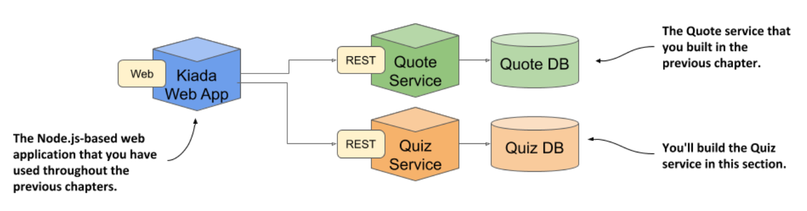
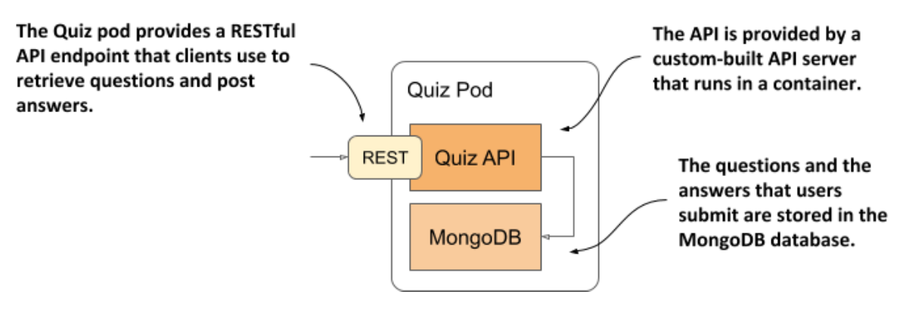

# Demonstrating the need for volumes

* In this chapter, you'll build a new service that requires its data to be persisted

  * To do this, the pod that runs the service will need to contain a volume

## Introducing the quiz service



* You've already built the initial version of the Kiada web application and the Quote service

  * Now you'll create the Quiz Service

  * It will provide the multiple-choice questions that the Kiada web application displays and store your answers to those questions

* The Quiz service consists of a RESTful API frontend and a MongoDB database as the backend

  * Initially, you'll run these two components in separate containers on the same pod, as shown in the following figure:



* As explained in the pod introduction in chapter 5, creating pods like this is not the best idea, as it doesn't allow for the containers to be scaled individually

  * The reason we'll use a single pod is b/c we haven't yet learned the correct way to make pods communicate w/ each other (see chpt 11)

    * That's when you'll split the two containers into separate pods

## Building the quiz api container

* The code is written in Go and built using a container

  * Instead of having to install the Go environment on your own computer to build the binary file from the Go source code, you build it in a container that already contains the Go environment

  * The result of the build is the `quiz-api` binary executable file that is written to the `quiz-api-0.1/app/bin/` directory

  * The file is then packaged into the `quiz-api:0.1` container image w/ a separate `docker build` command

  * If you wish, you can try building the binary and the container image yourself, but you can also use the image already built ▶︎ `docker.io/luksa/quiz-api:0.1`

## Running the quiz service in a pod w/o a volume

* The following listing shows the YAML manifest of the `quiz` pod `pod.quiz.novolume.yaml` ▶︎ The Quiz pod w/ no volume:

```yaml
apiVersion: v1
kind: Pod
metadata:
  name: quiz
spec:                         # ← This pod manifest defines containers, but no volumes.
  containers:
  - name: quiz-api            # ← The quiz-api container runs the API server written in Go
    image: luksa/quiz-api:0.1 # ← The quiz-api container runs the API server written in Go
    ports:
    - name: http
      containerPort: 8080
  - name: mongo               # ← The mongo container runs the MongoDB database and represents the backend.
    image: mongo              # ← The mongo container runs the MongoDB database and represents the backend.
```

* The listing shows that two containers are defined in the pod

  * The `quiz-api` container runs the Quiz API component explained earlier, and the `mongo` container runs the MongoDB database that the API component uses to store data

* Create the pod from the manifest and use `kubectl post-forward` to open a tunnel to the pod's port 8080 so that you can talk to the Quiz API

  * To get a random question, send a GET request to the `/questions/random` URI as follows:

```zsh
$ curl localhost:8080/questions/random
ERROR: Question random not found
```

* The database is still empty

  * We need to add questions to it

## Adding questions to the database

* The Quiz API doesn't provide a way to add questions to the database, so you'll have to insert it directly

  * You can do this via the mongo shell that's available in the `mongo` container

  * Use `kubectl exec` to run the shell like this:

```zsh
$ kubectl exec -it quiz -c mongo -- mongo
MongoDB shell version v4.4.2
connecting to: mongodb://127.0.0.1:27017/...
Implicit session: session { "id" : UUID("42671520-0cf7-...") }
MongoDB server version: 4.4.2
Welcome to the MongoDB shell.
...
```

* The Quiz API reads the questions from the `questions` collection in the `kiada` database

  * To add a question to that collection, type the following two commands:

```shell
> use kiada
switched to db kiada
> db.questions.insert({
... id: 1,
... text: "What does k8s mean?",
... answers: ["Kates", "Kubernetes", "Kooba Dooba Doo!"], ... correctAnswerIndex: 1})
WriteResult({ "nInserted" : 1 })
```

> [!NOTE]
> 
> Instead of typing all these commands, you can simply run the [insert-question.sh](insert-question.sh) shell script on your local computer to insert the question.

  * Exit the shell by pressing Control-D or typing the `exit` command

## Reading the questions from the database and the quiz API

* To confirm that the questions that you've just inserted are now stored in the database, run the following command:

```shell
> db.questions.find()
{ "_id" : ObjectId("5fc249ac18d1e29fed666ab7"), "id" : 1, "text" : "What does k8s mean?",
  "answers" : [ "Kates", "Kubernetes", "Kooba Dooba Doo!" ], "correctAnswerIndex" : 1
  }
```

* Now try to retrieve a random question through the Quiz API:

```shell
$ curl localhost:8080/questions/random
{"id":1,"text":"What does k8s mean?","correctAnswerIndex":1,
"answers":["Kates","Kubernetes","Kooba Dooba Doo!"]}
```

* Good. It looks like the quiz pod provides the service we need for the Kiada Suite

  * But is that always the case?

## Restarting the MongoDB database

* B/c the MongoDB database writes its files to the container's filesystem, they are lost every time the container is restarted

  * You can confirm this by telling the database to shut down w/ the following command:

```zsh
$ kubectl exec -it quiz -c mongo -- mongo admin --eval "db.shutdownServer()"
```

* When the database shuts down, the container stops, and K8s starts a new one in its place

  * B/c this is now a new container, w/ a fresh filesystem, it doesn't contain the questions you entered earlier

  * You can confirm this is true w/ the following command:

```zsh
$ kubectl exec -it quiz -c mongo -- mongo kiada --quiet --eval "db.questions.count()"
0 # ← There are no questions in the database
```

* Keep in mind that the `quiz` pod is still the same pod as before

  * The `quiz-api` container has been running fine this whole time

  * Only the `mongo` container was restarted

  * To be perfectly accurate, it was re-created, not restarted

  * You caused this by shutting down MongoDB, but it could happen for any reason

  * You'll agree that it's not acceptable that a simple restart causes data to be lost

* To ensure that the data is persisted, it needs to be stored outside the container-in a volume
