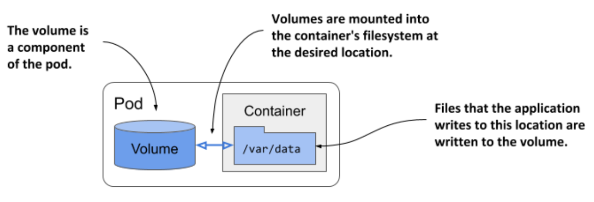
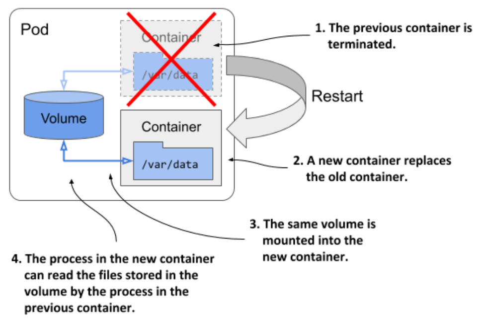
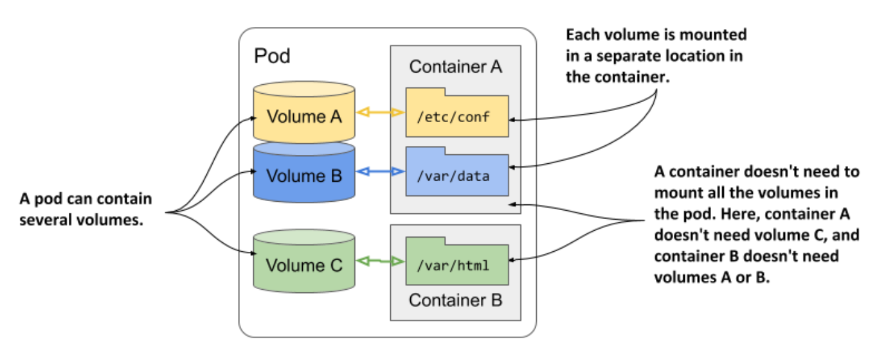
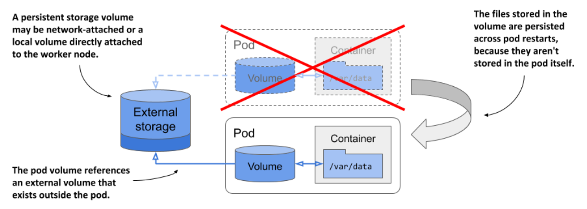
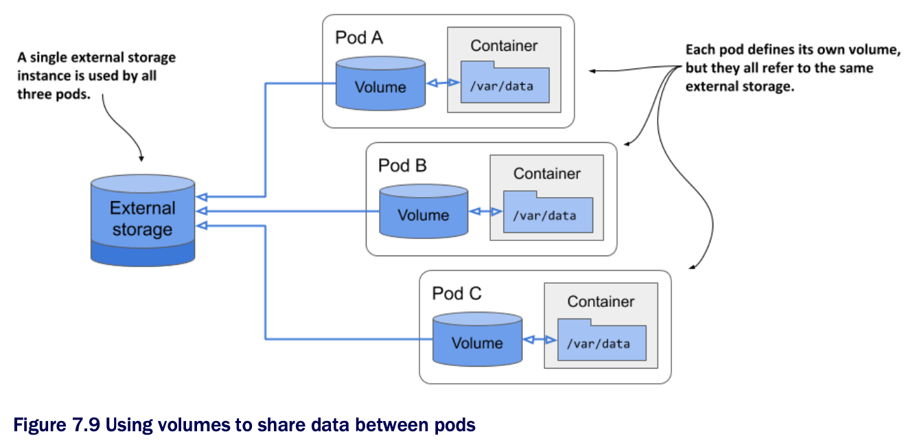

# Understanding how volumes fit into pods

* Like containers, volumes aren't top-level resources like pods or nodes, but are a component within the pod and thus share its lifecycle

  * As the following figure shows, a volume is defined at the pod level and then mounted at the desired location in the container

* The lifecycle of a volume is tied to the lifecycle of the entire pod and is independent of the lifecycle of the container in which it is mounted

  * Due to this fact, volumes are also used to persist data across container restarts

## Persisting files across container restarts

* All volumes in a pod are created when the pod is set up-before any of its containers are started

  * They are torn down when the pod is shut down

* Each time a container is (re)started, the volumes that the container is configured to use are mounted in the container's filesystem

  * The application running in the container can read from the volume and write to it if the volume and mount are configured to be writable

* A typical reason for adding a volume to a pod is to persist data across container restarts

  * If no volume is mounted in the container, the entire filesystem of the container is ephemeral

  * Since a container restart replaces the entire container, its filesystem is also re-created from the container image

  * As a result, all files written by the application are lost

* If, on the other hand, the application writes data to a volume mounted inside the container, as shown in the following figure, the application process in the new container can access the same data after the container is restarted

* It is up to the author of the application to determine which files must be retained on restart

  * Normally you want to preserve data representing the application's state, but you way not want to preserve files that contain the application's locally cached data, as this prevents the container from starting fresh when it's restarted

  * Starting fresh every time may allow the application to heal itself when corruption of the local cache causes it to crash

  * Just restarting the container and using the same corrupted files could result in an endless crash loop

> [!TIP]
> 
> Before you mount a volume in a container to preserve files across container restarts, consider how this affects the container's self-healing capability.

## Mounting multiple volumes in a container

* A pod can have multiple volumes and each container can mount zero or more of these volumes in different locations

* The reason why you might want to mount multiple volumes in one container is that these volumes may serve different purposes and can be of different types w/ different performance characteristics

* In pods w/ more than one container, some volumes can be mounted in some containers but not in others

  * This is especially useful when a volume contains sensitive information that should only be accessible to some containers

## Sharing files between multiple containers

* A volume can be mounted in more than one container so that applications running in these containers can share files

  * As discussed in chapter 5, a pod can combine a main application container w/ sidecar containers that extend the behavior of the main application

  * In some cases, the containers must read or write the same files

* For example, you could create a pod that combines a web server running in one container w/ a content-producing agent running in another container

  * The content agent container generates the static content that the web server then delivers to its clients

  * Each of the two containers performs a single task that has no real value on its own

  * However, as the next figure shows, if you add a volume to the pod and mount it in both containers, you enable these containers to become a complete system that provides a valuable service and is more than the sum of its parts

* The same volume can be mounted at different places in each container, depending on the needs of the container itself

  * If the content agent writes content to `/var/data`, it makes sense to mount the volume there

  * Since the web server expects the content to be in `/var/html`, the container running it has the volume mounted at this location

* In the figure you'll also notice that the volume mount in each container can be configured either as read/write or as read-only

  * B/c the content agent needs to write to the volume whereas the web server only reads from it, the two mounts are configured differently

  * In the interest of security, it's advisable to prevent the web server from writing to the volume, since this could allow an attacker to compromise the system if the web server software has a vulnerability that allows attackers to write arbitrary files to the filesystem and execute them

* Other examples of using a single volume in two containers are cases where a sidecar container runs a tool that processes or rotates the web server logs or when an init container creates configuration files for the main application container

## Persisting data across pod instances

* A volume is tied to the lifecycle of the pod and only exists for as long as the pod exists, but depending on the volume type, the files in the volume can remain intact after the pod and volume disappear and can later be mounted into a new volume

* As the following figure shows, a pod volume can map to persistent storage outside the pod

  * In this case, the file directory representing the volume isn't a local file directory that persists data only for the duration of the pod, but is instead a volume mount to an existing, typically network-attached storage volume (NAS) whose lifecycle isn't tied to any pod

  * The data stored in the volume is thus persistent and can be used by the application even after the pod it runs is replaced w/ a new pod running on a different worker node

* If the pod is deleted and a new pod is created to replace it, the same network-attached storage volume can be attached to the new pod instance so that it can access the data stored there by the previous instance

## Sharing data between pods

* Depending on the technology that provides the external storage volume, the same external volume can be attached to multiple pods simultaneously, allowing them to share data

* The following figure shows a scenario where three pods each define a volume that is mapped to the same external persistent storage volume:

* In the simplest case, the persistent storage volume could be a simple local directory on the worker node's filesystem, and the three pods have volumes that map to that directory

  * If all three pods are running on the same node, they can share files through this directory

* If the persistent storage is a network-attached storage volume, the pods may be able to use it even when they are deployed to different nodes

  * However, this depends on whether the underlying storage technology supports concurrently attaching the network volume to multiple computers

* While technologies such as Network File System (NFS) allow you to attach the volume in read/write mode on multiple computers, other technologies typically available in cloud environments, such as Google Compute Engine Persistent Disk, allow the volume to be used either in read/write mode on a single cluster node, or in read-only mode on many nodes

## Introducing the available volume types

* When you add a volume to a pod, you must specify the volume type

  * A wide range of volume types is available

  * Some are generic, while others are specific to the storage technologies used underneath

  * Here's a non-exhaustive list of supported volume types:

    * `emptyDir` ▶︎ A simple directory that allows the pod to store data for the duration of its lifecycle

      * The directory is created just before the pod starts and is initially empty-hence the name

      * The `gitRepo` volume, which is now deprecated, is similar, but is initialized by cloning a Get repository

      * Instead of using a `getRepo` volume, it is recommended to use an `emptyDir` volume and initialize it using an init container

    * `hostPath` ▶︎ Used for mounting files from the worker node's filesystem into the pod

    * `nfs` ▶︎ An NFS share mounted into the pod

    * The following storages are all used for mounting cloud provider-specific storage  

      * `gcePersistentDisk` ▶︎ Google Compute Engine Persistent Disk

      * `awsElasticBlockStore` ▶︎ Amazon Web Services Elastic Block Store

      * `azureFile` ▶︎ Microsoft Azure File Service

      * `azureDisk` ▶︎ (Microsoft Azure Data Disk)

    * `cephfs`, `cinder`, `fc`, `flexVolume`, `flocker`, `glusterfs`, `iscsi`, `portworxVolume`, `quobyte`, `rbd`, `scaleIO`, `storageos`, `photonPersistentDisk`, `vsphereVolume` ▶︎ Used for mounting other types of network storage

    * `configMap`, `secret`, `downwardAPI`, and the `projected` volume type ▶︎ special types of volumes used to explore information about the pod and other Kubernetes objects through files

      * They are typically used to configure the application running in the pod

      * See chapter 9 to learn more

    * `persistentVolumeClaim` ▶︎ A portable way to integrate external storage into pods. Instead of pointing directly to an external storage volume, this volume type points to a `PersistentVolumeClaim` object that points to a `PersistentVolume` object that finally references the actual storage

      * This volume type requires a separate explanation, which you'll find in the next chapter

    * `csi` ▶︎ A pluggable way of adding storage via the Container Storage Interface

      * This volume type allows anyone to implement their own storage driver that is then referenced in the `csi` volume definition

      * During pod setup, the CSI driver is called to attach the volume to the pod

* The volume types serve different purposes

  * The following sections cover the most representative volume types and help you to gain a general understanding of volumes
