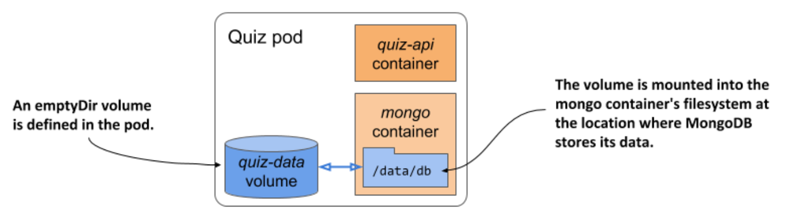
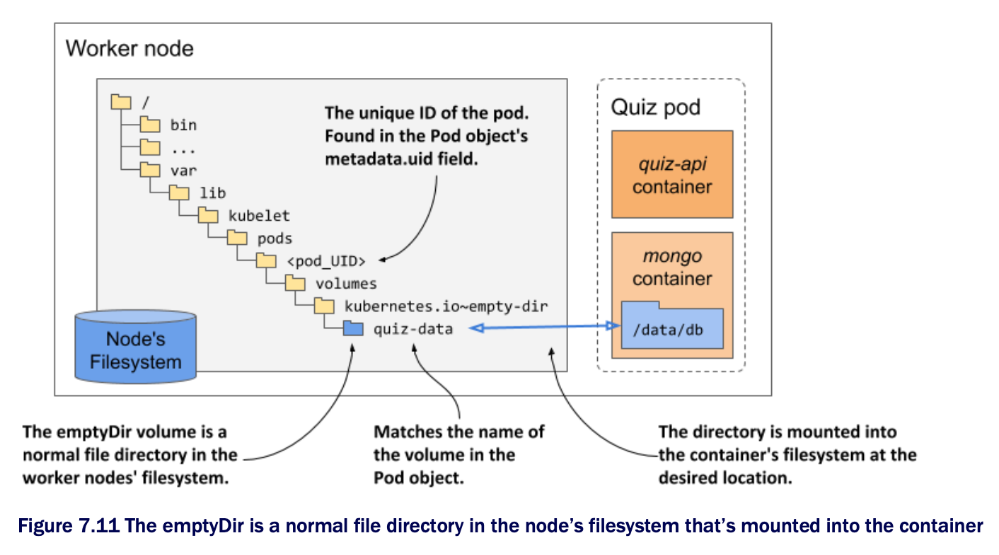

# Persisting files across container restarts

* Let's add an `emptyDir` volume to the quiz pod from section 7.1.1 to ensure that its data isn't lost when the MongoDB container restarts

## Adding an emptyDir volume to a pod

* You'll modify the definition of the quiz pod so that the MongoDB process writes its files to the volume instead of the filesystem of the contianer it runs in, whihc is perishable

  * A visual representation of the pod is given in the next figure:



* Two changes to the pod manifest are required to achieve this:

  1. An `emptyDir` volume must be added to the pod.

  2. The volume must be mounted into the container.

* The following listing shows the new pod manifest w/ these two changes highlighted in bold

  * You'll find the manifest in the file `pod.quiz.emptydir.yaml` ▶︎ the quiz pod with an emptyDir volume for the mongo container:

```yaml
apiVersion: v1
kind: Pod
metadata:
  name: quiz
spec:
  volumes:                # ← An emptyDir volume with the name quiz-data is defined.
  - name: quiz-data       # ← An emptyDir volume with the name quiz-data is defined.
    emptyDir: {}          # ← An emptyDir volume with the name quiz-data is defined.
  containers:
  - name: quiz-api
    image: luksa/quiz-api:0.1
    ports:
    - name: http
      containerPort: 8080
  - name: mongo
    image: mongo
    volumeMounts:         # ← The quiz-data volume is mounted into the mongo container’s filesystem at the location /data/db.
    - name: quiz-data     # ← The quiz-data volume is mounted into the mongo container’s filesystem at the location /data/db.
      mountPath: /data/db # ← The quiz-data volume is mounted into the mongo container’s filesystem at the location /data/db.
```

* The listing shows that an `emptyDir` volume named `quiz-data` is defined in the `spec.volumes` array of the pod manifest and that it is mounted into the `mongo` container's filesystem at the location `/data/db`

  * The following two sections explain more about the volume and the volume mount definitions

## Configuring the emptyDir volume

* In general, each volume definition must include a `name` and a type, which is indicated by the name of the nested field (for example: `emptyDir`, `gcePersistentDisk`, `nfs`, and so on)

  * This field typically contains several sub-fields that allow you to configure the volume

  * The set of sub-fields that you set depends on the volume type

    * For example, the `emptyDir` volume type supports two fields for configuring the volume

    * They are explained in the following table:

| **Field**   | **Description**                                                                                                                                                                                                                                                                                                                                         |
|-------------|---------------------------------------------------------------------------------------------------------------------------------------------------------------------------------------------------------------------------------------------------------------------------------------------------------------------------------------------------------|
| `medium`    | The type of storage medium to use for the directory. If left empty, the default medium of the host node is used (the directory is created on one of the node's disks). The only other supported option is `Memory`, which causes the volume to use `tmpfs`, a virtual memory filesystem where the files are kept in memory instead of on the hard disk. |
| `sizeLimit` | The total amount of local storage required for the directory, whether on disk or in memory. For example, to set the maximum size to ten mebibytes, you set this field to `10Mi`.                                                                                                                                                                        |

> [!NOTE]
> 
> The `emptyDir` field in the volume definition defines neither of these properties. The curly braces `{ }` have been added to indicate this explicitly, but they can be omitted.

## Mounting the volume in a container

* Defining a volume in the pod is only half of what you need to do to make it available in a container

  * The volume must also be mounted in the container

  * This is done by referencing the volume by name in the `volumeMounts` array in the container definition

* In addition to the `name`, a volume mount definition must also include the `mountPath`-the path within the container where the volume should be mounted

  * In the listing above, the volume is mounted at `/data/db` b/c that's where MongoDB stores its files

  * You want these files to be written to the volume instead of the container's filesystem, which is ephemeral

* The full list of supported fields in a volume mount definition is presented in the following table ▶︎ Configuration options for a volume mount:

| **Field**          | **Description**                                                                                                                                                                                                                                                                                                                                                                                                                                                                                                                                                                      |
|--------------------|--------------------------------------------------------------------------------------------------------------------------------------------------------------------------------------------------------------------------------------------------------------------------------------------------------------------------------------------------------------------------------------------------------------------------------------------------------------------------------------------------------------------------------------------------------------------------------------|
| `name`             | The name of the volume to mount. This must match one of the volumes defined in the pod.                                                                                                                                                                                                                                                                                                                                                                                                                                                                                              |
| `mountPath`        | The path within the container at which to mount the volume.                                                                                                                                                                                                                                                                                                                                                                                                                                                                                                                          |
| `readOnly`         | Whether to mount the volume as read-only. Defaults to `false`.                                                                                                                                                                                                                                                                                                                                                                                                                                                                                                                       |
| `mountPropagation` | Specifies what should happen if additional filesystem volumes are mounted inside the volume.</br>Defaults to `None`, which means that the container won't receive any mounts that are mounted by the host, and the host won't receive any mounts that are mounted by the container.</br>`HostToContainer` means that the container will receive all mounts that are mounted into this volume by the host, but not the other way around.</br>`Bidirectional` means that the container will receive mounts added by the host, and the host will receive mounts added by the container. |
| `subPath`          | Defaults to "" which indicates that the entire volume is to be mounted into the container. When set to a non-empty string, only the specified `subPath` within the volume is mounted into the container.                                                                                                                                                                                                                                                                                                                                                                             |
| `subPathExpr`      | Just like `subPath` but can have environment variable references using the syntax `$ (ENV_VAR_NAME)`. Only environment variables that are explicitly defined in the container definition are applicable. Implicit variables such as `HOSTNAME` will not be resolved. You'll learn how to specify environment variables in chapter 9.                                                                                                                                                                                                                                                 |

* In most cases, you only specify the `name`, `mountPath` and whether the mount should be `readOnly`

  * The `mountPropagation` option comes into play for advanced use-cases where additional mounts are added to the volume's file tree later, either from the host or from the container

  * The `subPath` and `subPathExpr` options are useful when you want to use a single volume w/ multiple directories that you want to mount to different containers instead of using multiple volumes

* The `subPathExpr` option is also used when a volume is shared by multiple pod replicas

  * In chapter 9, you'll learn how to use the Downward API to inject the name of the pod into an environment variable

  * By referencing this variable in `subPathExpr`, you can configure each replica to use its own subdirectory based on its name

## Understanding the lifespan of an emptyDir volume

* If you replace the quiz pod w/ the one in the listing above and insert questions into the database, you'll notice that the questions you add to the database remain intact, regardless of how often the container is restarted

  * This is b/c the volume's lifecycle is tied to that of the pod

* To see this is the case, insert the question(s) into the MongoDB database as you did in the previous section

  * We suggest using the shell script in the file `insert-question.sh` so that you don't have to type the entire question JSON again

  * After you add the question, count the number of questions in the database as follows:

```zsh
$ kubectl exec -it quiz -c mongo -- mongo kiada --quiet --eval "db.questions.count()"
1 # ← The number of questions in the database
```

* Now shut down the MongoDB server:

```zsh
$ kubectl exec -it quiz -c mongo -- mongo admin --eval "db.shutdownServer()"
```

* Check that the `mongo` container was restarted:

```zsh
$ kubectl get po quiz
NAME  READY   STATUS    RESTARTS    AGE
quiz  2/2     Running   1           10m   # ← The restart count shows that one container was restarted
```

* After the container restarts, recheck the number of questions in the database:

```zsh
$ kubectl exec -it quiz -c mongo -- mongo kiada --quiet --eval "db.questions.count()"
1 # ← The data has survived the container restart
```

* Restarting the container no longer causes the files to disappear b/v they no longer reside in the container's filesystem

  * They are stored in the volume

  * But where exactly is that? Let's find out

## Understanding where the files in an emptyDir volume are stored

* As you can see in the following figure, the files in an `emptyDir` volume are stored in a directory in the host node's filesystem

  * It's nothing but a normal file directory

  * This directory is mounted into the container at the desired location



* The directory is typically located at the following location in the node's filesystem:

```zsh
/var/lib/kubelet/pods/<pod_UID>/volumes/kubernetes.io~empty-dir/<volume_name>
```

* The `pod_UID` is the unique ID of the pod, which you'll find in the Pod object's `metadata` section

  * If you want to see the directory for yourself, run the following command to get the `pod_UID`:

```zsh
$ kubectl get po quiz -o json | jq .metadata.uid
"4f49f452-2a9a-4f70-8df3-31a227d020a1"
```

* The `volume_name` is the nme of the volume in the pod manifest-in the quiz pod, the name is `quiz-data`

* To get the name of the node that runs the pod, use `kubectl get po quiz -o wide` or the following alternative:

```zsh
$ kubectl get po quiz -o json | jq .spec.nodeName
```

* Now you have everything you need

  * Try to log into the node and inspect the contents of the directory

  * You'll notice that the files match those in the `mongo` container's `/data/db` directory

* If you delete the pod, the directory is deleted

  * This means that the data is lost once again

  * You'll learn how to persist it properly by using external storage volumes in the next section

## Creating the emptyDir volume in memory

* The `emptyDir` volume in the previous example created a directory on the actual drive of the worker node that runs your pod, so its performance depends on the type of drive installed on the node

  * If you want the I/O operations on the volume to be as fast as possible, you can instruct K8s to create the volume using the _tmpfs_ filesystem, which keeps files in memory

  * To do this, set the `emptyDir`'s `medium` field to `Memory` as in the following snippet:

```yaml
volumes:
  - name: content
    emptyDir:
      medium: Memory # ← This directory should be stored in memory.
```

* Creating the `emptyDir` volume in memory is also a good idea whenever it's used to store sensitive data

  * B/c the data is not written to disk, there is less chance that the data will be compromised and persisted longer than desired

  * As you'll learn in chapter 9, K8s uses the same in-memory approach when it exposes the data from the _Secret_ object kind in the container

## Specifying the size limit for the emptyDir volume

* The size of an `emptyDir` volume can be limited by setting the `sizeLimit` field

  * Setting this field is especially important for in-memory volumes when the overall memory usage of the pod is limited by so-called _resource limits_

  * You'll learn about this in chapter 20

* Next, let's see how an `emptyDir` volume is used to share files between containers of the same pod
