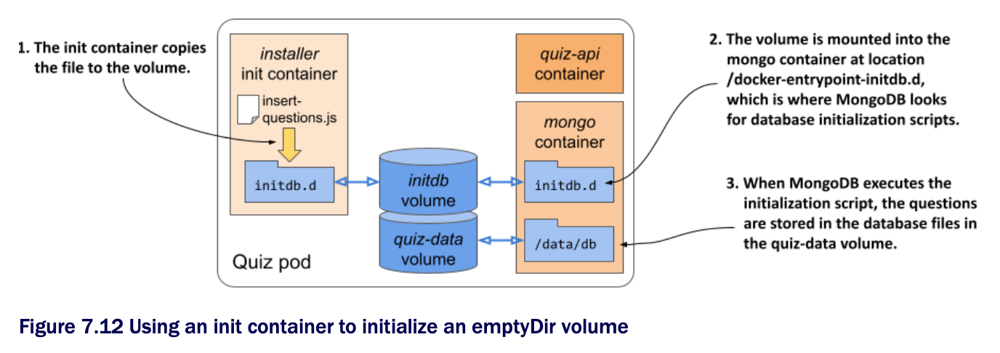

# Populating an emptyDir volume with data using an init container

* Every time you create the quiz pod from the previous section, the MongoDB database is empty, and you have to insert the questions manually

  * Let's improve the pod by automatically populating the database when the pod starts

* Many ways of doing this exist

  * You could run the MongoDB container locally, insert the data, commit the container state into a new image and use that image in your pod

  * But then you'd have to repeat the process every time a new version of the MongoDB container image is released

* Fortunately, the MongoDB container image provides a mechanism to populate the database the first time it's started

  * On start-up, if the database is empty, it invokes any .js and .sh files that it finds in the `/docker-entrypoint-initdb.d` directory

  * All you need to do is get the file into that location

  * Again, you could build a new MongoDB image w/ the file in that location, but you'd run into the same problem as described previously

  * An alternative solution is to use a volume to inject the file into that location of the MongoDB container's filesystem

  * But how do you get the file into the volume in the first place?

* A more generic way of populating an `emptyDir` volume is to package the data into a container image and copy the data files from the container to the volume when the container starts

  * This removes the dependency on any external systems and allows the pod to run regardless of the network connectivity status

* To help you visualize the pod, look at the following figure:



* When the pod starts, first the volumes and then the init container is created

  * The initdb volume is mounted into this init container

  * The container image contains the `insert-questions.js` file, which the container copies to the volume when it runs

  * Then the copy operation is complete, the init container finishes and the pod's main containers are started

  * The initdb volume is mounted into the mongo container at the location where MongoDB looks for database initialization scripts

  * On first start-up, MongoDB executes the insert-questions.js script

    * This inserts the questions into the database

    * As in the previous version of the pod, the database files are stored in the quiz-data volume to allow the data to survive container restarts

* The contents of the [insert-questions.js](./quiz-initdb-script-installer-0.1/insert-questions.js) file:

```js
db.getSiblingDB("kiada").questions.insertMany(  // ← This command inserts documents into the questions collection of the kiada database.
[{                                              // ← This is the first document.
  "id": 1,                                      // ← This is the first document.
  "text": "What is kubectl?",                   // ← This is the first document.
  ...                                           // ← This is the first document.
```

* Dockerfile for the [quiz-initdb-script-installer:0.1](./quiz-initdb-script-installer-0.1) container image:

```zsh
FROM busybox
COPY insert-questions.js /                                              # ← Adds the file to the container image
CMD cp /insert-questions.js /initdb.d/ \                                # ← When the container runs, it copies the file to the  
    && echo "Successfully copied insert-questions.js to /initdb.d" \    #   /docker-entrypoint-initdb.d directory and prints
    || echo "Error copying insert-questions.js to /initdb.d"            #   a status message to the standard output.
```

* After you've got the container image, modify the pod manifest from the previous section so its contents match the next listing (the resulting file is [pod.quiz.emptydir.init.yaml](./pod.quiz.emptydir.init.yaml))

  * Using an init container to initialize an emptyDir volume:

```yaml
apiVersion: v1
kind: Pod
metadata:
  name: quiz
spec:
  volumes:
  - name: initdb                                    # ← The initdb emptyDir volume is defined here.
    emptyDir: {}                                    # ← The initdb emptyDir volume is defined here.
  - name: quiz-data
    emptyDir: {}
  initContainers:
  - name: installer                                 # ← The volume is mounted in the init container at the location to which
    image: luksa/quiz-initdb-script-installer:0.1   #   the container copies the insert-questions.js file.
    volumeMounts:                                   # ← The volume is mounted in the init container at the location to which
    - name: initdb                                  #   the container copies the insert-questions.js file.
      mountPath: /initdb.d
  containers:
  - name: quiz-api
    image: luksa/quiz-api:0.1
    ports:
    - name: http
      containerPort: 8080
  - name: mongo
    image: mongo
    volumeMounts:
    - name: quiz-data
      mountPath: /data/db
    - name: initdb                                  # ← The same volume is also mounted in the mongo container
      mountPath: /docker-entrypoint-initdb.d/       #   at the location where MongoDB looks for initialization
      readOnly: true                                #   scripts.
```

* The listing shows that the initdb volume is mounted into the init container

  * After this container copies the `insert-questions.js` file to the volume, it terminates and allows the mongo and quiz-api containers to start

  * B/c the initdb volume is mounted in the `/docker-entrypoint-initdb.d` directory in the mongo container, MongoDB executes the .js file, which populates the database w/ questions

* You can delete the old quiz pod and deploy this new version of the pod

  * You'll see that the database gets populated every time you deploy the pod
