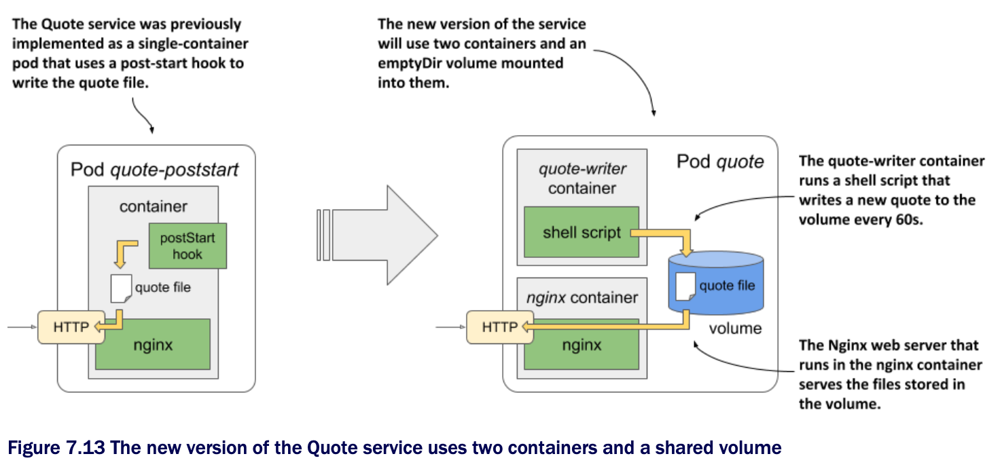

# Sharing files between containers

* As you saw in the previous section, an emptyDir volume can be initialized w/ an init container and then used by one of the pod's main containers

  * But a volume can also be used by multiple main containers concurrently

  * The quiz-api and the mongo containers that are in the quiz pod don't need to share files, so you'll use a different example to learn how volumes are shared between containers

* Remember the quote pod from the previous chapter?

  * The one that uses a post-start hook to run the `fortune` command

  * The command writes a quote from this book into a file that is then served by the Nginx web server

  * The quote pod currently serves the same quote throughout the lifetime of the pod

  * Let's build a new version of the pod, where a new quote is served every 60 seconds

* You'll retain Nginx as the web server but will replace the post-start hook w/ a container that periodically runs the `fortune` command to update the file where the quote is stored

  * Let's call this container `quote-writer`

  * The Nginx server will continue to be in the `nginx` container

* As visualized in the following figure, the pod now has two containers instead of one

  * To allow the `nginx` container to see the file that the `quote-writer` creates, a volume must be defined in the pod and mounted into both containers:



## Creating a pod w/ two containers and a shared volume

* The image for the `quote-writer` container is available at `docker.io/luksa/quote-writer:0.1`, but you can also build it yourself from the files in the Chapter07/qute-writer-0.1 directory

  * The `nginx` container will continue to use the existing `nginx:alpine` image

* The pod manifest for the new quote pod is shown in the next listing: [pod.quote.yaml](./pod.quote.yaml) ▶︎ A pod w/ two containers that share a volume:

```yaml
apiVersion: v1
kind: Pod
metadata:
  name: quote
spec:
  volumes:                              # ← An emptyDir volume with the name shared is defined.
  - name: shared                        # ← An emptyDir volume with the name shared is defined.
    emptyDir: {}                        # ← An emptyDir volume with the name shared is defined.
  containers:
  - name: quote-writer                  # ← The quote-writer container writes the quote to a file.
    image: luksa/quote-writer:0.1       # ← The quote-writer container writes the quote to a file.
    volumeMounts:                       # ← The shared volume is mounted into the quote-writer container.
    - name: shared                      # ← The shared volume is mounted into the quote-writer container.
      mountPath: /var/local/output
  - name: nginx                         # ← The nginx container serves the quote file.
    image: nginx:alpine                 # ← The nginx container serves the quote file.
    volumeMounts:                       # ← The shared volume is mounted into the nginx container.
    - name: shared                      # ← The shared volume is mounted into the nginx container.
      mountPath: /usr/share/nginx/html  # ← The shared volume is mounted into the nginx container.
      readOnly: true                    # ← The shared volume is mounted into the nginx container.
    ports:
    - name: http
      containerPort: 80
```

* The pod consists of two containers and a single volume, which is mounted in both containers, but at a different location in each container

  * The reason for this is that the `quote-writer` container writes the `quote` file to the `/var/local/output` directory, whereas the `nginx` container serves files from the `/usr/share/nginx/html` directory

> [!NOTE]
> 
> Since the two containers start at the same time, there can be a short period where nginx is already running, but the quote hasn’t been generated yet. One way of making sure this doesn’t happen is to generate the initial quote using an init container, as explained in [section 7.2.3](../populate-emptydir-vol-with-init-container).

## Running the pod

* When you create the pod from the manifest, the two containers start and continue running until the pod is deleted

  * The `quote-writer` container writes a new quote to the file every 60 seconds, and the `nginx` container serves this file

  * After you create the pod, use the `kubectl port-forward` command to open a communication tunnel to the pod:

```zsh
$ kubectl port-forward quote 1080:80
```

* In another terminal, verify that the server responds w/ a different quote every 60 seconds by running the following command several times:

```zsh
$ curl localhost:1080/quote
```

* Alternatively, you can also display the contents of the file using either of the following two commands:

```zsh
$ kubectl exec quote -c quote-writer -- cat /var/local/output/quote
$ kubectl exec quote -c nginx -- cat /usr/share/nginx/html/quote
```

* As you can see, one of them prints the contents of the file from within the `quote-writer` container, whereas the other command prints the contents from within the `nginx` container

  * B/c the two paths point to the same `quote` file on the shared volume, the output of the commands is identical
