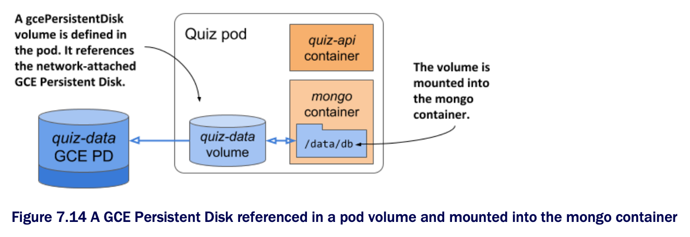

# Using a Google Compute Engine Persistent Disk as a volume

* If you use Google Kubernetes Engine to run the exercises in this book, your cluster nodes run on Google Compute Engine (GCE)

  * In GCE, persistent storage is provided via GCE Persistent Disks

  * Kubernetes supports adding them to your pods via the `gcePersistentDisk` volume type

> [!NOTE]
> 
> To adapt this exercise for use w/ other cloud providers, use the appropriate volume type supported by the cloud provider. Consult the documentation provided by the cloud provider to determine how to create the storage volume and how to mount it into the pod.

## Creating a GCE persistent disk

* Before you can use the GCE Persistent Disk volume in your pod, you must create the disk itelf

  * It must reside in the same zone as your Kubernetes cluster

  * If you don't remember in which zone you created the cluster, you can see it by listing your Kubernetes clusters using the `gcloud` command as follows:

```zsh
$ gcloud container clusters list
NAME    ZONE            MASTER_VERSION    MASTER_IP       ...
kiada   europe-west3-c  1.14.10-gke.42    104.155.84.137  ...
```

* In our case, the command output indicates that the cluster is in zone `europe-west3-c`, so we have to create the GCE Persistent Disk there

  * Create the disk in the correct zone as follows:

```zsh
$ gcloud compute disks create --size=10GiB --zone=europe-west3-c quiz-data
WARNING: You have selected a disk size of under [200GB]. This may result in poor I/O performance.
For more information, see: https://developers.google.com/compute/docs/disks#pdperformance.
Created [https://www.googleapis.com/.../zones/europe-west3-c/disks/quiz-data].
NAME      ZONE            SIZE_GB TYPE        STATUS
quiz-data europe-west3-c  10      pd-standard READY
```

* This command creates a GCE Persistent Disk called `quiz-data` w/ 10GiB of space

  * You can freely ignore the disk size warning, b/c it doesn't affect the exercises you're about to run

  * You may also see an additional warning that the disk is not yet formatted

  * You can ignore that, too, b/c formatting is done automatically when you use the disk in your pod

## Creating a pod w/ a gcePersistentDisk volume

* Now that you have set up tour physical storage, you can use it in a volume inside your quiz pod

  * You'll create the pod from the YAML in the following listing (file `pod.quiz.gcepd.yaml`)

  * This is the same file as `pod.quiz.emptydir.yaml` w/ slight alterations ▶︎ Using a gcePersistentDisk volume in the quiz pod:

```yaml
apiVersion: v1
kind: Pod
metadata:
  name: quiz
spec:
  volumes:
  - name: quiz-data
    gcePersistentDisk:        # ← The volume points to a GCE Persistent Disk you created earlier.
      pdName: quiz-data       # ← The name of the GCE Persistent Disk
      fsType: ext4            # ← The filesystem type
  containers:
  - name: quiz-api
    image: luksa/quiz-api:0.1
    ports:
    - name: http
      containerPort: 8080
  - name: mongo
    image: mongo
    volumeMounts:
    - name: quiz-data
      mountPath: /data/db
```

> [!NOTE]
> 
> If you created your cluster w/ Minikube or kind, you can't use a GCE Persistent Disk. Use the file [`pod.quiz.hostpath.yaml`](./pod.quiz.hostpath.yaml), which uses a `hostPath` volume in place of the GCE PD. This type of volume uses node-local instead of network storage, so you must ensure that the pod is always deployed to the same node. This is always true in Minikube b/c it creates a single node cluster. However, if you're using kind, create the pod from the file `pod.quiz.hostpath.kind.yaml` to ensure that the pod is always deployed to the same node.

* The pod is visualized in the following figure

  * It contains a single volume that refers to the GCE Persistent Disk you created earlier

  * The volume is mounted in the `mongo` container at `/data/db`

  * This ensures that MongoDB writes its files to the persistent disk



## Verifying that the GCE Persistent Disk persists data

* Use the shell script in the file [`insert-question.sh`](../../../section02/emptydir-volume/populate-emptydir-vol-with-init-container/quiz-initdb-script-installer-0.1/insert-questions.js) to add a question to the MongoDB database

  * Confirm that the question is stored by using the following command:

```zsh
$ kubectl exec -it quiz -c mongo -- mongo kiada --quiet --eval "db.questions.count()"
1 # ← The number of questions in the database
```

* Okay, the database has the data

  * MongoDB's data files are stored in the `/data/db` directory, which is where you mounted the GCE Persistent Disk

  * Therefore, the data files should be stored on the GCE PD

* You can now safely delete the quiz pod and recreate it:

```zsh
$ kubectl delete pod quiz
pod "quiz" deleted
$ kubectl apply -f pod.quiz.gcepd.yaml
pod "quiz" created
```

* Since the new pod is an exact replica of the previous, it points to the same GCE Persistent Disk as the previous pod did

  * The mongo container should see the files that it wrote earlier, even if the new pod is scheduled to another node

> [!TIP]
> 
> You can see what node a pod is scheduled to by running `kubectl get po -o wide`.

> [!NOTE]
> 
> If you use a kind-provisioned cluster, the pod is always scheduled to the same node.

* After the pod starts, recheck the number of questions in the database:

```zsh
$ kubectl exec -it quiz -c mongo -- mongo kiada --quiet --eval "db.questions.count()"
1 # ← The data is still present
```

* As expected, the data still exists even though you deleted and recreated the pod

  * This confirms that you can use a GCE Persistent Disk to persist disk in two or more pods at the same time

  * The answer to this question is not straightforward, b/c it requires the understanding of how external volumes are mounted in pods

  * We'll explain this in section 7.3.3

  * Before we do that, let's examine how to use external storage when your cluster doesn't run on Google's infrastructure
