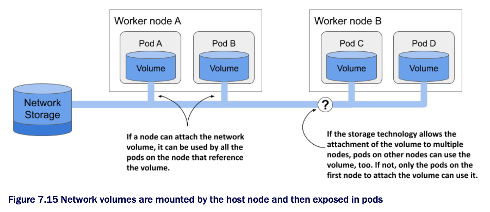

# Understanding how external volumes are mounted

* To understand the limitations of using external volumes in your pods, whether a pod references the volume directly or indirectly, as explained in the next chapter, you must be aware of the caveats associated w/ the way network storage volumes are actually attached to the pods

* Let's return to the issue of using the same network storage volume in multiple pods at the same time

  * What happens if you create a second pod and point it to the same GCE Persistent Disk?

* We've prepared a manifest for a second MongoDB pod that uses the same GCE Persistent Disk

  * The manifest can be found in the file `pod.quiz2.gcepd.yaml`

  * If you use it to create the second pod, you'll notice that it never runs

  * It never gets past the `ContainerCreating` status:

```zsh
$ kubectl get po
NAME    READY     STATUS              RESTARTS    AGE
quiz    2/2       Running             0           10m
quiz2   0/2       ContainerCreating   0           2m
```

> [!NOTE]
> 
> If your GKE cluster has a single worker node and the pod's status is `Pending`, the reason could be that there isn't enough allocated CPU for the pod to fit on the node. Resize the cluster to at least two nodes w/ the command `gcloud container clusters resize <CLUSTER_NAME> --size <NUMBER_OF_NODES>`.

* You can see why this is the case w/ the `kubectl describe pod quiz2 command`

  * At the very bottom, you see a `FailedAttachVolume` event generated by the `attachdetach-controller`

  * The event has the following message:

```zsh
AttachVolume.Attach failed for volume "quiz-data" : googleapi: Error 400:
RESOURCE_IN_USE_BY_ANOTHER_RESOURCE -                                           # ← The GCE Persistent Disk is already being used by another node.
The disk resource
'projects/kiada/zones/europe-west3-c/disks/quiz-data' is already being used by
'projects/kiada/zones/europe-west3-c/instances/gke-kiada-default-pool-xyz-1b27' # ← The worker node that the GCE PD is attached to
```

* The message indicates that the node hosting the `quiz2` pod can't attach the external volume b/c it's already in use by another node

  * If you check where the two oid are scheduled, you'll see that they are not on the same nod:

```zsh
$ kubectl get po -o wide
NAME    READY   STATUS            ... NODE
quiz    2/2     Running           ... gke-kiada-default-pool-xyz-1b27
quiz2   0/2     ContainerCreating ... gke-kiada-default-pool-xyz-gqbj
```

* The `quiz` pod runs on node `xyz-1b27`, whereas `quiz2` is on node `xyz-gqbj`

  * As is typically the case in cloud environments, you can't mount the same GCE Persistent Disk on multiple hosts simultaneously in read/write mode

  * You can only mount it on multiple hosts if you use the read-only mode

* Interestingly, the error message doesn't say that the disk is being used by the `quiz` pod, but by the node hosting the pod

  * This is an often overlooked detail about how external volumes are mounted into pods

> [!TIP]
> 
> Use the following command to see which network volumes that are attached to a node: `kubectl get node <NODE_NAME> -o json | jq .status.volumesAttached`.

* As the following figure shows, a network volume is mounted by the host node, and then the pod is given access to the mount point

  * The underlying storage technology may not allow a volume to be attached to more than one node at a time in read/write mode, but multiple pods on the same node _can_ all use the volume in read/write mode



* For most storage technologies available in the cloud, you can typically use the same network volume on multiple nodes simultaneously if you mount them in read-only mode

  * For example, pods scheduled to different nodes can use the same GCE Persistent Disk if it is mounted in read-only mode, as shown in the next listing ▶︎ Mounting a GCE Persistent Disk in read-only mode:

```yaml
kind: Pod
spec:
  volumes:
  - name: my-volume
    gcePersistentDisk:
      pdName: my-volume
      fsType: ext4
      readOnly: true    # ← This GCE Persistent Disk is mounted in read-only mode
```

* It is important to consider this network storage limitation when designing the architecture of your distributed application

  * Replicas of the same pod typically can't use the same network volume in read/write mode

  * Fortunately, Kubernetes takes care of this, too

  * In chapter 13, you'll learn how to deploy stateful applications, where each pod instance gets itw own network storage volume
